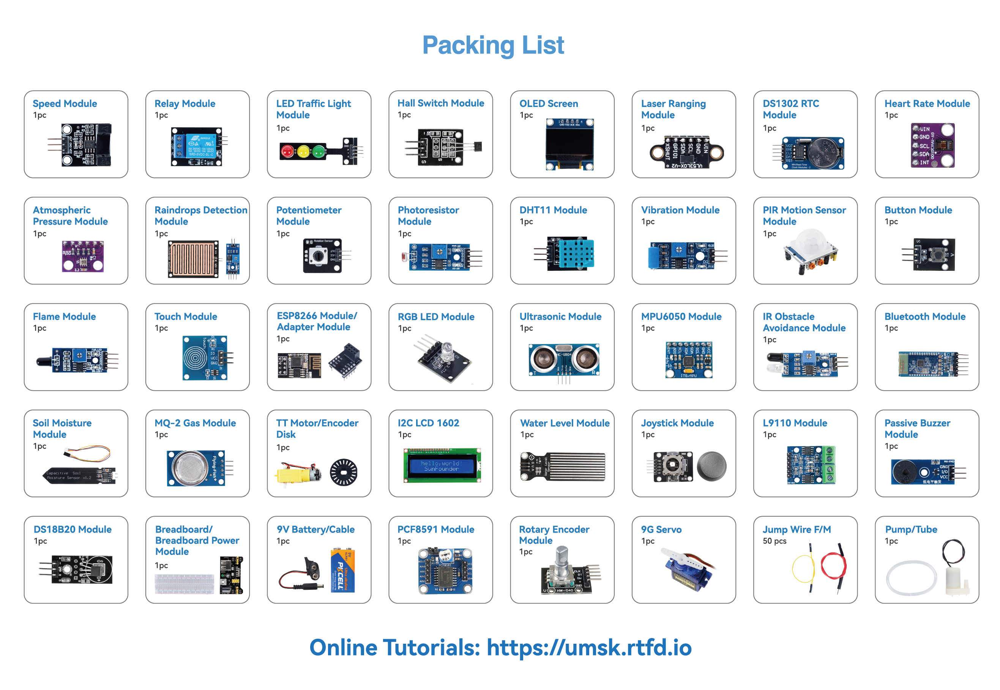

.. note::

    こんにちは、SunFounder Raspberry Pi & Arduino & ESP32 Enthusiasts Communityへようこそ！Facebook上で、仲間と一緒にRaspberry Pi、Arduino、ESP32をさらに深く探求しましょう。

     **なぜ参加するのか？** 

    - **専門的なサポート**：購入後の問題や技術的な課題をコミュニティやチームの助けを借りて解決。
    - **学びと共有**：スキルを向上させるためのヒントやチュートリアルを交換。
    - **限定プレビュー**：新製品発表や予告編に早期アクセス。
    - **特別割引**：最新製品の特別割引を楽しむ。
    - **フェスティブプロモーションとプレゼント**：プレゼントやホリデープロモーションに参加。

    👉 私たちと一緒に探索と創造を始める準備はできましたか？[|link_sf_facebook|]をクリックして、今すぐ参加しましょう！

キットのコンポーネントについて学ぶ
============================================

パッケージを開けた後、コンポーネントの数量が製品説明に準拠しているか、すべてのコンポーネントが良好な状態にあるかを確認してください。

* :download:`SunFounder Universal Maker Sensor Kit Components List </_static/pdf/sunfounder_universal_maker_sensor_components_list.pdf>`

以下では、各コンポーネントの紹介とその動作原理、および対応するプロジェクトを説明します。 **各コンポーネントには、すぐに始められる簡単なコード例があります。**

**基本**

.. toctree::
    :maxdepth: 1

    38-component_breadboard

**センサー**

.. toctree::
    :maxdepth: 1

    01-component_button
    02-component_soil
    03-component_flame
    04-component_gas
    05-component_mpu6050
    06-component_hall_sensor
    07-component_speed
    08-component_ir_obstacle
    09-component_joystick
    10-component_pcf8591
    11-component_photoresistor
    12-component_pir_motion
    13-component_potentiometer
    14-component_max30102
    15-component_raindrop
    16-component_rtc_ds1302
    17-component_rotary_encoder
    18-component_ds18b20
    19-component_dht11
    20-component_bmp280
    21-component_VL53L0X
    22-component_touch
    23-component_ultrasonic
    24-component_vibration
    25-component_water_level

**ディスプレイ**

.. toctree::
    :maxdepth: 1

    26-component_i2c_lcd1602
    27-component_oled
    28-component_rgb
    29-component_traffic

**アクチュエーター**

.. toctree::
    :maxdepth: 1

    30-component_relay
    31-component_pump
    37-component_l9110
    32-component_buzzer
    33-component_servo
    34-component_ttmotor

**ワイヤレス & IoT**

.. toctree::
    :maxdepth: 1

    35-component_esp8266
    36-component_jdy31

**電源**

.. toctree::
    :maxdepth: 1
    
    39-component_power
