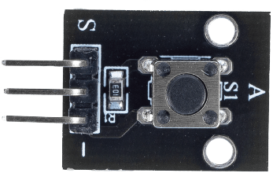
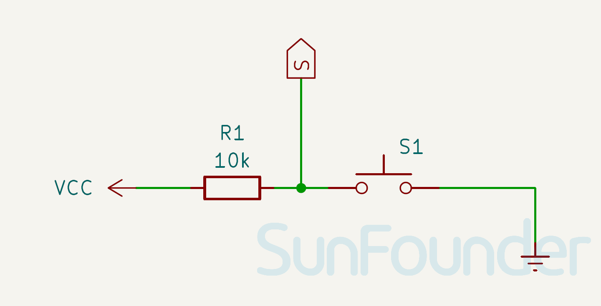

.. note::

   Hallo und willkommen in der SunFounder Raspberry Pi & Arduino & ESP32 Enthusiasten-Gemeinschaft auf Facebook! Tauchen Sie tiefer ein in die Welt von Raspberry Pi, Arduino und ESP32 mit anderen Enthusiasten.

   **Warum beitreten?**

   - **Expertenunterstützung**: Lösen Sie Nachverkaufsprobleme und technische Herausforderungen mit Hilfe unserer Gemeinschaft und unseres Teams.
   - **Lernen & Teilen**: Tauschen Sie Tipps und Anleitungen aus, um Ihre Fähigkeiten zu verbessern.
   - **Exklusive Vorschauen**: Erhalten Sie frühzeitigen Zugang zu neuen Produktankündigungen und exklusiven Einblicken.
   - **Spezialrabatte**: Genießen Sie exklusive Rabatte auf unsere neuesten Produkte.
   - **Festliche Aktionen und Gewinnspiele**: Nehmen Sie an Gewinnspielen und Feiertagsaktionen teil.

   👉 Sind Sie bereit, mit uns zu erkunden und zu erschaffen? Klicken Sie auf [|link_sf_facebook|] und treten Sie heute bei!

.. _cpn_button:

Tastenmodul
==========================

.. raw:: html

    

.. _btn_intro:

Das Tastenmodul ist ein elektronisches Gerät, das den Zustand einer Taste erkennt. Es wird üblicherweise als Schalter verwendet, um Stromkreise zu verbinden oder zu unterbrechen. Tasten werden in vielen Szenarien eingesetzt, wie z.B. bei Türklingeln, Schreibtischlampen, Fernbedienungen, Aufzügen, Feueralarmen usw.

Funktionsprinzip
---------------------------
Das Tastenmodul arbeitet nach dem Prinzip eines Schalters. Ein Schalter ist ein elektrisches Bauteil, das zum Öffnen oder Schließen eines Stromkreises verwendet werden kann.

Das folgende Bild zeigt den inneren Aufbau einer Taste. Das Symbol unten rechts wird üblicherweise verwendet, um eine Taste in Schaltkreisen darzustellen.

.. image:: img/01_button_2.png
    :width: 400
    :align: center

Da Pin 1 mit Pin 2 und Pin 3 mit Pin 4 verbunden ist, sind bei gedrückter Taste alle vier Pins verbunden, wodurch der Stromkreis geschlossen wird.

.. image:: img/01_button_3.png
    :width: 700
    :align: center

.. _cpn_button_sch:

Schaltplan
---------------------------

.. raw:: html

    

Beispiel
---------------------------
* :ref:`uno_lesson01_button` (Arduino UNO)
* :ref:`eps32_lesson01_button` (ESP32)
* :ref:`pico_lesson01_button` (Raspberry Pi Pico)
* :ref:`pi_lesson01_button` (Raspberry Pi)
* :ref:`esp32_iot_mqtt` (ESP32)
