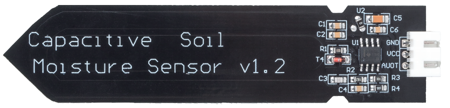
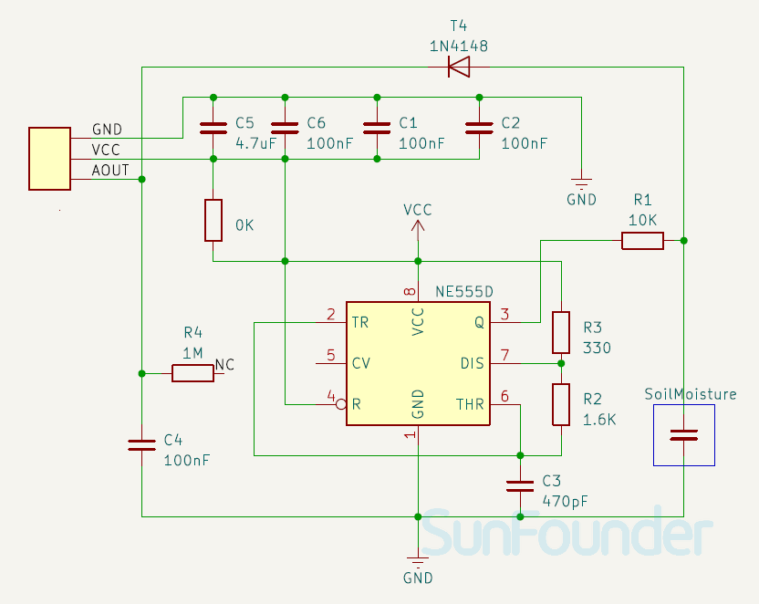

.. note::

    Hello, welcome to the SunFounder Raspberry Pi & Arduino & ESP32 Enthusiasts Community on Facebook! Dive deeper into Raspberry Pi, Arduino, and ESP32 with fellow enthusiasts.

    **Why Join?**

    - **Expert Support**: Solve post-sale issues and technical challenges with help from our community and team.
    - **Learn & Share**: Exchange tips and tutorials to enhance your skills.
    - **Exclusive Previews**: Get early access to new product announcements and sneak peeks.
    - **Special Discounts**: Enjoy exclusive discounts on our newest products.
    - **Festive Promotions and Giveaways**: Take part in giveaways and holiday promotions.

    👉 Ready to explore and create with us? Click [|link_sf_facebook|] and join today!

.. _cpn_soil:

Capacitive Soil Moisture Module
=====================================

.. raw:: html

     

The Soil Moisture Module is a sensor used in agriculture to measure the moisture content of soil, helping farmers monitor soil moisture levels and determine when to water their crops.
This capacitive soil moisture sensor differs from the resistive sensors on the market, using the principle of capacitive induction to detect soil moisture. It avoids the problem of easy corrosion in resistive sensors and greatly extends its working life.

Pinout
---------------------------
* **VCC**: This is the positive power supply input from the main control. 
* **GND**: Ground connection.
* **AUOT**: Analog output. The higher the soil moisture content, the lower the analog output value.

Principle
---------------------------

This capacitive soil moisture sensor is different from most of the resistive sensors on the market, using the principle of capacitive induction to detect soil moisture. It avoids the problem that resistive sensors are highly susceptible to corrosion and greatly extends its working life.

It is made of corrosion-resistant materials and has an excellent service life. Insert it into the soil around plants and monitor real-time soil moisture data. The module includes an on-board voltage regulator that allows it to operate over a voltage range of 3.3 ~ 5.5 V. It is ideal for low-voltage microcontrollers with 3.3 V and 5 V supplies.

The hardware schematic of the capacitive soil moisture sensor is shown below.

.. raw:: html

     

There is a fixed frequency oscillator, which is built with a 555 timer IC. The generated square wave is then fed to the sensor like a capacitor. However, for the square wave signal, the capacitor has a certain reactance or, for the sake of argument, a resistor with a pure ohmic resistor (10k resistor on pin 3) to form a voltage divider.

The higher the soil moisture, the higher the capacitance of the sensor. As a result, the square wave has less reactance, which reduces the voltage on the signal line, and the smaller the value of the analog input through the microcontroller.

Example
---------------------------
* :ref:`uno_lesson02_soil_moisture` (Arduino UNO)
* :ref:`esp32_lesson02_soil_moisture` (ESP32)
* :ref:`pico_lesson02_soil_moisture` (Raspberry Pi Pico)
* :ref:`pi_lesson02_soil_moisture` (Raspberry Pi Pi)

* :ref:`uno_lesson45_plant_monitor` (Arduino UNO)
* :ref:`esp32_plant_monitor` (ESP32)
