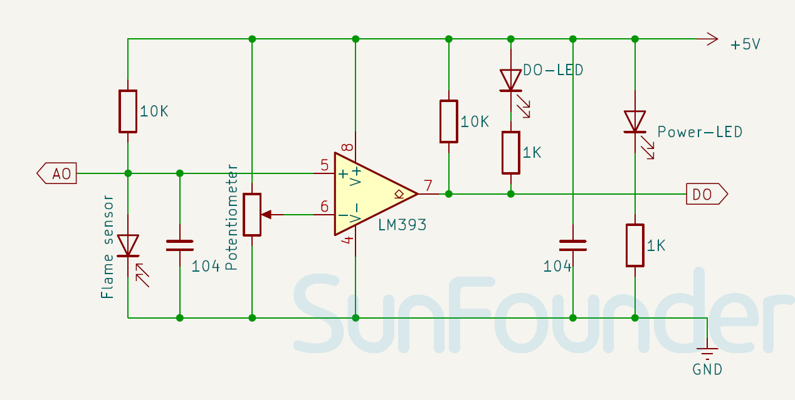

.. _cpn_flame:

Flame Sensor Module
==========================

.. image:: img/03_flame_module.png
    :width: 400
    :align: center

.. raw:: html

    

.. tip::
   Keep a specific distance between the sensor and the flame to prevent damage from high temperatures. 

The Flame sensor is a sensor that can detect the presence of fire or flames. The flame sensor works based on infrared radiation. The IR photodiode will detect the IR radiation from any hot body. This value is then compared with a set value. Once the radiation reaches the threshold value, the sensor will change its output accordingly. It is widely used in fire detection systems in homes and industries.

The Flame sensor works on the principle of infrared (IR) detection. The sensor has an IR receiver that detects the IR radiation emitted by flames. When fire burns it emits a small amount of Infra-red light, this light will be received by the Photodiode (IR receiver) on the sensor module. Then we use an Op-Amp to check for a change in voltage across the IR Receiver, so that if a fire is detected the output pin (DO) will give 0V(LOW), and if the is no fire the output pin will be 5V(HIGH).

Specification
---------------------------
* Supply Voltage: 3.3V - 5V
* PCB Size: 31 x 14mm
* Output Signal Type: DO and AO
* Detection Angle: 60 degrees

Pinout
---------------------------
* **VCC**: This is the positive power supply input from the main control. 
* **GND**: Ground connection.
* **DO**: Digital output. It indicates the presence of a flame. When the infrared radiation exceeds the threshold value (set by the potentiometer), DO becomes LOW; otherwise, it remains HIGH.
* **AO**: Analog output. It generates an output voltage that is inversely proportional to the intensity of infrared radiation (flame size). Therefore, higher infrared radiation will result in a lower voltage, while lower infrared radiation will result in a higher voltage.

Schematic diagram
---------------------------

.. raw:: html

    

Example
---------------------------
* :ref:`uno_lesson03_flame` (Arduino UNO)
* :ref:`esp32_lesson03_flame` (ESP32)
* :ref:`pico_lesson03_flame` (Raspberry Pi Pico)
* :ref:`pi_lesson03_flame` (Raspberry Pi)