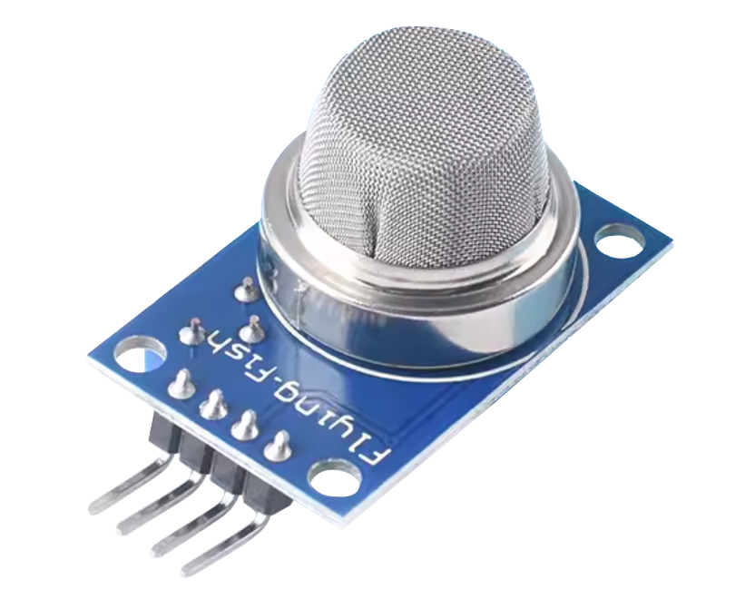

.. note::

    こんにちは、SunFounder Raspberry Pi & Arduino & ESP32 Enthusiasts Communityへようこそ！Facebook上で、仲間と一緒にRaspberry Pi、Arduino、ESP32をさらに深く探求しましょう。

     **なぜ参加するのか？** 

    - **専門的なサポート**：購入後の問題や技術的な課題をコミュニティやチームの助けを借りて解決。
    - **学びと共有**：スキルを向上させるためのヒントやチュートリアルを交換。
    - **限定プレビュー**：新製品発表や予告編に早期アクセス。
    - **特別割引**：最新製品の特別割引を楽しむ。
    - **フェスティブプロモーションとプレゼント**：プレゼントやホリデープロモーションに参加。

    👉 私たちと一緒に探索と創造を始める準備はできましたか？[|link_sf_facebook|]をクリックして、今すぐ参加しましょう！

.. _cpn_gas:

ガス/煙センサーモジュール (MQ2) 
=====================================

.. tip::
   MQ2は加熱駆動型のセンサーで、使用前に予熱が必要です。予熱期間中、センサーは通常高い値を示し、徐々に安定するまで低下します。

MQ-2センサーは、多種のガス（アルコール、一酸化炭素、水素、イソブタン、液化石油ガス、メタン、プロパン、煙）を検出可能な汎用ガスセンサーです。その低コストと使いやすさから、初心者にも人気があります。

原理
---------------------------
MQ-2センサーは、異なるガスの存在による抵抗変化の原理で動作します。対象ガスが加熱されたMOS（金属酸化物半導体）材料と接触すると、酸化または還元反応が起こり、MOS材料の抵抗が変化します。**MQ2ガスセンサーは複数のガスを検出できますが、それらを区別することはできません。** これはほとんどのガスセンサーに共通する特徴です。

センサーには内蔵のポテンショメータがあり、センサーのデジタル出力（D0）のしきい値を調整できます。空気中のガス濃度が特定のしきい値を超えると、センサーの抵抗が変化します。この抵抗の変化は電気信号に変換され、Arduinoボードで読み取ることができます。

MQ2ガスセンサーの校正
----------------------------------
MQ2は加熱駆動型のセンサーであるため、長期間保管されると校正がずれる可能性があります。
長期間（1ヶ月以上）保管した後に初めて使用する場合、センサーの最大精度を確保するために24〜48時間の完全な予熱が必要です。
最近使用されたセンサーの場合、完全に予熱するのに5〜10分しかかかりません。予熱期間中、センサーは通常高い値を示し、徐々に安定するまで低下します。

仕様
---------------------------
* モデル: MQ2
* 供給電圧: 5V
* PCBサイズ: 32 x 20mm
* 出力信号タイプ: DOとAO
* 検出濃度: 300〜10000ppm
* 予熱時間: 初回は24時間以上
* 検出ガス: LPG、アルコール、プロパン、水素、一酸化炭素、メタン

ピン配置
---------------------------
* **VCC**: メインコントローラからの正電源入力。
* **GND**: グランド接続。
* **DO**: デジタル出力。可燃性ガスの存在を示します。ガス濃度がしきい値（ポテンショメータで設定）を超えると、D0はLOWになり、それ以外の場合はHIGHになります。
* **AO**: アナログ出力。ガス濃度に比例したアナログ出力電圧を生成し、濃度が高いほど電圧が高くなり、濃度が低いほど電圧が低くなります。

例
---------------------------

* :ref:`uno_lesson04_mq2` (Arduino UNO)
* :ref:`esp32_lesson04_mq2` (ESP32)
* :ref:`pico_lesson04_mq2` (Raspberry Pi Pico)
* :ref:`pi_lesson04_mq2` (Raspberry Pi)

* :ref:`uno_lesson38_gas_leak_alarm` (Arduino UNO)
* :ref:`esp32_gas_leak_alarm` (ESP32)