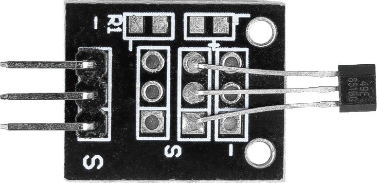
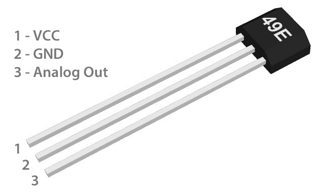

.. _cpn_hall:

Hall Sensor Module
=====================================

.. raw:: html

    

The Hall Sensor module is a magnetic non-contact sensor that produces an electrical signal proportional to the applied magnetic field. It can measure both north and south polarity of a magnetic field and the relative strength of the field. It's used for detecting magnetic fields, acting like a magnet detector that can identify nearby magnets. This sensor is useful in various projects, such as developing door alarm systems or measuring the speed of rotating objects.

Principle
---------------------------

The working principle of the Hall Sensor module is based on the |link_hall_effect|, discovered by Edwin Hall. Here's how it works in simple terms: when electricity flows through a conductor (like a wire), and there's a magnetic field around it, the magnetic field pushes the moving electrons in the conductor to one side. This creates a voltage difference across the conductor - this is the Hall Effect.

In the Hall Sensor module, when a magnet comes close, the magnetic field affects the electrons in the semiconductor material inside the sensor. This changes the voltage across the sensor, which the sensor detects. The Arduino can read this voltage change and understand whether there's a magnet nearby and how strong its magnetic field is.

.. raw:: html

    

The Hall Sensor module is equipped with a 49E Linear Hall-Effect Sensor, capable of measuring both the north and south polarity of a magnetic field as well as the relative strength of the field. The output pin provides an analog representation indicating the presence and strength of a magnetic field, along with its polarity (north or south). When no magnetic field is present, the 49E outputs a voltage around half of the source voltage. If the south pole of a magnet is placed near the labeled side of the 49E (the side with text etched on it), then the output voltage will linearly increase towards the source voltage in proportion to the strength of the applied magnetic field. Conversely, if you place a north pole near this side, then there will be a linear decrease in output voltage relative to the strength of that magnetic field. 

For instance, when powering 49E with 5V and no magnetic field present, its output will be approximately 2.5V. In this scenario, placing a strong magnet's south pole near it would cause an increase in output voltage up to around 4.2V; while placing its north pole nearby would result in dropping down to about 0.86V from source based on their respective strengths.

Example
---------------------------
* :ref:`uno_lesson06_hall_sensor` (Arduino UNO)
* :ref:`esp32_lesson06_hall_sensor` (ESP32)
* :ref:`pico_lesson06_hall_sensor` (Raspberry Pi Pico)
* :ref:`pi_lesson06_hall_sensor` (Raspberry Pi Pi)