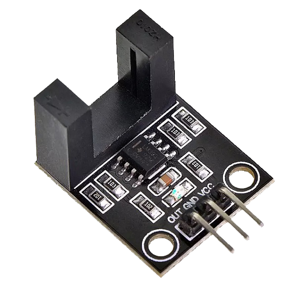
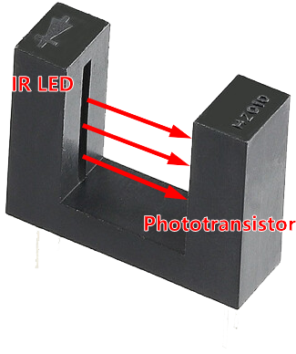
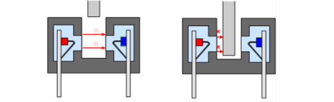
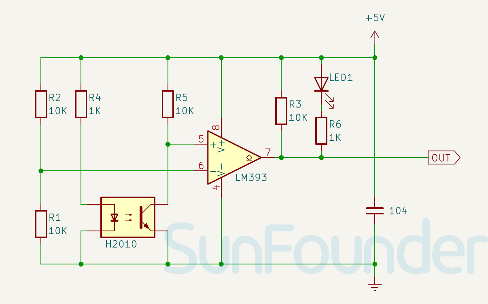

.. note::

    Hello, welcome to the SunFounder Raspberry Pi & Arduino & ESP32 Enthusiasts Community on Facebook! Dive deeper into Raspberry Pi, Arduino, and ESP32 with fellow enthusiasts.

    **Why Join?**

    - **Expert Support**: Solve post-sale issues and technical challenges with help from our community and team.
    - **Learn & Share**: Exchange tips and tutorials to enhance your skills.
    - **Exclusive Previews**: Get early access to new product announcements and sneak peeks.
    - **Special Discounts**: Enjoy exclusive discounts on our newest products.
    - **Festive Promotions and Giveaways**: Take part in giveaways and holiday promotions.

    👉 Ready to explore and create with us? Click [|link_sf_facebook|] and join today!

.. _cpn_speed:

Infrared Speed Sensor Module
=====================================

The Infrared Speed Sensor Module is an IR counter that has an IR transmitter and receiver. If any obstacle is placed between these sensors, a signal is sent to the microcontroller. The module can be used in association with a microcontroller for motor speed detection, pulse count, position limit, etc.

Pinout
---------------------------
* **VCC**: This is the positive power supply(3.3V or 5V) input from the main control.
* **GND**: Ground connection.
* **OUT**: Digital output. When the speed sensor is obstructed, it outputs a high level; when unobstructed, it outputs a low level.

Principle
---------------------------

The speed sensor module is mainly used to detect changes in rotational speed or velocity. When an object passes by the H2010 sensor, it generates a pulse signal. The integrated LM393 comparator inside the module compares this pulse signal with a preset threshold, producing a stable high-level output signal.

The Infrared Speed Sensor Module has 1 H2010 photocell, which consists of a phototransistor and an infrared light emitter packaged in a 10 cm wide black plastic housing.

When operating, the infrared light-emitting diode continuously emits infrared light (invisible light), and the photosensitive triode will conduct if it receives it.

.. raw:: html

    

Schematic diagram
---------------------------

.. raw:: html

    

Example
---------------------------
* :ref:`uno_lesson07_speed` (Arduino UNO)
* :ref:`esp32_lesson07_speed` (ESP32)
* :ref:`pico_lesson07_speed` (Raspberry Pi Pico)
* :ref:`pi_lesson07_speed` (Raspberry Pi)
