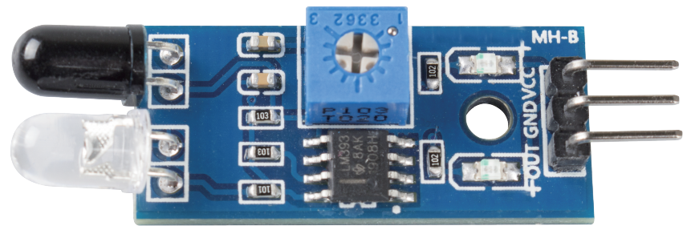
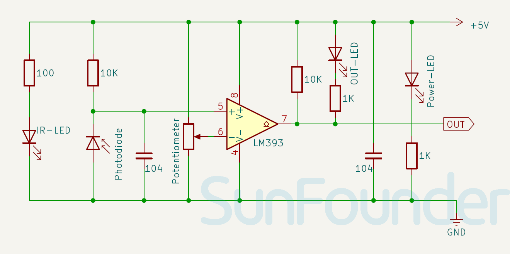

.. _cpn_ir_obstacle:

IR Obstacle Avoidance Sensor Module
=====================================

.. raw:: html

    

This module can adapt to ambient light and includes a pair of infrared emitting and receiving tubes. The emitting tube sends out infrared at a specific frequency, and when the detection direction encounters an obstacle (reflective surface), the receiving tube picks up the reflected infrared. After being processed by the comparator circuit, the green indicator light will turn on, and simultaneously, the signal output interface will produce a digital signal (a low level signal). The detection distance can be adjusted using a potentiometer knob.

Specification
---------------------------
* Supply Voltage: 3.3V - 5V
* PCB Size: 32 x 14mm
* Output Signal Type: Digital Output
* Detection Angle: 35°
* Detection distance: 2～30cm

Pinout
---------------------------
* **VCC**: This is the positive power supply input from the main control. 
* **GND**: Ground connection.
* **OUT**: Digital output. Outputs high level when there is no obstacle, and outputs low level when an obstacle is detected. The detection distance of obstacles can be adjusted by the potentiometer on the module.

Principle
---------------------------
An obstacle avoidance sensor mainly consists of an infrared transmitter, an infrared receiver and a potentiometer. According to the reflecting character of an object, if there is no obstacle, the emitted infrared ray will weaken with the distance it spreads and finally disappear. If there is an obstacle, when the infrared ray encounters it, the ray will be reflected back to the infrared receiver. Then the infrared receiver detects this signal and confirms an obstacle in front. The detection range can be adjusted by the built-in potentiometer.

.. image:: img/08_IR_obstacle_module_1.png
    :width: 600
    :align: center

.. raw:: html

    

Schematic diagram
---------------------------

.. raw:: html

    

Example
---------------------------
* :ref:`uno_lesson08_ir_obstacle_avoidance` (Arduino UNO)
* :ref:`esp32_lesson08_ir_obstacle_avoidance` (ESP32)
* :ref:`pico_lesson08_ir_obstacle_avoidance` (Raspberry Pi Pico)
* :ref:`pi_lesson08_ir_obstacle_avoidance` (Raspberry Pi)

* :ref:`uno_lesson39_soap_dispenser` (Arduino UNO)
* :ref:`esp32_soap_dispenser` (ESP32)

