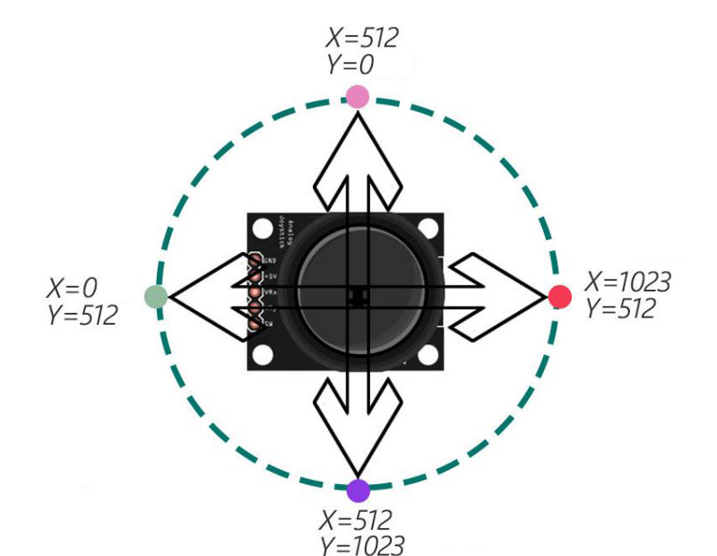
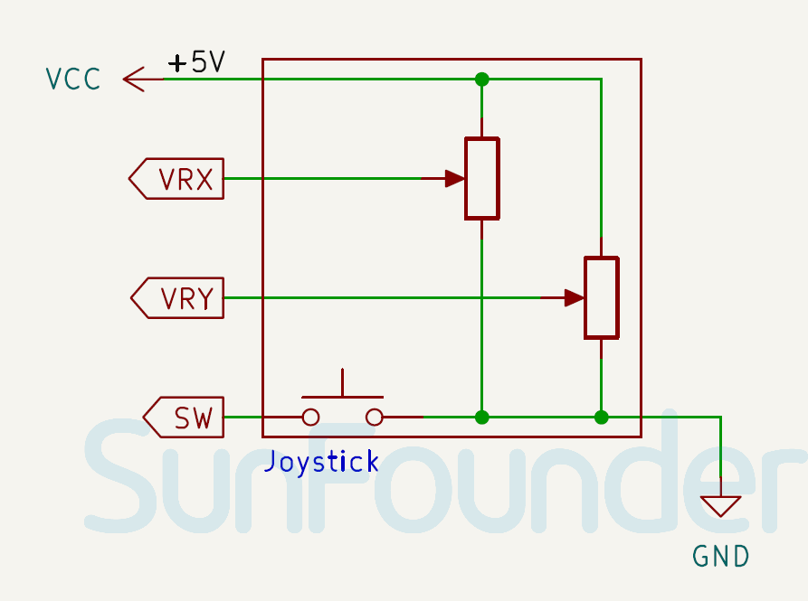

.. note::

    こんにちは、SunFounder Raspberry Pi & Arduino & ESP32 Enthusiasts Communityへようこそ！Facebook上で、仲間と一緒にRaspberry Pi、Arduino、ESP32をさらに深く探求しましょう。

    **なぜ参加するのか？**

    - **専門的なサポート**：購入後の問題や技術的な課題をコミュニティやチームの助けを借りて解決。
    - **学びと共有**：スキルを向上させるためのヒントやチュートリアルを交換。
    - **限定プレビュー**：新製品発表や予告編に早期アクセス。
    - **特別割引**：最新製品の特別割引を楽しむ。
    - **フェスティブプロモーションとプレゼント**：プレゼントやホリデープロモーションに参加。

    👉 私たちと一緒に探索と創造を始める準備はできましたか？[|link_sf_facebook|]をクリックして、今すぐ参加しましょう！

.. _cpn_joystick:

ジョイスティックモジュール
==========================

.. image:: img/09_joystick.png
    :width: 400
    :align: center

.. raw:: html

    

ジョイスティックモジュールは、ノブの動きを水平方向（X軸）および垂直方向（Y軸）の二方向で測定できるデバイスです。ジョイスティックモジュールは、ゲーム、ロボット、カメラなどのさまざまなものを制御するために使用できます。

仕様
---------------------------
* 供給電圧: 3.3Vまたは5V
* PCBサイズ: 34 x 26mm
* 出力信号タイプ: DOとAO
* アナログ出力: X、Y、2軸アナログ出力
* デジタル出力: Z、デジタル出力

ピン配置
---------------------------
* **+5V**: メインコントローラからの正電源入力。
* **GND**: グランド接続。
* **VRX**: アナログ出力。X軸のアナログ出力電圧。ジョイスティックを左右に動かすと、出力電圧が0からVCCまで変化します。ジョイスティックが中央位置（アイドル状態）にあるとき、約VCCの半分を読み取ります。
* **VRY**: アナログ出力。Y軸のアナログ出力電圧。ジョイスティックを上下に動かすと、出力電圧が0からVCCまで変化します。ジョイスティックが中央位置（休止状態）にあるとき、約VCCの半分を読み取ります。
* **SW**: デジタル出力。プッシュボタンスイッチはデフォルトで浮動信号を出力します。

.. tip::
    プッシュボタンスイッチを読み取るには、プルアップ抵抗が必要です。ジョイスティックのノブを押すと、スイッチ出力はLOWになり、押されていないときはHIGHのままです。スイッチに接続された入力ピンには、内部プルアップを有効にするか、外部プルアップ抵抗を接続してください。

原理
---------------------------
ジョイスティックは、二つのポテンショメータ（通常は10キロオーム）の抵抗変化に基づいて動作します。X方向およびY方向の抵抗を変えることで、Arduinoは異なる電圧を受信し、それをXおよびY座標として解釈します。プロセッサは、ジョイスティックのアナログ値をデジタル値に変換し、必要な処理を行うためにADCユニットを必要とします。

Arduinoボードには6つの10ビットADCチャネルがあります。これは、Arduinoの基準電圧（5ボルト）が1024セグメントに分割されることを意味します。ジョイスティックがX軸に沿って移動すると、ADC値は0から1023まで上昇し、中央値は512です。以下の画像は、ジョイスティックの位置に基づくADCの概算値を示しています。

回路図
---------------------------

.. raw:: html

    

例
---------------------------

* :ref:`uno_lesson09_joystick` (Arduino UNO)
* :ref:`esp32_lesson09_joystick` (ESP32)
* :ref:`pico_lesson09_joystick` (Raspberry Pi Pico)
* :ref:`pi_lesson09_joystick` (Raspberry)

