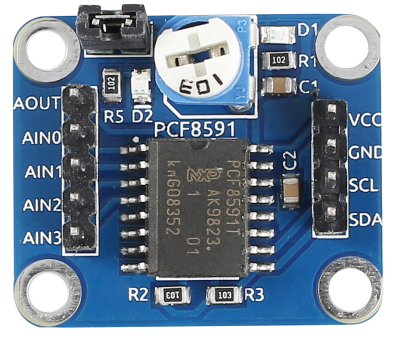
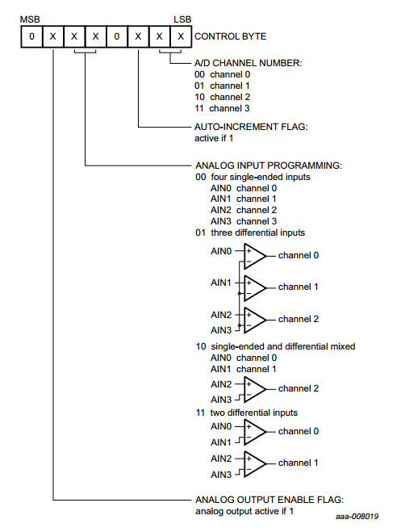
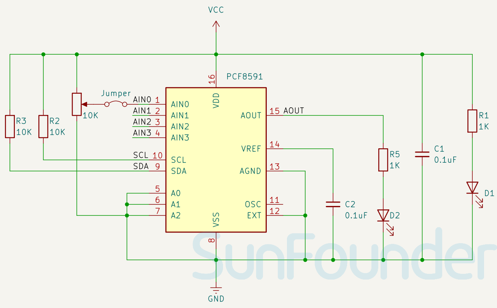

.. note::

    こんにちは、SunFounder Raspberry Pi & Arduino & ESP32 Enthusiasts Communityへようこそ！Facebook上で、仲間と一緒にRaspberry Pi、Arduino、ESP32をさらに深く探求しましょう。

    **なぜ参加するのか？**

    - **専門的なサポート**：購入後の問題や技術的な課題をコミュニティやチームの助けを借りて解決。
    - **学びと共有**：スキルを向上させるためのヒントやチュートリアルを交換。
    - **限定プレビュー**：新製品発表や予告編に早期アクセス。
    - **特別割引**：最新製品の特別割引を楽しむ。
    - **フェスティブプロモーションとプレゼント**：プレゼントやホリデープロモーションに参加。

    👉 私たちと一緒に探索と創造を始める準備はできましたか？[|link_sf_facebook|]をクリックして、今すぐ参加しましょう！

.. _cpn_pcf8591:
PCF8591 ADC DACコンバータモジュール
=====================================

.. raw:: html

    

PCF8591は、4つのアナログ入力、1つのアナログ出力、およびシリアルI2Cバスインターフェースを備えたシングルチップ、シングルサプライの低消費電力8ビットCMOSデータ取得デバイスです。ハードウェアアドレスをプログラムするためにA0、A1、A2の3つのアドレスピンが使用され、追加のハードウェアなしでI2Cバスに接続された最大8台のデバイスの使用を可能にします。アドレス、制御、データの送受信は、双方向の2線式I2Cバスを介してシリアルで行われます。

このデバイスの機能には、アナログ入力の多重化、オンチップのトラックおよびホールド機能、8ビットのアナログ-デジタル変換および8ビットのデジタル-アナログ変換が含まれます。最大変換速度はI2Cバスの最大速度によって決まります。

原理
---------------------------

**アドレッシング:**

I2Cバスシステム内の各PCF8591デバイスは、有効なアドレスをデバイスに送信することでアクティブになります。アドレスは固定部分とプログラム可能部分で構成されています。プログラム可能部分は、アドレスピンA0、A1、A2に従って設定する必要があります。アドレスは常にI2Cバスプロトコルの開始条件の後に最初のバイトとして送信されます。アドレスバイトの最後のビットは、データ転送の方向を設定する読み取り/書き込みビットです（下図参照）。

.. image:: img/10_pcf8591_addressing.png
   :width: 60%

**制御バイト:**

PCF8591デバイスに送信される2番目のバイトは、その制御レジスタに保存され、デバイス機能を制御するために必要です。制御レジスタの上位ニブルはアナログ出力を有効にするため、およびアナログ入力をシングルエンドまたは差動入力としてプログラムするために使用されます。下位ニブルは、上位ニブルで定義されたアナログ入力チャネルの1つを選択します。自動インクリメントフラグが設定されている場合、各A/D変換後にチャネル番号が自動的にインクリメントされます。下図を参照してください。

.. _cpn_pcf8591_sch:

回路図
---------------------------

.. raw:: html

    

例
---------------------------

* :ref:`uno_lesson10_pcf8591` (Arduino UNO)
* :ref:`esp32_lesson10_pcf8591` (ESP32)
* :ref:`pico_lesson10_pcf8591` (Raspberry Pi Pico)
* :ref:`pi_lesson10_pcf8591` (Raspberry Pi)

* :ref:`pi_lesson02_soil_moisture` (Raspberry Pi)
* :ref:`pi_lesson09_joystick` (Raspberry Pi)
* :ref:`pi_lesson11_photoresistor` (Raspberry Pi)
* :ref:`pi_lesson13_potentiometer` (Raspberry Pi)
* :ref:`pi_lesson25_water_level` (Raspberry Pi)
