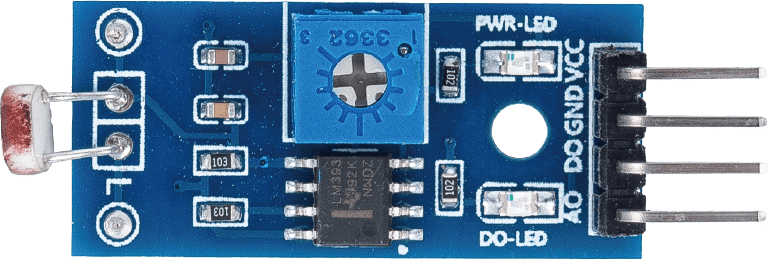
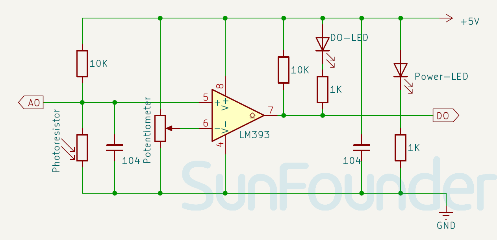

.. note::

   Hallo und willkommen in der SunFounder Raspberry Pi & Arduino & ESP32 Enthusiasten-Gemeinschaft auf Facebook! Tauchen Sie tiefer ein in die Welt von Raspberry Pi, Arduino und ESP32 mit anderen Enthusiasten.

   **Warum beitreten?**

   - **Expertenunterstützung**: Lösen Sie Nachverkaufsprobleme und technische Herausforderungen mit Hilfe unserer Gemeinschaft und unseres Teams.
   - **Lernen & Teilen**: Tauschen Sie Tipps und Anleitungen aus, um Ihre Fähigkeiten zu verbessern.
   - **Exklusive Vorschauen**: Erhalten Sie frühzeitigen Zugang zu neuen Produktankündigungen und exklusiven Einblicken.
   - **Spezialrabatte**: Genießen Sie exklusive Rabatte auf unsere neuesten Produkte.
   - **Festliche Aktionen und Gewinnspiele**: Nehmen Sie an Gewinnspielen und Feiertagsaktionen teil.

   👉 Sind Sie bereit, mit uns zu erkunden und zu erschaffen? Klicken Sie auf [|link_sf_facebook|] und treten Sie heute bei!

.. _cpn_photoresistor:

Fotowiderstandsmodul
==========================

.. raw:: html

    

Das Fotowiderstandsmodul ist ein Gerät, das die Lichtintensität in der Umgebung erkennen kann. Es kann für verschiedene Zwecke verwendet werden, wie z.B. zur Anpassung der Helligkeit eines Geräts, zur Erkennung von Tag und Nacht oder zum Aktivieren eines Lichtschalters.

Ein wichtiger Bestandteil des Fotowiderstandsmoduls ist der Fotowiderstand. Ein Fotowiderstand ist ein lichtgesteuerter variabler Widerstand. Der Widerstand eines Fotowiderstands nimmt mit zunehmender Lichtintensität ab; mit anderen Worten, er zeigt Photoleitfähigkeit.

Ein Fotowiderstand kann in lichtempfindlichen Detektorschaltungen und licht- und dunkelaktivierten Schaltungen als Widerstandshalbleiter verwendet werden. Im Dunkeln kann ein Fotowiderstand einen Widerstand von mehreren Megaohm (MΩ) haben, während er im Licht einen Widerstand von nur wenigen hundert Ohm haben kann.

Hier ist das elektronische Symbol des Fotowiderstands.

.. image:: img/11_photoresistor_symbol_2.png
    :width: 200
    :align: center

Spezifikation
---------------------------
* Versorgungsspannung: 3,3V - 5V
* PCB-Größe: 32 x 14mm
* Ausgangssignaltyp: DO und AO

Pinbelegung
---------------------------
* **VCC**: Dies ist der positive Stromeingang von der Hauptsteuerung.
* **GND**: Masseanschluss.
* **DO**: Digitalausgang. Wenn die Lichtintensität den Schwellenwert (eingestellt durch das Potentiometer) überschreitet, wird D0 LOW; andernfalls bleibt es HIGH.
* **AO**: Analogausgang. Je stärker das Licht, desto niedriger der Ausgangswert; umgekehrt, je schwächer das Licht, desto höher der Ausgangswert.

Funktionsprinzip
---------------------------
Das Fotowiderstandsmodul arbeitet nach dem Prinzip der Widerstandsänderung in Reaktion auf unterschiedliche Lichtintensitäten. Der Sensor verfügt über ein eingebautes Potentiometer, das den Schwellenwert des digitalen Ausgangs (D0) des Sensors einstellt.

Schaltplan
---------------------------

.. raw:: html

    

Beispiel
---------------------------
* :ref:`uno_lesson11_photoresistor` (Arduino UNO)
* :ref:`esp32_lesson11_photoresistor` (ESP32)
* :ref:`pico_lesson11_photoresistor` (Raspberry Pi Pico)
* :ref:`pi_lesson11_photoresistor` (Raspberry Pi)
