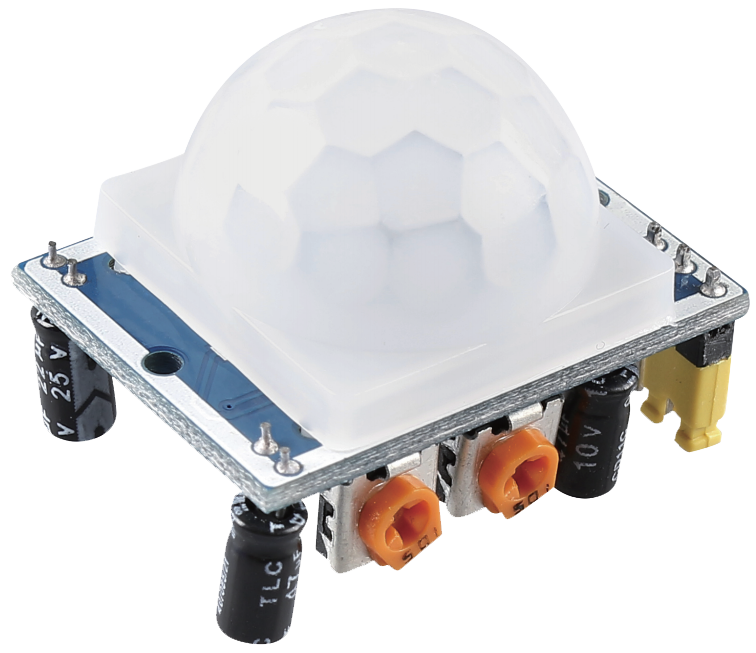

.. note::

    こんにちは、SunFounder Raspberry Pi & Arduino & ESP32 Enthusiasts Communityへようこそ！Facebook上で、仲間と一緒にRaspberry Pi、Arduino、ESP32をさらに深く探求しましょう。

    **なぜ参加するのか？**

    - **専門的なサポート**：購入後の問題や技術的な課題をコミュニティやチームの助けを借りて解決。
    - **学びと共有**：スキルを向上させるためのヒントやチュートリアルを交換。
    - **限定プレビュー**：新製品発表や予告編に早期アクセス。
    - **特別割引**：最新製品の特別割引を楽しむ。
    - **フェスティブプロモーションとプレゼント**：プレゼントやホリデープロモーションに参加。

    👉 私たちと一緒に探索と創造を始める準備はできましたか？[|link_sf_facebook|]をクリックして、今すぐ参加しましょう！

.. _cpn_pir_motion:

PIRモーションモジュール (HC-SR501)
=====================================

受動赤外線（PIR）モーションセンサーは、動きを検出するセンサーです。セキュリティシステムや自動照明システムで一般的に使用されています。センサーには赤外線を検出する2つのスロットがあります。人などの物体がセンサーの前を通過すると、赤外線の量の変化を検出し、出力信号をトリガーします。

仕様
---------------------------
* 供給電圧: 5V〜20V
* 出力: デフォルトは低レベル; 誰かが通過すると高レベルになります。
* 遅延時間: 5〜200秒（調整可能）
* ブロッキング時間: 8秒
* 検出範囲: <120°、7メートル以内（調整可能）
* トリガーモード: L 非再トリガーモード、H 再トリガーモード
* PCBサイズ: 32 x 24mm
* レンズサイズ: 23mm
* 動作温度: -15〜+70℃

ピン配置
---------------------------
* **VCC**: メインコントローラからの正電源入力。
* **GND**: グランド接続。
* **DO**: デジタル出力。デフォルトは低レベル; 誰かが通過すると高レベルになります。

原理
---------------------------
PIRセンサーは差動増幅器に接続された2つのスロットに分かれています。センサーの前に静止した物体がある場合、2つのスロットは同じ量の放射を受け取り、出力はゼロになります。センサーの前に動く物体がある場合、1つのスロットがもう1つより多くの放射を受け取り、出力が高低に変動します。この出力電圧の変化は、動きの検出結果です。

.. image:: img/12_pir_working_principle.jpg
    :width: 500
    :align: center

センサーモジュールが配線された後、1分間の初期化が行われます。初期化中、モジュールは0〜3回の間隔で出力します。その後、モジュールは待機モードになります。干渉信号による誤動作を避けるために、モジュールの表面から光源やその他の干渉源を遠ざけてください。風もセンサーに干渉する可能性があるため、できるだけ風の少ない環境でモジュールを使用してください。

.. image:: img/12_pir_module_back.png
    :width: 350
    :align: center

.. raw:: html

      

距離調整
^^^^^^^^^^^^^^^^^^^^
距離調整用ポテンショメータのノブを時計回りに回すと、検出距離の範囲が広がり、最大検出距離は約0〜7メートルです。反時計回りに回すと、検出距離の範囲が狭まり、最小検出距離は約0〜3メートルです。

遅延調整
^^^^^^^^^^^^^^^^^^^^
遅延調整用ポテンショメータのノブを時計回りに回すと、検出遅延が増加します。最大遅延は300秒に達します。逆に反時計回りに回すと、最小5秒まで遅延を短縮できます。

二つのトリガーモード
^^^^^^^^^^^^^^^^^^^^
ジャンパーキャップを使用して異なるモードを選択します。

* H: 再トリガーモード。人間の身体を検出すると、モジュールは高レベルを出力します。遅延期間中に誰かが検出範囲に入ると、出力は高レベルのまま維持されます。
* L: 非再トリガーモード。人間の身体を検出すると、高レベルを出力します。遅延後、出力は自動的に高レベルから低レベルに変わります。

例
---------------------------

* :ref:`uno_lesson12_pir_motion` (Arduino UNO)
* :ref:`esp32_lesson12_pir_motion` (ESP32)
* :ref:`pico_lesson12_pir_motion` (Raspberry Pi Pico)
* :ref:`pi_lesson12_pir_motion` (Raspberry Pi)

* :ref:`uno_lesson40_motion_triggered_relay` (Arduino UNO)
* :ref:`uno_iot_intrusion_alert_system` (Arduino UNO)
* :ref:`esp32_motion_triggered_relay` (ESP32)
* :ref:`esp32_iot_intrusion_alert_system` (ESP32)