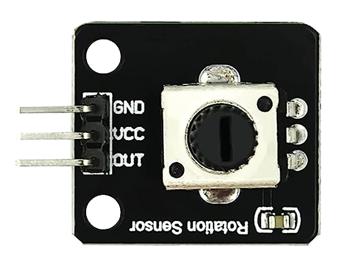
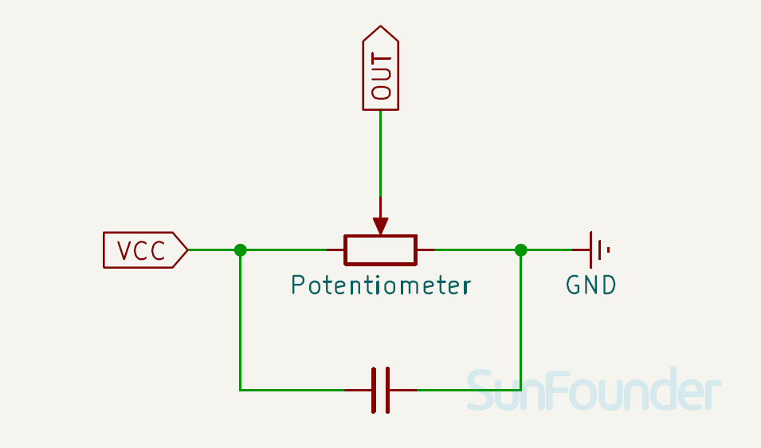

.. note::

    Hello, welcome to the SunFounder Raspberry Pi & Arduino & ESP32 Enthusiasts Community on Facebook! Dive deeper into Raspberry Pi, Arduino, and ESP32 with fellow enthusiasts.

    **Why Join?**

    - **Expert Support**: Solve post-sale issues and technical challenges with help from our community and team.
    - **Learn & Share**: Exchange tips and tutorials to enhance your skills.
    - **Exclusive Previews**: Get early access to new product announcements and sneak peeks.
    - **Special Discounts**: Enjoy exclusive discounts on our newest products.
    - **Festive Promotions and Giveaways**: Take part in giveaways and holiday promotions.

    👉 Ready to explore and create with us? Click [|link_sf_facebook|] and join today!

.. _cpn_potentiometer:

Potentiometer Module
==========================

.. raw:: html

    

The potentiometer module is an electronic component that changes its resistance depending on the position of the twist knob.It can be used for various purposes, such as controlling the volume of a speaker, the brightness of a LED, or the speed of a motor.

Pinout
---------------------------
* **VCC**: This is the positive power supply input from the main control. 
* **GND**: Ground connection.
* **AO**: Analog output. 

Principle
---------------------------
Potentiometer is also a resistance component with 3 terminals and its resistance value can be adjusted according to some regular variation.

Potentiometers come in various shapes, sizes, and values, but they all have the following things in common:

- They have three terminals (or connection points).
- They have a knob, screw, or slider that can be moved to vary the resistance between the middle terminal and either one of the outer terminals.
- The resistance between the middle terminal and either one of the outer terminals varies from 0 Ω to the maximum resistance of the pot as the knob, screw, or slider is moved.

Here is the circuit symbol of potentiometer.

.. image:: img/13_potentiometer_symbol_2.png
    :width: 200
    :align: center

The functions of the potentiometer in the circuit are as follows:

#. Serving as a voltage divider
    Potentiometer is a continuously adjustable resistor. When you adjust the shaft or sliding handle of the potentiometer, the movable contact will slide on the resistor. At this point, a voltage can be output depending on the voltage applied onto the potentiometer and the angle the movable arm has rotated to or the travel it has made.

#. Serving as a rheostat
    When the potentiometer is used as a rheostat, connect the middle pin and one of the other 2 pins in the circuit. Thus you can get a smoothly and continuously changed resistance value within the travel of the moving contact.

#. Serving as a current controller
    When the potentiometer acts as a current controller, the sliding contact terminal must be connected as one of the output terminals.

Schematic diagram
---------------------------

.. raw:: html

    

Example
---------------------------
* :ref:`uno_lesson13_potentiometer` (Arduino UNO)
* :ref:`esp32_lesson13_potentiometer` (ESP32)
* :ref:`pico_lesson13_potentiometer` (Raspberry Pi Pico)
* :ref:`pi_lesson13_potentiometer` (Raspberry Pi)

* :ref:`uno_potentiometer_scale_value` (Arduino UNO)
* :ref:`esp32_potentiometer_scale_value` (ESP32)