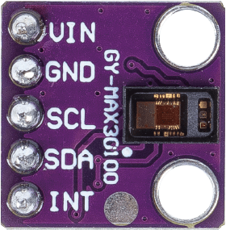

.. note::

    Hello, welcome to the SunFounder Raspberry Pi & Arduino & ESP32 Enthusiasts Community on Facebook! Dive deeper into Raspberry Pi, Arduino, and ESP32 with fellow enthusiasts.

    **Why Join?**

    - **Expert Support**: Solve post-sale issues and technical challenges with help from our community and team.
    - **Learn & Share**: Exchange tips and tutorials to enhance your skills.
    - **Exclusive Previews**: Get early access to new product announcements and sneak peeks.
    - **Special Discounts**: Enjoy exclusive discounts on our newest products.
    - **Festive Promotions and Giveaways**: Take part in giveaways and holiday promotions.

    👉 Ready to explore and create with us? Click [|link_sf_facebook|] and join today!

.. _cpn_max30102:

Pulse Oximeter and Heart Rate Sensor Module (MAX30102)
===============================================================

.. raw:: html

    

The MAX30102 is an advanced sensor module designed for tracking heart rate and blood oxygen levels (SpO2). Manufactured by Maxim Integrated, it combines pulse oximetry and heart rate monitoring into a compact package, making it a popular choice for wearable health and fitness applications.

Specification
---------------------------
* Chip Type: MAX30102
* LED Peak Wavelength: 660nm/880nm
* Supply Voltage: 3.3V or 5V; 
* Detection Signal Type: Optical Reflection Signal (PPG)
* Output Signal Interface: I2C Interface
* PCB size: 14 x 14mm
* Working temperature: -40 ~ +85℃

Pinout
---------------------------
* **VCC**: This is the positive power supply input from the main control. 
* **GND**: Ground connection.
* **SCL**: serial clock pin for the I2C interface.
* **SDA**: serial data pin for the I2C interface.
* **INT**: the Interrupt pin of the IC. 

Principle
---------------------------

MAX30102 is a sensor that combines a pulse oximeter and a heart rate monitor. It's an optical sensor that measures the absorbance of pulsating blood through a photodetector after emitting two wavelengths of light from two LEDs - a red and an infrared one. This particular LED colour combination is designed to allow data to be read with the tip of one's finger.

The MAX30102 works by shining both lights onto the finger or earlobe (or essentially anywhere where the skin isn’t too thick, so both lights can easily penetrate the tissue) and measuring the amount of reflected light using a photodetector. This method of pulse detection through light is called Photoplethysmogram.

The working of MAX30102 can be divided into two parts: Heart Rate Measurement and Pulse Oximetry (measuring the oxygen level of the blood).

Heart Rate Measurement
^^^^^^^^^^^^^^^^^^^^^^^^^^
The oxygenated hemoglobin (HbO2) in the arterial blood has the characteristic of absorbing IR light. The redder the blood (the higher the hemoglobin), the more IR light is absorbed. As the blood is pumped through the finger with each heartbeat, the amount of reflected light changes, creating a changing waveform at the output of the photodetector. As you continue to shine light and take photodetector readings, you quickly start to get a heart-beat (HR) pulse reading.

Pulse Oximetry
^^^^^^^^^^^^^^^^^^^^
Pulse oximetry is based on the principle that the amount of RED and IR light absorbed varies depending on the amount of oxygen in your blood.    

Example
---------------------------
* :ref:`uno_lesson14_max30102` (Arduino UNO)
* :ref:`esp32_lesson14_max30102` (ESP32)
* :ref:`pico_lesson14_max30102` (Raspberry Pi Pico)
* :ref:`pi_lesson14_max30102` (Raspberry Pi)

* :ref:`uno_lesson41_heartrate_monitor` (Arduino UNO)
* :ref:`esp32_heartrate_monitor` (ESP32)