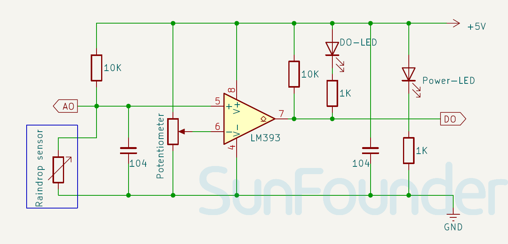

.. _cpn_raindrop:

Raindrop Detection Module
==========================

.. image:: img/15_raindrop_detection_module.png
    :width: 400
    :align: center

The Raindrop Detection Sensor Module is a weather sensor that detects rainfall presence and intensity. It includes a raindrop sensor board with printed tracks, usually paired with a comparator module. When raindrops hit the sensor board, they create a conductive path between tracks, changing the resistance. This change is then converted into an analog or digital signal to show the rainfall intensity.

Specification
---------------------------
* Supply Voltage: 3.3V - 5V
* PCB Size: 32 x 14mm
* Output Signal Type: DO and AO

Pinout
---------------------------
* **VCC**: This is the positive power supply input from the main control. 
* **GND**: Ground connection.
* **DO**: Digital output. Outputs a low level when raindrops are detected, and a high level when dry.
* **AO**: Analog output. The more rainwater, the smaller the analog output value.

Principle
---------------------------
Raindrop sensor is basically a board on which nickel is coated in the form of lines. It works on the principal of resistance. When there is no rain drop on board. Resistance is high so we gets high voltage according to V=IR. When rain drop present it reduces the resistance because water is conductor of electricity and presence of water connects nickel lines in parallel so reduced resistance and reduced voltage drop across it. The more intense the rainfall the lower the resistance.

Schematic diagram
---------------------------

.. raw:: html

    

Example
---------------------------
* :ref:`uno_lesson15_raindrop` (Arduino UNO)
* :ref:`esp32_lesson15_raindrop` (ESP32)
* :ref:`pico_lesson15_raindrop` (Raspberry Pi Pico)
* :ref:`pi_lesson15_raindrop` (Raspberry Pi)
