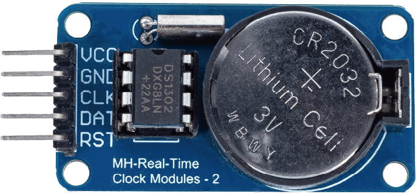
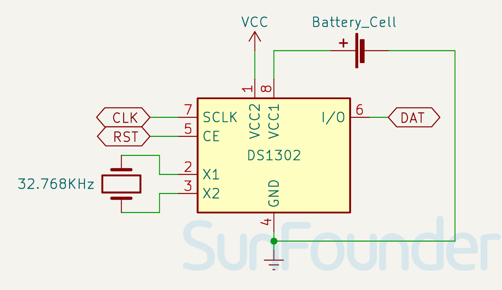

 .. note::

    Hallo und willkommen in der SunFounder Raspberry Pi & Arduino & ESP32 Enthusiasten-Gemeinschaft auf Facebook! Tauchen Sie tiefer ein in die Welt von Raspberry Pi, Arduino und ESP32 mit anderen Enthusiasten.

    **Warum beitreten?**

    - **Expertenunterstützung**: Lösen Sie Nachverkaufsprobleme und technische Herausforderungen mit Hilfe unserer Gemeinschaft und unseres Teams.
    - **Lernen & Teilen**: Tauschen Sie Tipps und Anleitungen aus, um Ihre Fähigkeiten zu verbessern.
    - **Exklusive Vorschauen**: Erhalten Sie frühzeitigen Zugang zu neuen Produktankündigungen und exklusiven Einblicken.
    - **Spezialrabatte**: Genießen Sie exklusive Rabatte auf unsere neuesten Produkte.
    - **Festliche Aktionen und Gewinnspiele**: Nehmen Sie an Gewinnspielen und Feiertagsaktionen teil.

    👉 Sind Sie bereit, mit uns zu erkunden und zu erschaffen? Klicken Sie auf [|link_sf_facebook|] und treten Sie heute bei!

.. _cpn_rtc_ds1302:

Echtzeituhr-Modul (DS1302)
=====================================

.. raw:: html

    

Das DS1302-Modul ist ein Echtzeituhr (RTC)-Modul, das Jahre, Monate, Tage, Wochentage, Stunden, Minuten und Sekunden verfolgen kann. Es kann auch Schaltjahre anpassen. Es ist nützlich für Projekte, die präzises Timing und Zeitplanung erfordern.

Spezifikation
---------------------------
* Versorgungsspannung: 3,3V - 5V
* PCB-Größe: 44 x 23mm
* Uhr-IC: DS1302
* Betriebstemperatur: 0℃ - 70℃

Pinbelegung
---------------------------
* **VCC**: Modulstromversorgung
* **GND**: Masse
* **CLK**: Taktpin
* **DAT**: Datenpin
* **RST**: Reset-Pin

Schaltplan
---------------------------

.. raw:: html

    

Beispiel
---------------------------
* :ref:`uno_lesson16_ds1306` (Arduino UNO)
* :ref:`esp32_lesson16_ds1306` (ESP32)
* :ref:`pico_lesson16_ds1306` (Raspberry Pi Pico)
