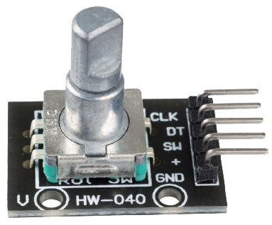
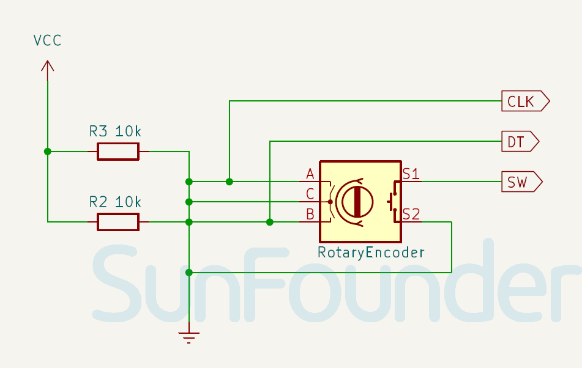

 .. note::

    Hallo und willkommen in der SunFounder Raspberry Pi & Arduino & ESP32 Enthusiasten-Gemeinschaft auf Facebook! Tauchen Sie tiefer ein in die Welt von Raspberry Pi, Arduino und ESP32 mit anderen Enthusiasten.

    **Warum beitreten?**

    - **Expertenunterstützung**: Lösen Sie Nachverkaufsprobleme und technische Herausforderungen mit Hilfe unserer Gemeinschaft und unseres Teams.
    - **Lernen & Teilen**: Tauschen Sie Tipps und Anleitungen aus, um Ihre Fähigkeiten zu verbessern.
    - **Exklusive Vorschauen**: Erhalten Sie frühzeitigen Zugang zu neuen Produktankündigungen und exklusiven Einblicken.
    - **Spezialrabatte**: Genießen Sie exklusive Rabatte auf unsere neuesten Produkte.
    - **Festliche Aktionen und Gewinnspiele**: Nehmen Sie an Gewinnspielen und Feiertagsaktionen teil.

    👉 Sind Sie bereit, mit uns zu erkunden und zu erschaffen? Klicken Sie auf [|link_sf_facebook|] und treten Sie heute bei!

.. _cpn_rotary_encoder:

Drehgeber-Modul
=====================================

.. raw:: html

    

Ein Drehgeber ist ein Positionssensor, der die Drehung eines Knopfes in ein Ausgangssignal umwandelt und die Drehrichtung anzeigt.

Drehgeber sind digitale Versionen von Potentiometern und bieten eine größere Vielseitigkeit. Sie können kontinuierlich drehen, während Potentiometer eine begrenzte Drehung haben. Potentiometer zeigen die genaue Position des Knopfes an, während Drehgeber Positionsänderungen anzeigen.

Pinbelegung
---------------------------
* **VCC**: Positive Stromversorgung vom Hauptsteuergerät.
* **GND**: Masseverbindung.
* **SW**: Digitaler Ausgang.
* **CLK**: Ähnlich wie der CLK-Ausgang, aber mit einer Phasenverschiebung von 90°. Dieser Ausgang wird verwendet, um die Drehrichtung zu bestimmen.
* **DT**: Der primäre Ausgangsimpuls zur Bestimmung der Drehmenge. Jedes Mal, wenn der Knopf in eine der beiden Richtungen um einen Rastpunkt (Klick) gedreht wird, durchläuft der 'CLK'-Ausgang einen Zyklus von HIGH zu LOW.

Funktionsprinzip
---------------------------

Inkrementale Encoder erzeugen zwei Phasenrechtecksignale mit einem Phasenunterschied von 90 Grad, die üblicherweise als A- und B-Kanal bezeichnet werden.

Wie unten dargestellt, wenn der Kanal A von einem hohen Pegel auf einen niedrigen Pegel wechselt, und der Kanal B sich auf einem hohen Pegel befindet, zeigt dies an, dass der Drehgeber im Uhrzeigersinn (CW) dreht; befindet sich der Kanal B in diesem Moment auf einem niedrigen Pegel, bedeutet dies, dass die Drehung gegen den Uhrzeigersinn (CCW) erfolgt. Daher kann durch Ablesen des Werts von Kanal B, wenn Kanal A auf einem niedrigen Pegel ist, die Drehrichtung des Drehgebers bestimmt werden.

.. image:: img/17_rotary_encoder_wave.png
    :width: 60%
    :align: center

Schaltplan
---------------------------

.. raw:: html

    

Beispiel
---------------------------
* :ref:`uno_lesson17_rotary_encoder` (Arduino UNO)
* :ref:`esp32_lesson17_rotary_encoder` (ESP32)
* :ref:`pico_lesson17_rotary_encoder` (Raspberry Pi Pico)
* :ref:`pi_lesson17_rotary_encoder` (Raspberry Pi)
