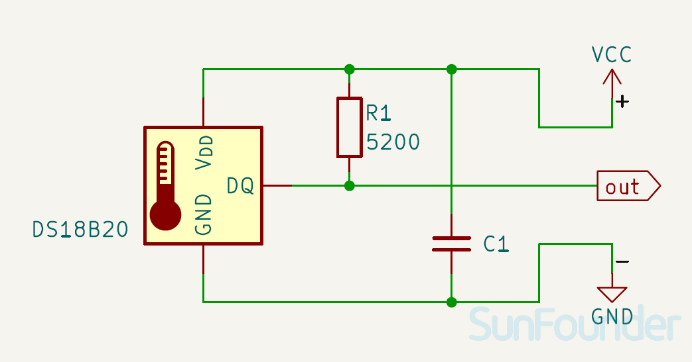

 .. note::

    Hallo und willkommen in der SunFounder Raspberry Pi & Arduino & ESP32 Enthusiasten-Gemeinschaft auf Facebook! Tauchen Sie tiefer ein in die Welt von Raspberry Pi, Arduino und ESP32 mit anderen Enthusiasten.

    **Warum beitreten?**

    - **Expertenunterstützung**: Lösen Sie Nachverkaufsprobleme und technische Herausforderungen mit Hilfe unserer Gemeinschaft und unseres Teams.
    - **Lernen & Teilen**: Tauschen Sie Tipps und Anleitungen aus, um Ihre Fähigkeiten zu verbessern.
    - **Exklusive Vorschauen**: Erhalten Sie frühzeitigen Zugang zu neuen Produktankündigungen und exklusiven Einblicken.
    - **Spezialrabatte**: Genießen Sie exklusive Rabatte auf unsere neuesten Produkte.
    - **Festliche Aktionen und Gewinnspiele**: Nehmen Sie an Gewinnspielen und Feiertagsaktionen teil.

    👉 Sind Sie bereit, mit uns zu erkunden und zu erschaffen? Klicken Sie auf [|link_sf_facebook|] und treten Sie heute bei!

.. _cpn_ds18b20:

Temperatursensormodul (DS18B20)
===============================================

.. image:: img/18_ds18b20_module.png
    :width: 300
    :align: center

.. raw:: html

    

Der DS18B20 ist ein digitaler Temperatursensor, der Temperaturen im Bereich von -55°C bis +125°C mit einer Genauigkeit von ±0,5°C messen kann. Er verwendet das Single-Wire-Protokoll und kann mit nur einem Pin mit einem Mikrocontroller kommunizieren. Der Sensor kann direkt über die Datenleitung mit Strom versorgt werden, wodurch eine externe Stromversorgung überflüssig wird. Anwendungsbereiche des DS18B20-Temperatursensors umfassen Industriesysteme, Verbraucherprodukte, thermisch empfindliche Systeme, thermostatische Steuerungen und Thermometer.

Spezifikation
---------------------------
* PCB-Größe: 13 x 27,9mm
* Stromversorgung: 3V bis 5,5V
* Temperaturbereich: -55 bis 125°C
* Genauigkeit: ±0,5°C
* Auflösung: 9 bis 12 Bit (wählbar)

Pinbelegung
---------------------------
* **VCC**: Dies ist der positive Stromeingang von der Hauptsteuerung.
* **GND**: Masseanschluss.
* **OUT**: Der 1-Wire-Datenbus, der mit einem digitalen Pin des Mikrocontrollers verbunden werden sollte.

Schaltplan
---------------------------

.. raw:: html

    

Beispiel
---------------------------
* :ref:`uno_lesson18_ds18b20` (Arduino UNO)
* :ref:`esp32_lesson18_ds18b20` (ESP32)
* :ref:`pico_lesson18_ds18b20` (Raspberry Pi Pico)
* :ref:`pi_lesson18_ds18b20` (Raspberry Pi)
