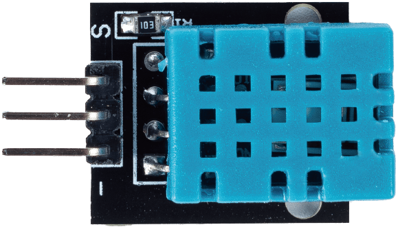
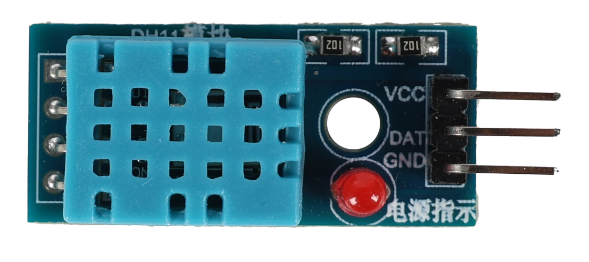
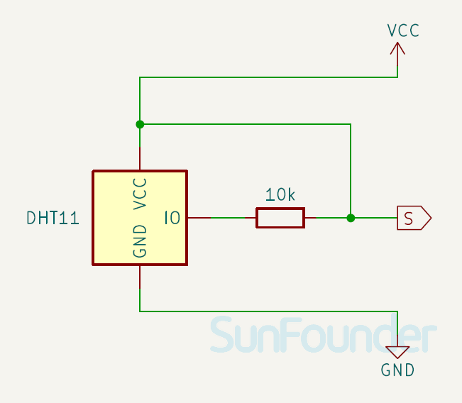
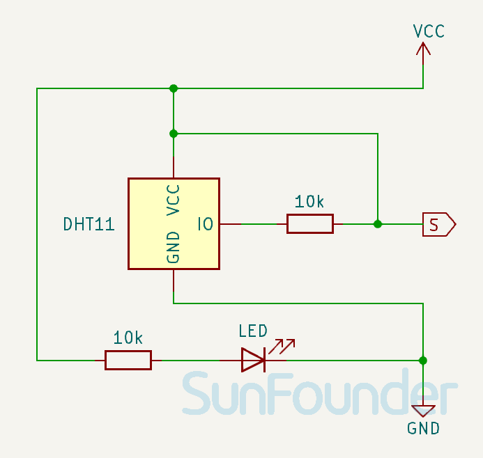

.. note::

    こんにちは、SunFounder Raspberry Pi & Arduino & ESP32 Enthusiasts Communityへようこそ！Facebook上で、仲間と一緒にRaspberry Pi、Arduino、ESP32をさらに深く探求しましょう。

    **なぜ参加するのか？**

    - **専門的なサポート**：購入後の問題や技術的な課題をコミュニティやチームの助けを借りて解決。
    - **学びと共有**：スキルを向上させるためのヒントやチュートリアルを交換。
    - **限定プレビュー**：新製品発表や予告編に早期アクセス。
    - **特別割引**：最新製品の特別割引を楽しむ。
    - **フェスティブプロモーションとプレゼント**：プレゼントやホリデープロモーションに参加。

    👉 私たちと一緒に探索と創造を始める準備はできましたか？[|link_sf_facebook|]をクリックして、今すぐ参加しましょう！

.. _cpn_dht11:

温度湿度センサーモジュール (DHT11)
================================================

.. raw:: html

    

デジタル温度湿度センサーDHT11は、温度と湿度の校正されたデジタル信号出力を含む複合センサーです。専用のデジタルモジュール収集技術と温度湿度感知技術を適用することで、高い信頼性と優れた長期安定性を確保しています。

仕様
---------------------------
* 供給電圧: 3.3V - 5V
* 出力信号タイプ: デジタル出力
* 温度測定範囲: 0-50℃ ± 2℃
* 湿度測定範囲: 20-90%RH ± 5%RH
* 温度精度: ±2°C
* 湿度精度: ±5% RH

ピン配置
---------------------------
* **VCC**: メインコントローラからの正電源入力。
* **GND**: グランド接続。
* **S**: データピン、データ伝送に使用されます。

原理
---------------------------
使用できるピンはVCC、GND、およびDATAの3つのみです。通信プロセスは、DATAラインがDHT11にスタート信号を送信することから始まり、DHT11が信号を受信して応答信号を返します。その後、ホストが応答信号を受信し、40ビットの湿度と温度データ（8ビットの湿度整数 + 8ビットの湿度小数 + 8ビットの温度整数 + 8ビットの温度小数 + 8ビットのチェックサム）を受信し始めます。

.. image:: img/19_dht11_module_2.png
    :width: 300
    :align: center

.. raw:: html

     

回路図
---------------------------

.. csv-table:: 
   :widths: 30, 70

   |dht11_module|, |dht11_module_schematic|
   |dht11_module_withLED|, |dht11_module_withLED_schematic|

   

   

例
---------------------------

* :ref:`uno_lesson19_dht11` (Arduino UNO)
* :ref:`esp32_lesson19_dht11` (ESP32)
* :ref:`pico_lesson19_dht11` (Raspberry Pi Pico)
* :ref:`pi_lesson19_dht11` (Raspberry Pi)

* :ref:`uno_plant_monitor` (Arduino UNO)
* :ref:`esp32_plant_monitor` (ESP32)
* :ref:`esp32_adafruit_io` (ESP32)