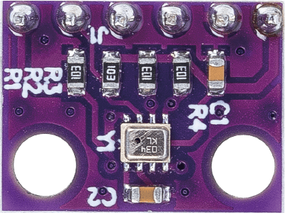

.. _cpn_bmp280:

Temperature, Humidity & Pressure Sensor (BMP280)
===============================================================

.. raw:: html
    
     

The BMP280, developed by Bosch Sensortec, is a high-precision, low-power digital sensor module for measuring barometric pressure and temperature. It is widely used in mobile devices, weather monitoring, altitude estimations, and various other applications that require accurate atmospheric pressure and temperature data due to its small size and superior performance.

Specification
---------------------------
* Supply Voltage: 3.3V or 5V
* PCB size: 15 x 11mm
* Working temperature range: -40 ~ +85℃
* Air pressure measurement range: 300 ~ 1100hPa
* Interface: I2C (up to 3.4MHz), SPI (up to 10MHz)

Pinout
---------------------------
* **VCC**: This is the positive power supply input from the main control. 
* **GND**: Ground connection.
* **SCL**: serial clock pin for the I2C interface.
* **SDA**: serial data pin for the I2C interface.
* **CSB**: the chip select pin of the module, if you are communicating with the device with SPI you can use this pin to communicate to select one if multiple devices are connected in the same bus.
* **SDO**: Serial Data out pin of the module. An output signal on a device where data is sent out to another SPI device.

Schematic diagram
---------------------------

.. image:: img/20_bmp280_module_schematic.png
    :width: 100%
    :align: center

.. raw:: html

    

Example
---------------------------
* :ref:`uno_lesson20_bmp280` (Arduino UNO)
* :ref:`esp32_lesson20_bmp280` (ESP32)
* :ref:`pico_lesson20_bmp280` (Raspberry Pi Pico)
* :ref:`pi_lesson20_bmp280` (Raspberry Pi)
* :ref:`uno_iot_weather_monito` (Arduino UNO)