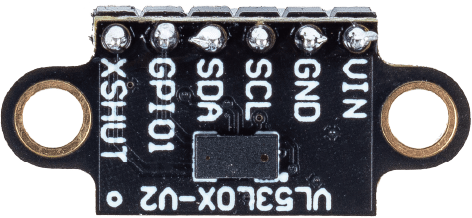

 .. note::

    Hallo und willkommen in der SunFounder Raspberry Pi & Arduino & ESP32 Enthusiasten-Gemeinschaft auf Facebook! Tauchen Sie tiefer ein in die Welt von Raspberry Pi, Arduino und ESP32 mit anderen Enthusiasten.

    **Warum beitreten?**

    - **Expertenunterstützung**: Lösen Sie Nachverkaufsprobleme und technische Herausforderungen mit Hilfe unserer Gemeinschaft und unseres Teams.
    - **Lernen & Teilen**: Tauschen Sie Tipps und Anleitungen aus, um Ihre Fähigkeiten zu verbessern.
    - **Exklusive Vorschauen**: Erhalten Sie frühzeitigen Zugang zu neuen Produktankündigungen und exklusiven Einblicken.
    - **Spezialrabatte**: Genießen Sie exklusive Rabatte auf unsere neuesten Produkte.
    - **Festliche Aktionen und Gewinnspiele**: Nehmen Sie an Gewinnspielen und Feiertagsaktionen teil.

    👉 Sind Sie bereit, mit uns zu erkunden und zu erschaffen? Klicken Sie auf [|link_sf_facebook|] und treten Sie heute bei!

.. _cpn_VL53L0X:

Time-of-Flight-Micro-LIDAR-Entfernungssensor (VL53L0X)
===============================================================

.. raw:: html

     

Das VL53L0X-Modul ist ein fortschrittlicher Time-of-Flight (ToF)-Entfernungssensor, der hochpräzise Abstandsmesungen ermöglicht, unabhängig von der Farbe und Reflektivität des Ziels. Hergestellt von STMicroelectronics, eignet sich dieser Sensor hervorragend für die Messung absoluter Distanzen bis zu 2 Metern und ist somit ideal für Anwendungen in den Bereichen Robotik, Drohnen und tragbare Geräte.

Spezifikation
---------------------------
* Versorgungsspannung: 3,3V oder 5V
* PCB-Größe: 11 x 25mm
* Kommunikationsmethode: I2C
* ToF-Messreichweite: ≤2M

Pinbelegung
---------------------------
* **VIN**: Dies ist der Stromversorgungs-Pin.
* **GND**: Gemeinsame Masse für Strom und Logik.
* **SCL**: I2C-Taktpin, verbinden Sie diesen mit der I2C-Taktleitung Ihres Mikrocontrollers.
* **SDA**: I2C-Datenpin, verbinden Sie diesen mit der I2C-Datenleitung Ihres Mikrocontrollers.
* **GPIO1**: Programmierbarer Interrupt-Ausgang. Dieser Ausgang ist nicht pegelgewandelt.
* **XSHUT**: Dieser Pin ist ein aktiv-low Shutdown-Eingang; durch Anlegen eines niedrigen Pegels wird der Sensor in den Hardware-Standby-Modus versetzt. Dieser Eingang ist nicht pegelgewandelt.

Beispiel
---------------------------
* :ref:`uno_lesson21_vl53l0x` (Arduino UNO)
* :ref:`esp32_lesson21_vl53l0x` (ESP32)
* :ref:`pico_lesson21_vl53l0x` (Raspberry Pi Pico)
* :ref:`pi_lesson21_vl53l0x` (Raspberry Pi)
