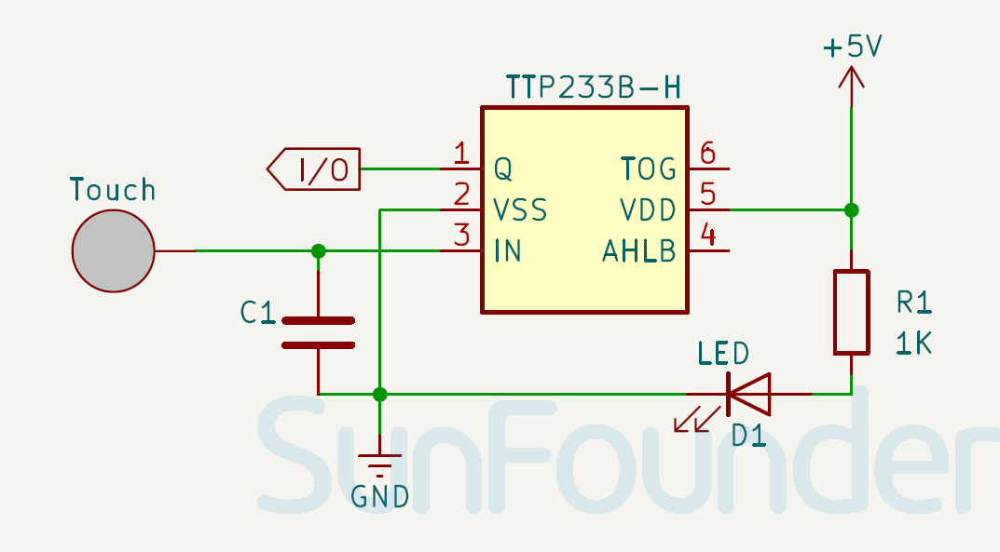

.. note::

    Hello, welcome to the SunFounder Raspberry Pi & Arduino & ESP32 Enthusiasts Community on Facebook! Dive deeper into Raspberry Pi, Arduino, and ESP32 with fellow enthusiasts.

    **Why Join?**

    - **Expert Support**: Solve post-sale issues and technical challenges with help from our community and team.
    - **Learn & Share**: Exchange tips and tutorials to enhance your skills.
    - **Exclusive Previews**: Get early access to new product announcements and sneak peeks.
    - **Special Discounts**: Enjoy exclusive discounts on our newest products.
    - **Festive Promotions and Giveaways**: Take part in giveaways and holiday promotions.

    👉 Ready to explore and create with us? Click [|link_sf_facebook|] and join today!

.. _cpn_touch:

Touch Sensor Module
==========================

.. image:: img/22_touch_sensor_moudle.png
    :width: 200
    :align: center

The Touch switch sensor (also called touch button or touch switch) is widely used to control devices (e.g. touchable lamp). It has the same functionality as a button. It is used instead of the button on many new devices because it makes the product look neat.

Pinout
---------------------------
* **VCC**: This is the positive power supply input from the main control. 
* **GND**: Ground connection.
* **IO**: Digital output. High level with a touch, low level without touching.

Principle
---------------------------
This module is a capacitive touch switch module based on a touch sensor IC (TTP223B). In the normal state, the module outputs a low level with low power consumption; when a finger touches the corresponding position, the module outputs a high level and becomes low level again after the finger is released.

Here is how the capacitive touch switch works:

A capacitive touch switch has different layers—top insulating face plate followed by touch plate, another insulating layer and then ground plate.

.. image:: img/22_touch_sensor_moudle_principle.jpeg
    :width: 400
    :align: center

.. raw:: html
    
     

In practice, a capacitive sensor can be made on a double-sided PCB by regarding one side as the touch sensor and the opposite side as ground plate of the capacitor. When power is applied across these plates, the two plates get charged. In equilibrium state, the plates have the same voltage as the power source.

The touch detector circuit has an oscillator whose frequency is dependent on capacitance of the touchpad. When a finger is moved close to the touchpad, additional capacitance causes frequency of this internal oscillator to change. The detector circuit tracks oscillator frequency at timed intervals, and when the shift crosses the threshold change, the circuit triggers a key-press event.

Schematic diagram
---------------------------

.. raw:: html

    

Example
---------------------------
* :ref:`uno_lesson22_touch_sensor` (Arduino UNO)
* :ref:`esp32_lesson22_touch_sensor` (ESP32)
* :ref:`pico_lesson22_touch_sensor` (Raspberry Pi Pico)
* :ref:`pi_lesson22_touch_sensor` (Raspberry Pi)

* :ref:`uno_touch_toggle_light` (Arduino UNO)
* :ref:`esp32_touch_toggle_light` (ESP32)