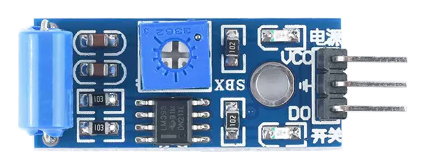
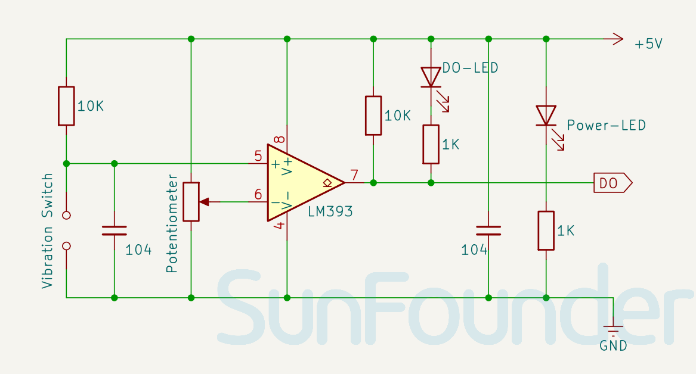

.. note::

    こんにちは、SunFounder Raspberry Pi & Arduino & ESP32 Enthusiasts Communityへようこそ！Facebook上で、仲間と一緒にRaspberry Pi、Arduino、ESP32をさらに深く探求しましょう。

    **なぜ参加するのか？**

    - **専門的なサポート**：購入後の問題や技術的な課題をコミュニティやチームの助けを借りて解決。
    - **学びと共有**：スキルを向上させるためのヒントやチュートリアルを交換。
    - **限定プレビュー**：新製品発表や予告編に早期アクセス。
    - **特別割引**：最新製品の特別割引を楽しむ。
    - **フェスティブプロモーションとプレゼント**：プレゼントやホリデープロモーションに参加。

    👉 私たちと一緒に探索と創造を始める準備はできましたか？[|link_sf_facebook|]をクリックして、今すぐ参加しましょう！

.. _cpn_vibration:

Vibration Sensor Module (SW-420)
=====================================

The SW-420 vibration sensor is a module that detects vibrations or shocks on a surface. It can be used for various purposes, such as detecting door knocks, machine malfunctions, car collisions, or alarm systems. It operates within a voltage range of 3.3 V to 5 V and has three peripherals: two LEDs (one for power status and the other for sensor output) and a potentiometer that can be used to control the vibration threshold point.

Pinout
---------------------------
* **VCC**: This is the positive power supply input from the main control. 
* **GND**: Ground connection.
* **DO**: Digital output. During normal operation, the sensor outputs a Logic Low signal. When vibration is detected, the sensor outputs a Logic High signal.

Principle
---------------------------
SW-420 vibration sensor module consists of a SW-420 vibration switch and an LM393 voltage comparator. A SW-420 vibration switch is a device that has a spring and a rod inside a tube. When the switch is exposed to a vibration, the spring touches the rod and closes the circuit. The vibration sensor in the module detects these oscillations and converts them into electrical signals. The LM393 comparator chip then compares these signals with a reference voltage set by the potentiometer. If the amplitude of the signal exceeds this reference voltage, the output of the comparator goes high (1), otherwise it goes low (0).

Schematic diagram
---------------------------

.. raw:: html

    

Example
---------------------------
* :ref:`uno_lesson24_vibration_sensor` (Arduino UNO)
* :ref:`esp32_lesson24_vibration_sensor` (ESP32)
* :ref:`pico_lesson24_vibration_sensor` (Raspberry Pi Pico)
* :ref:`pi_lesson24_vibration_sensor` (Raspberry Pi)

* :ref:`uno_digital_dice` (Arduino UNO)
* :ref:`uno_iot_vib_alert_system` (Arduino UNO)
* :ref:`esp32_digital_dice` (ESP32)