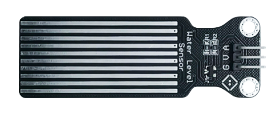
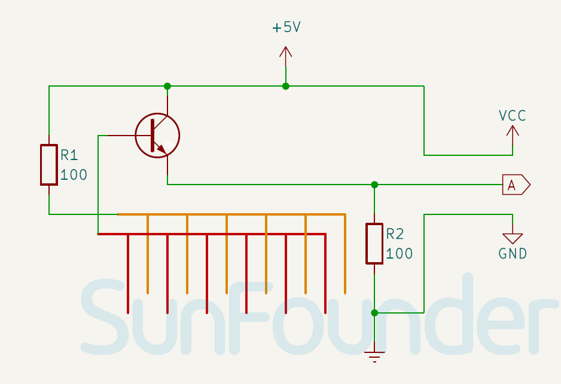

.. note::

    こんにちは、SunFounder Raspberry Pi & Arduino & ESP32 Enthusiasts Communityへようこそ！Facebook上で、仲間と一緒にRaspberry Pi、Arduino、ESP32をさらに深く探求しましょう。

    **なぜ参加するのか？**

    - **専門的なサポート**：購入後の問題や技術的な課題をコミュニティやチームの助けを借りて解決。
    - **学びと共有**：スキルを向上させるためのヒントやチュートリアルを交換。
    - **限定プレビュー**：新製品発表や予告編に早期アクセス。
    - **特別割引**：最新製品の特別割引を楽しむ。
    - **フェスティブプロモーションとプレゼント**：プレゼントやホリデープロモーションに参加。

    👉 私たちと一緒に探索と創造を始める準備はできましたか？[|link_sf_facebook|]をクリックして、今すぐ参加しましょう！

.. _cpn_water_level:

水位センサーモジュール
=====================================

.. raw:: html

    

水位センサーは、手頃な価格で使いやすいデバイスで、コンパクトかつ軽量です。露出した並列ワイヤートレースを使用して水滴や水量を測定し、水位を判断します。このセンサーは水位を簡単にアナログ信号に変換し、プログラム関数が水位アラームをトリガーするのに容易に利用できます。低消費電力と高感度も特筆すべき特徴です。

仕様
---------------------------
* 供給電圧: 3.3V または 5V
* PCBサイズ: 22 x 60mm
* 動作温度範囲: 10℃ - 30℃
* 動作湿度範囲: 10% - 90%

ピン配置
---------------------------
* **V**: メインコントロールからの正電源入力。
* **G**: 接地接続。
* **A**: アナログ出力。水位が高いほど、出力電圧も高くなります。

回路図
---------------------------

.. raw:: html

    

例
---------------------------
* :ref:`uno_lesson25_water_level` (Arduino UNO)
* :ref:`esp32_lesson25_water_level` (ESP32)
* :ref:`pico_lesson25_water_level` (Raspberry Pi Pico)
* :ref:`pi_lesson25_water_level` (Raspberry Pi)
