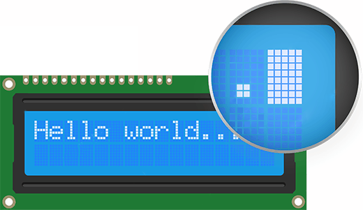

.. _cpn_i2c_lcd1602:

I2C LCD 1602
==========================

.. image:: img/26_i2c_lcd.png
    :width: 90%
    :align: center

.. raw:: html

    

An I2C LCD1602 is a device that can display text and characters on a 16x2 (16 columns and 2 rows) liquid crystal display (LCD) using the I2C protocol. You can use an I2C LCD1602 to show information from your Arduino projects, such as sensor readings, messages, menus, etc. The I2C module has a built-in PCF8574 I2C chip that converts I2C serial data to parallel data for the LCD display.        

* |link_PCF8574_Datasheet|

Principle
---------------------------
An I2C LCD1602 consists of a normal LCD1602 and an I2C module that is attached to the back of the LCD. The I2C module is a chip that can expand the I/O ports of the Arduino using the I2C protocol. The I2C protocol is a serial communication protocol that uses two wires: SDA (serial data) and SCL (serial clock). The I2C protocol allows multiple devices to communicate with each other using only two wires and unique addresses.

The I2C module converts the signals from the Arduino into commands for the LCD. The LCD has 16x2 cells that can display characters or symbols. Each cell consists of 5x8 dots that can be turned on or off by applying voltage. The LCD can display different characters or symbols by turning on or off different combinations of dots.

.. raw:: html
    
       

**I2C Address**

The default address is basically 0x27, in a few cases it may be 0x3F.

Taking the default address of 0x27 as an example, the device address can be modified by shorting the A0/A1/A2 pads; in the default state, A0/A1/A2 is 1, and if the pad is shorted, A0/A1/A2 is 0.

.. image:: img/26_i2c_address.jpg
    :width: 600
    :align: center

.. raw:: html
    
     

**Backlight/Contrast**

Backlight can be enabled by jumper cap, unplugg the jumper cap to disable the backlight. The blue potentiometer on the back is used to adjust the contrast (the ratio of brightness between the brightest white and the darkest black).

.. image:: img/26_back_lcd1602.jpg
    :width: 600
    :align: center

.. raw:: html
    
      

* **Shorting Cap**: Backlight can be enabled by this cap，unplugg this cap to disable the backlight.
* **Potentiometer**: It is used to adjust the contrast (the clarity of the displayed text), which is increased in the clockwise direction and decreased in the counterclockwise direction.

.. note::
    After wiring the LCD, you should turn on the Arduino and adjust the contrast by rotating the potentiometer on the I2C module until the first row of rectangles appear to ensure proper LCD operation.

Example
---------------------------
* :ref:`uno_lesson26_lcd` (Arduino UNO)
* :ref:`esp32_lesson26_lcd` (ESP32)
* :ref:`pico_lesson26_lcd` (Raspberry Pi Pico)
* :ref:`pico_lesson26_lcd` (Raspberry Pi)

* :ref:`uno_potentiometer_scale_value` (Arduino UNO)
* :ref:`uno_plant_monitor` (Arduino UNO)
* :ref:`uno_bluetooth_lcd` (Arduino UNO)
* :ref:`esp32_potentiometer_scale_value` (ESP32)
* :ref:`esp32_plant_monitor` (ESP32)
* :ref:`esp32_iot_owm` (ESP32)