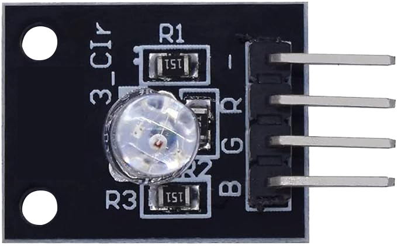
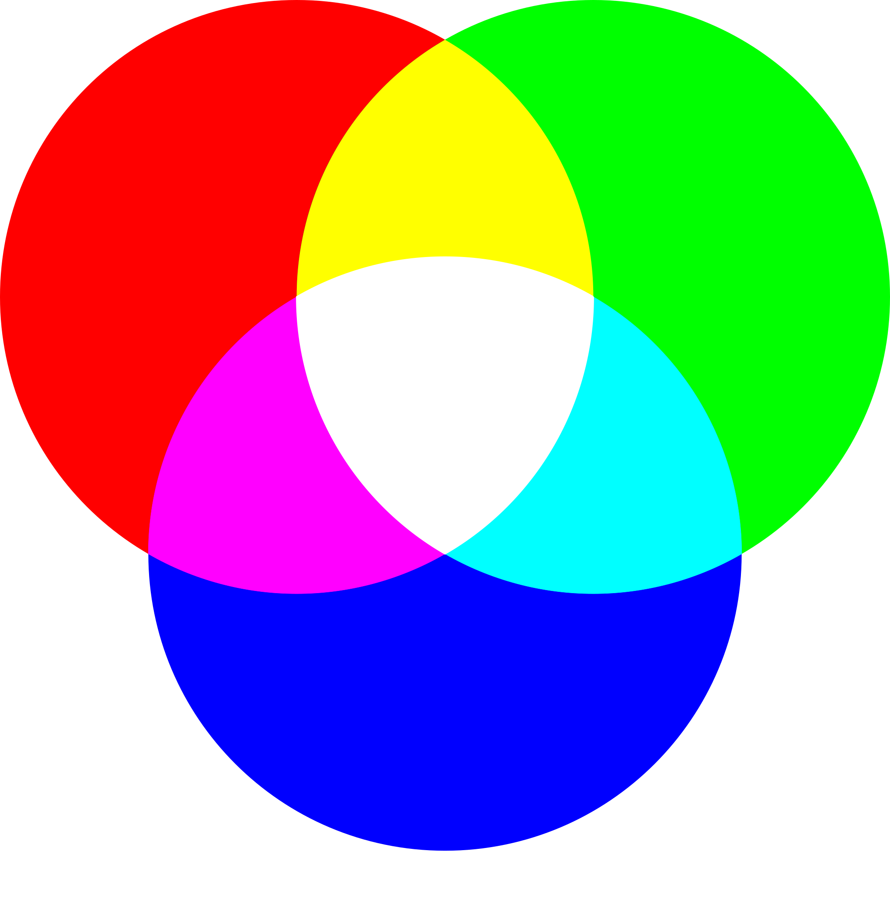
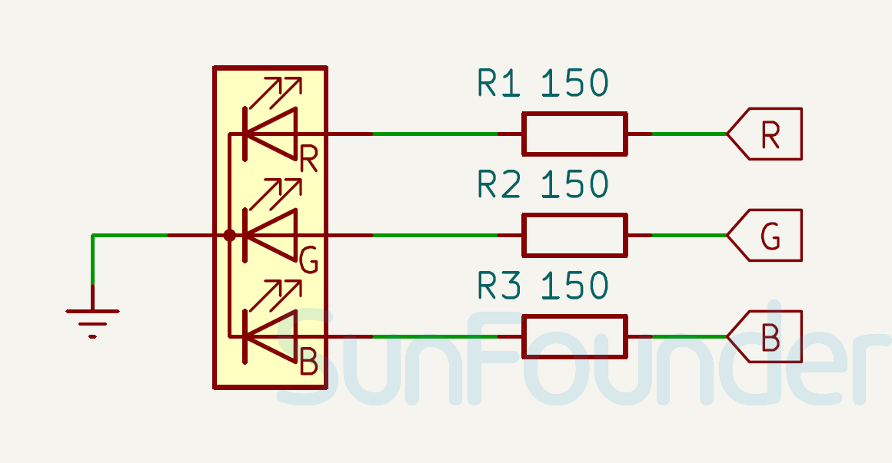

 
.. note::

   Hallo und willkommen in der SunFounder Raspberry Pi & Arduino & ESP32 Enthusiasten-Gemeinschaft auf Facebook! Tauchen Sie tiefer ein in die Welt von Raspberry Pi, Arduino und ESP32 mit anderen Enthusiasten.

   **Warum beitreten?**

   - **Expertenunterstützung**: Lösen Sie Nachverkaufsprobleme und technische Herausforderungen mit Hilfe unserer Gemeinschaft und unseres Teams.
   - **Lernen & Teilen**: Tauschen Sie Tipps und Anleitungen aus, um Ihre Fähigkeiten zu verbessern.
   - **Exklusive Vorschauen**: Erhalten Sie frühzeitigen Zugang zu neuen Produktankündigungen und exklusiven Einblicken.
   - **Spezialrabatte**: Genießen Sie exklusive Rabatte auf unsere neuesten Produkte.
   - **Festliche Aktionen und Gewinnspiele**: Nehmen Sie an Gewinnspielen und Feiertagsaktionen teil.

   👉 Sind Sie bereit, mit uns zu erkunden und zu erschaffen? Klicken Sie auf [|link_sf_facebook|] und treten Sie heute bei!

.. _cpn_rgb:

RGB LED-Modul
==========================

.. raw:: html

     

Das RGB-Farb-LED-Modul emittiert eine Vielzahl von Farben durch das Mischen von rotem, grünem und blauem Licht. Jede Farbe wird durch die Verwendung von PWM (Pulsweitenmodulation) angepasst. Es kann verwendet werden, um farbenfrohe Lichteffekte zu erzeugen oder um zu lernen, wie man PWM mit Arduino verwendet.

Pinbelegung
---------------------------

* **GND**: Gemeinsame Masse für die Stromversorgung.
* **B**: Steuert die Helligkeit der roten LED. Durch Anpassen des durch diesen Pin fließenden Stroms kann die Intensität des roten Lichts variiert werden.
* **R**: Steuert die Helligkeit der grünen LED. Ähnlich wie beim roten Pin ändert sich die Intensität des grünen Lichts durch Anpassen des Stromflusses durch diesen Pin.
* **G**: Steuert die Helligkeit der blauen LED. Durch Anpassen des durch diesen Pin fließenden Stroms kann die Intensität des blauen Lichts verändert werden.

Funktionsprinzip
---------------------------
Das RGB-Modul arbeitet mit einer Vollfarb-LED, die die R-, G- und B-Pins mit einstellbarem PWM-Spannungseingang verwendet.
Farben aus der LED können kombiniert werden. Zum Beispiel ergibt die Mischung von blauem und grünem Licht cyanfarbenes Licht, rotes Licht und grünes Licht ergeben gelbes Licht. Dies wird als "additive Farbmischung" bezeichnet.

* `Additive color - Wikipedia <https://en.wikipedia.org/wiki/Additive_color>`_

Basierend auf dieser Methode können wir die drei Primärfarben verwenden, um das sichtbare Licht jeder Farbe in unterschiedlichen Proportionen zu mischen. Zum Beispiel kann Orange durch mehr Rot und weniger Grün erzeugt werden. Die Intensität der Primärfarben (Rot, Blau, Grün) wird angepasst, um einen vollständigen Farbeffektemix zu erzielen. PWM ist eine Technik, bei der das Tastverhältnis eines digitalen Signals geändert wird, um den Prozentsatz der Zeit anzupassen, in der das Signal innerhalb eines bestimmten Zeitraums aktiv bleibt. Durch Ändern des Tastverhältnisses können wir die LED heller oder dunkler erscheinen lassen.

Schaltplan
---------------------------

.. raw:: html

    

Beispiel
---------------------------
* :ref:`uno_lesson28_rgb_module` (Arduino UNO)
* :ref:`esp32_lesson28_rgb_module` (ESP32)
* :ref:`pico_lesson28_rgb_module` (Raspberry Pi Pico)
* :ref:`pi_lesson28_rgb_module` (Raspberry Pi)

* :ref:`esp32_lesson30_relay_module` (ESP32)
* :ref:`pico_lesson30_relay_module` (Raspberry Pi Pico)
* :ref:`pi_lesson30_relay_module` (Raspberry Pi)

* :ref:`uno_lesson38_gas_leak_alarm` (Arduino UNO)
* :ref:`uno_lesson40_motion_triggered_relay` (Arduino UNO)
* :ref:`esp32_gas_leak_alarm` (ESP32)
* :ref:`esp32_motion_triggered_relay` (ESP32)
* :ref:`esp32_bluetooth_led` (ESP32)
* :ref:`esp32_iot_mqtt` (ESP32)
* :ref:`esp32_adafruit_io` (ESP32)
* :ref:`esp32_iot_bluetooth_app` (ESP32)
