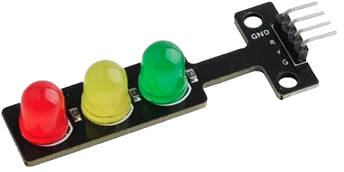
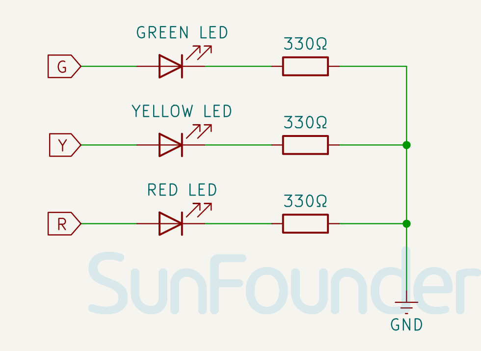

.. note::

   Hallo und willkommen in der SunFounder Raspberry Pi & Arduino & ESP32 Enthusiasten-Gemeinschaft auf Facebook! Tauchen Sie tiefer ein in die Welt von Raspberry Pi, Arduino und ESP32 mit anderen Enthusiasten.

   **Warum beitreten?**

   - **Expertenunterstützung**: Lösen Sie Nachverkaufsprobleme und technische Herausforderungen mit Hilfe unserer Gemeinschaft und unseres Teams.
   - **Lernen & Teilen**: Tauschen Sie Tipps und Anleitungen aus, um Ihre Fähigkeiten zu verbessern.
   - **Exklusive Vorschauen**: Erhalten Sie frühzeitigen Zugang zu neuen Produktankündigungen und exklusiven Einblicken.
   - **Spezialrabatte**: Genießen Sie exklusive Rabatte auf unsere neuesten Produkte.
   - **Festliche Aktionen und Gewinnspiele**: Nehmen Sie an Gewinnspielen und Feiertagsaktionen teil.

   👉 Sind Sie bereit, mit uns zu erkunden und zu erschaffen? Klicken Sie auf [|link_sf_facebook|] und treten Sie heute bei!

.. _cpn_traffic:

Ampelmodul
==========================

.. raw:: html

     

Das Ampelmodul ist ein kleines Gerät, das rote, gelbe und grüne Lichter anzeigen kann, genau wie eine echte Ampel. Es kann verwendet werden, um ein Ampelsystemmodell zu erstellen oder um zu lernen, wie man LEDs mit Arduino steuert. Es zeichnet sich durch seine geringe Größe, einfache Verdrahtung, gezielte und kundenspezifische Installation aus. Es kann mit einem PWM-Pin verbunden werden, um die Helligkeit der LED zu steuern.

Funktionsprinzip
---------------------------
Das Ampelmodul kann auf zwei Hauptarten gesteuert werden. Die einfachere Methode beinhaltet die Verwendung digitaler Eingänge vom Arduino, bei denen ein HIGH- oder LOW-Signal die entsprechende LED direkt ein- oder ausschaltet. Alternativ kann PWM (Pulsweitenmodulation) verwendet werden, insbesondere wenn die Helligkeit der LED variiert werden soll. PWM ist eine Technik, bei der das Tastverhältnis eines digitalen Signals geändert wird, um die Helligkeit der LED zu modulieren. Ein Tastverhältnis gibt an, wie lange ein Signal während einer bestimmten Periode eingeschaltet bleibt. Ein Tastverhältnis von 50% bedeutet beispielsweise, dass das Signal für die Hälfte der Dauer aktiv und für die andere Hälfte inaktiv ist. Durch Anpassen des Tastverhältnisses kann die Helligkeit der LED moduliert werden.

Schaltplan
---------------------------

.. raw:: html

    

Beispiel
---------------------------
* :ref:`uno_lesson29_traffic_light_module` (Arduino UNO)
* :ref:`esp32_lesson29_traffic_light_module` (ESP32)
* :ref:`pico_lesson30_relay_module` (Raspberry Pi Pico)
* :ref:`pi_lesson30_relay_module` (Raspberry Pi)

* :ref:`uno_lesson30_relay_module` (Arduino UNO)

* :ref:`uno_touch_toggle_light` (Arduino UNO)
* :ref:`uno_bluetooth_traffic_light` (Arduino UNO)
* :ref:`esp32_touch_toggle_light` (ESP32)
