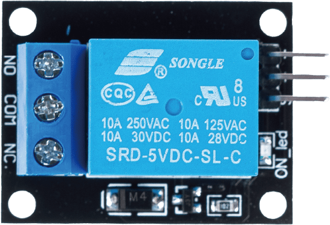
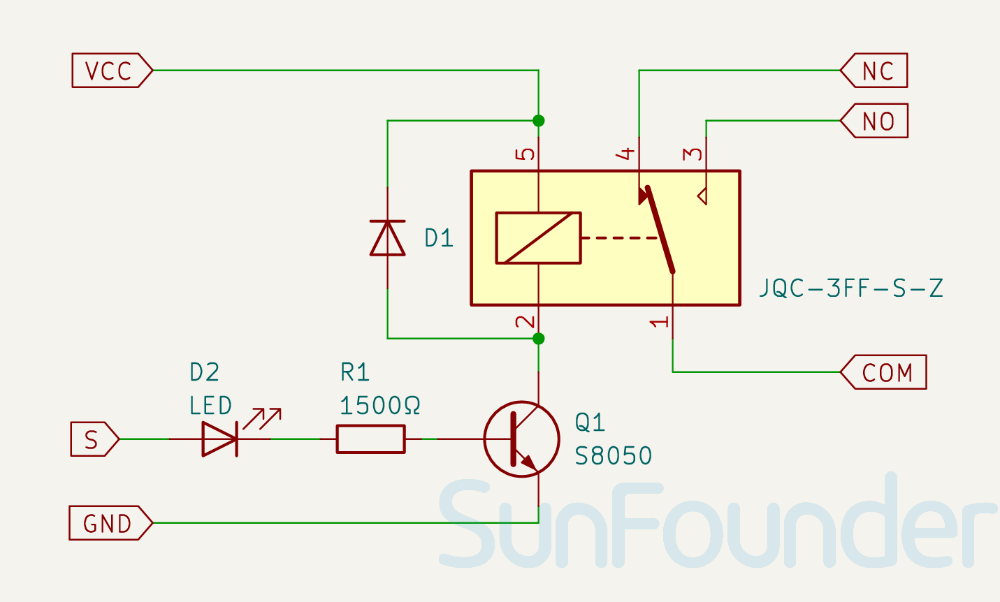

.. _cpn_relay:

5V Relay Module
==========================

.. raw:: html
    
     

5V relay modules are devices that can switch high voltage or high current devices on and off using a 5V signal from Arduino. They can be used to control devices such as lights, fans, motors, solenoids, etc. 5V relay has three high voltage terminals (NC, C, and NO) which connect to the device you want to control. The other side has three low voltage pins (Ground, Vcc, and Signal) which connect to the Arduino.

Principle
---------------------------
A relay is a device which is used to provide connection between two or more points or devices in response to the input signal applied. In other words, relays provide isolation between the controller and devices, which may operate on either AC or DC. However, they receive signals from a microcontroller which works on DC hence requiring a relay to bridge the gap. Relay is extremely useful when you need to control a large amount of current or voltage with small electrical signal.

There are 5 parts in every relay:

.. image:: img/30_relay_2.jpeg
    :width: 500
    :align: center

Electromagnet - It consists of an iron core wounded by coil of wires. When electricity is passed through, it becomes magnetic. Therefore, it is called electromagnet.

Armature - The movable magnetic strip is known as armature. When current flows through them, the coil gets energized thus producing a magnetic field which is used to make or break the normally open (N/O) or normally close (N/C) points. And the armature can be moved with direct current (DC) as well as alternating current (AC).

Spring - When no currents flow through the coil on the electromagnet, the spring pulls the armature away so the circuit cannot be completed.

Set of electrical contacts - There are two contact points:

* Normally open - connected when the relay is activated, and disconnected when it is inactive.
* Normally closed - not connected when the relay is activated, and connected when it is inactive.

Molded frame - This is typically made of plastic and provides structural support and protection for the relay.

The working principle of relay is simple. When power is supplied to the relay, currents start flowing through the control coil; as a result, the electromagnet starts energizing. Then the armature is attracted to the coil, pulling down the moving contact together thus connecting with the normally open contacts. So the circuit with the load is energized. Then breaking the circuit would be a similar case, as the moving contact will be pulled up to the normally closed contacts under the force of the spring. In this way, the switching on and off of the relay can control the state of a load circuit.

Schematic diagram
---------------------------

.. raw:: html

    

Example
---------------------------
* :ref:`uno_lesson30_relay_module` (Arduino UNO)
* :ref:`esp32_lesson30_relay_module` (ESP32)
* :ref:`pico_lesson30_relay_module` (Raspberry Pi Pico)
* :ref:`pi_lesson30_relay_module` (Raspberry Pi)
 