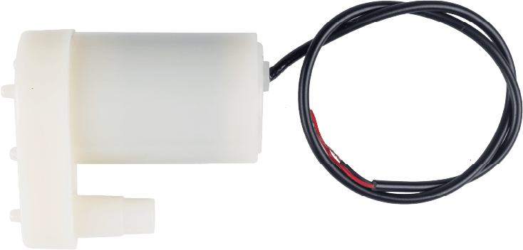

.. note::

    こんにちは、SunFounder Raspberry Pi & Arduino & ESP32 Enthusiasts Communityへようこそ！Facebook上で、仲間と一緒にRaspberry Pi、Arduino、ESP32をさらに深く探求しましょう。

    **なぜ参加するのか？**

    - **専門的なサポート**：購入後の問題や技術的な課題をコミュニティやチームの助けを借りて解決。
    - **学びと共有**：スキルを向上させるためのヒントやチュートリアルを交換。
    - **限定プレビュー**：新製品発表や予告編に早期アクセス。
    - **特別割引**：最新製品の特別割引を楽しむ。
    - **フェスティブプロモーションとプレゼント**：プレゼントやホリデープロモーションに参加。

    👉 私たちと一緒に探索と創造を始める準備はできましたか？[|link_sf_facebook|]をクリックして、今すぐ参加しましょう！

.. _cpn_pump:

Centrifugal Pump
==========================

.. raw:: html
    
     
    

A centrifugal pump is a device that can move liquids from one place to another by using a rotating impeller. It can be used to pump water, oil, chemicals, etc. A centrifugal pump has two main parts: a motor and a pump. The motor provides power to the pump and the pump converts the rotational energy into pressure and flow.

Specification
---------------------------

* **Voltage Scope**: DC 3 ~ 4.5V
* **Operating Current**: 120 ~ 180mA
* **Power**: 0.36 ~ 0.91W
* **Max Water Head**: 0.35 ~ 0.55M
* **Max Flow Rate**: 80 ~ 100 L/H
* **Continuous Working Life**: 100 hours
* **Water Fing Grade**: IP68
* **Driving Mode**: DC, Magnetic Driving
* **Material**: Engineering Plastic
* **Outlet Outside Diameter**: 7.8 mm
* **Outlet Inside Diameter**: 6.5 mm
* It is a submersible pump and should be used that way. It tends to heat too much that there's a risk of overheating if you turn it on unsubmerged.

Example
---------------------------
* :ref:`uno_lesson31_pump` (Arduino UNO)
* :ref:`esp32_lesson31_pump` (ESP32)
* :ref:`pico_lesson31_pump` (Raspberry Pi Pico)
* :ref:`pi_lesson31_pump` (Raspberry Pi)

* :ref:`uno_lesson39_soap_dispenser` (Arduino UNO)
* :ref:`uno_plant_monitor` (Arduino UNO)
* :ref:`esp32_soap_dispenser` (ESP32)
* :ref:`esp32_plant_monitor` (ESP32)
