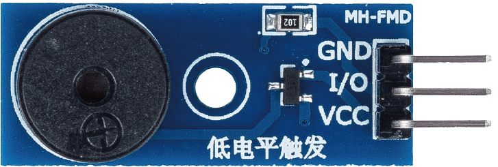
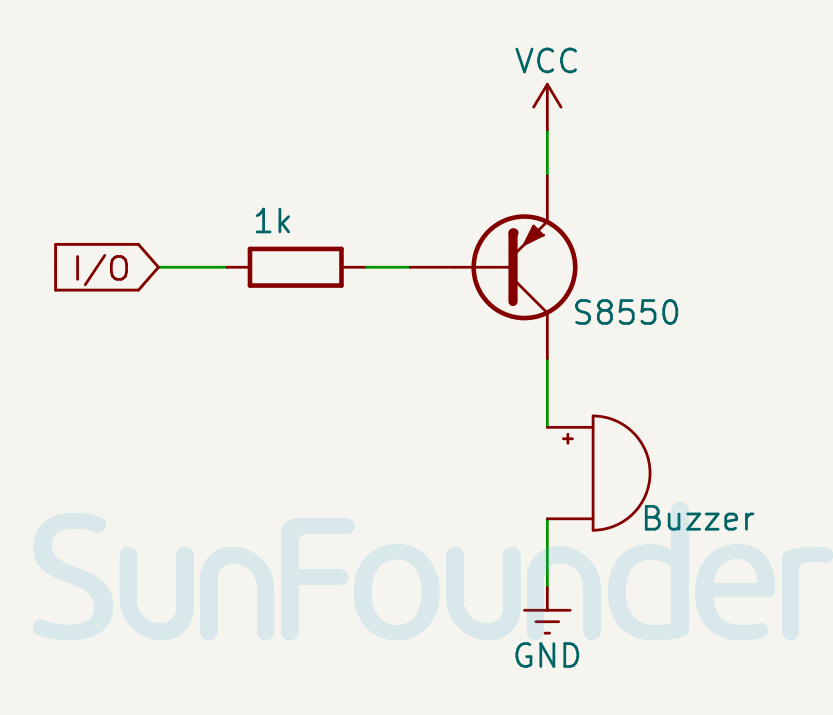

.. _cpn_buzzer:

Passive Buzzer Module
==========================

.. raw:: html
    
     

The passive buzzer is a device that generates sound when an electrical signal is applied to it. It is called passive because it does not have an internal oscillator to generate sound on its own. Instead, it relies on an external signal from a microcontroller like Arduino to produce sound. The passive buzzer module is a small electronic component that contains a passive buzzer and some additional circuitry that makes it easier to use with Arduino.

Pinout
---------------------------
* **VCC**: This is the positive power supply input from the main control. 
* **GND**: Ground connection.
* **I/O**: Through this pin, you can send control signals to control the tone and frequency of the buzzer.

Schematic diagram
---------------------------

.. raw:: html

    

Example
---------------------------
* :ref:`uno_lesson32_passive_buzzer` (Arduino UNO)
* :ref:`esp32_lesson32_passive_buzzer` (ESP32)
* :ref:`pico_lesson32_passive_buzzer` (Raspberry Pi Pico)
* :ref:`pi_lesson32_passive_buzzer` (Raspberry Pi)

* :ref:`uno_lesson38_gas_leak_alarm` (Arduino UNO)
* :ref:`esp32_gas_leak_alarm` (ESP32)