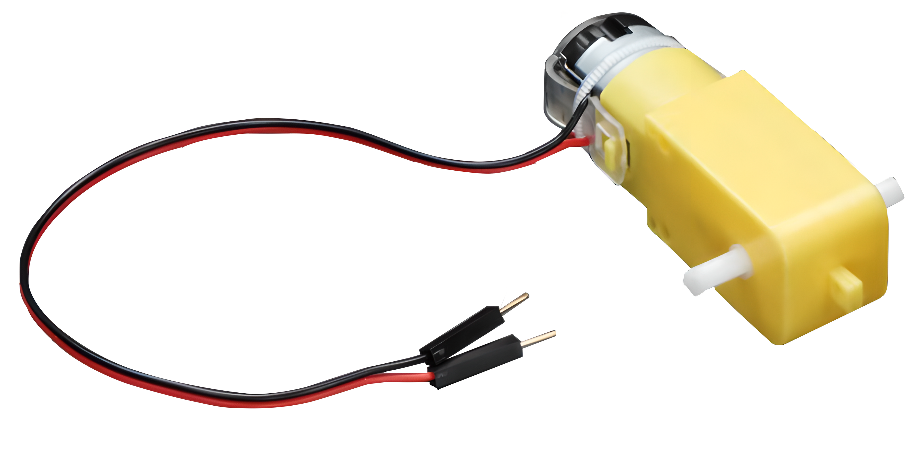
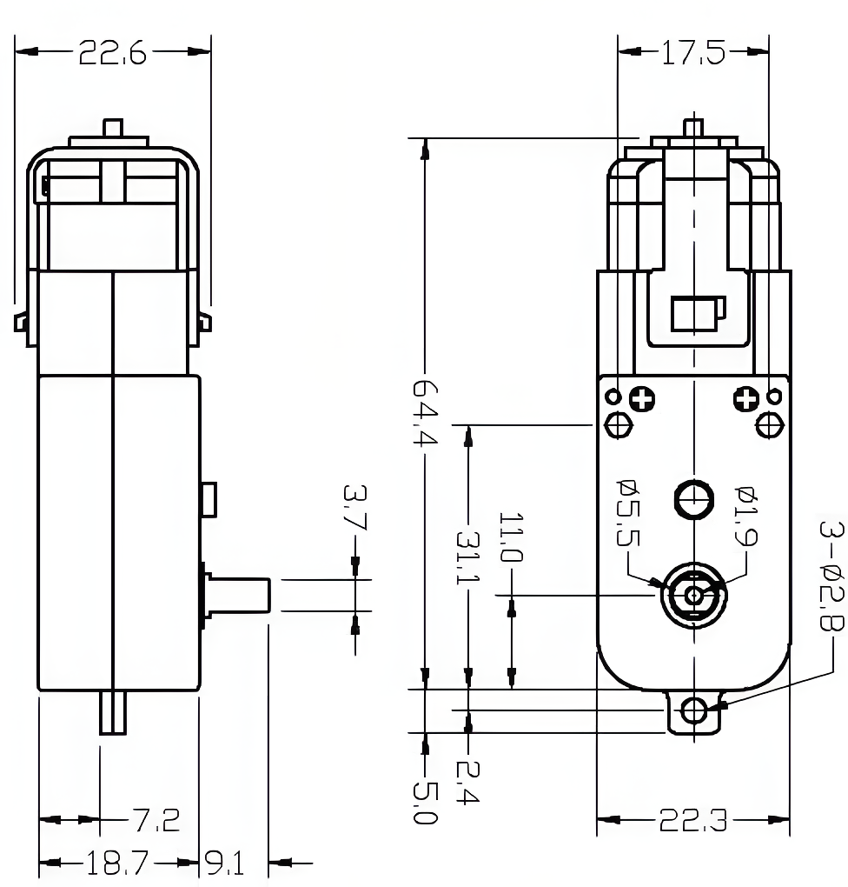

.. note::

   Hallo und willkommen in der SunFounder Raspberry Pi & Arduino & ESP32 Enthusiasten-Gemeinschaft auf Facebook! Tauchen Sie tiefer ein in die Welt von Raspberry Pi, Arduino und ESP32 mit anderen Enthusiasten.

   **Warum beitreten?**

   - **Expertenunterstützung**: Lösen Sie Nachverkaufsprobleme und technische Herausforderungen mit Hilfe unserer Gemeinschaft und unseres Teams.
   - **Lernen & Teilen**: Tauschen Sie Tipps und Anleitungen aus, um Ihre Fähigkeiten zu verbessern.
   - **Exklusive Vorschauen**: Erhalten Sie frühzeitigen Zugang zu neuen Produktankündigungen und exklusiven Einblicken.
   - **Spezialrabatte**: Genießen Sie exklusive Rabatte auf unsere neuesten Produkte.
   - **Festliche Aktionen und Gewinnspiele**: Nehmen Sie an Gewinnspielen und Feiertagsaktionen teil.

   👉 Sind Sie bereit, mit uns zu erkunden und zu erschaffen? Klicken Sie auf [|link_sf_facebook|] und treten Sie heute bei!

.. _cpn_ttmotor:

TT-Motor
==========================

.. raw:: html

     

Ein TT-Motor ist ein Gleichstrommotor, der ein Getriebe angebracht hat. Das Getriebe reduziert die Drehzahl des Motors und erhöht dessen Drehmoment. Ein TT-Motor wird häufig in Anwendungen wie dem Antrieb von Rädern, Propellern, Lüftern und ähnlichem eingesetzt. Ein TT-Motor hat zwei Drähte: einen positiven Draht und einen negativen Draht. Der positive Draht ist normalerweise rot und der negative Draht ist normalerweise schwarz.

Ein TT-Gleichstromgetriebemotor mit einem Übersetzungsverhältnis von 1:48 wird in diesem Produkt verwendet. Er wird mit 2 x 200 mm Drähten mit 0,1-Zoll-Männchenanschlüssen geliefert, die in ein Steckbrett passen. Perfekt zum Einstecken in ein Steckbrett oder eine Klemmenleiste.

Diese Motoren können mit 3 ~ 6VDC betrieben werden, laufen jedoch bei höheren Spannungen etwas schneller.

**Technische Details**

* Nennspannung: 3~6V
* Kontinuierlicher Leerlaufstrom: 150mA +/- 10%
* Min. Betriebsdrehzahl (3V): 90+/- 10% U/min
* Min. Betriebsdrehzahl (6V): 200+/- 10% U/min
* Stillstandsdrehmoment (3V): 0.4kg.cm
* Stillstandsdrehmoment (6V): 0.8kg.cm
* Übersetzungsverhältnis: 1:48
* Abmessungen des Gehäuses: 70 x 22 x 18mm
* Kabellänge: 200mm & 28 AWG
* Gewicht: 30.6g

**Abmessungszeichnung**

.. raw:: html

     

Beispiel
---------------------------
* :ref:`uno_lesson34_motor` (Arduino UNO)
* :ref:`esp32_lesson34_motor` (ESP32)
* :ref:`pico_lesson34_motor` (Raspberry Pi Pico)
* :ref:`pi_lesson34_motor` (Raspberry Pi)

* :ref:`uno_lesson07_speed` (Arduino UNO)
* :ref:`pi_lesson07_speed` (Raspberry Pi)
