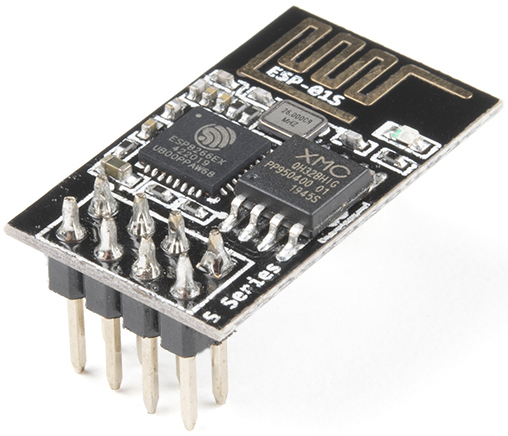
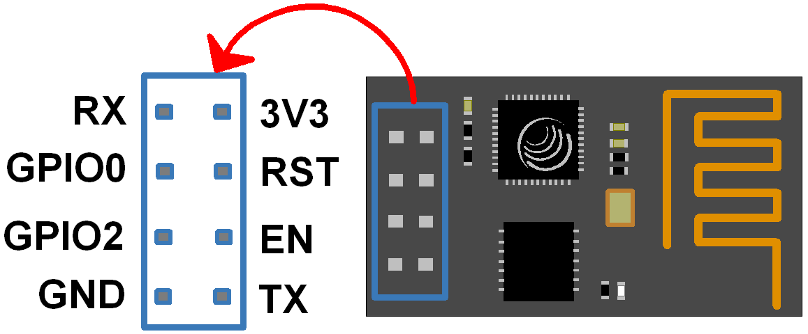
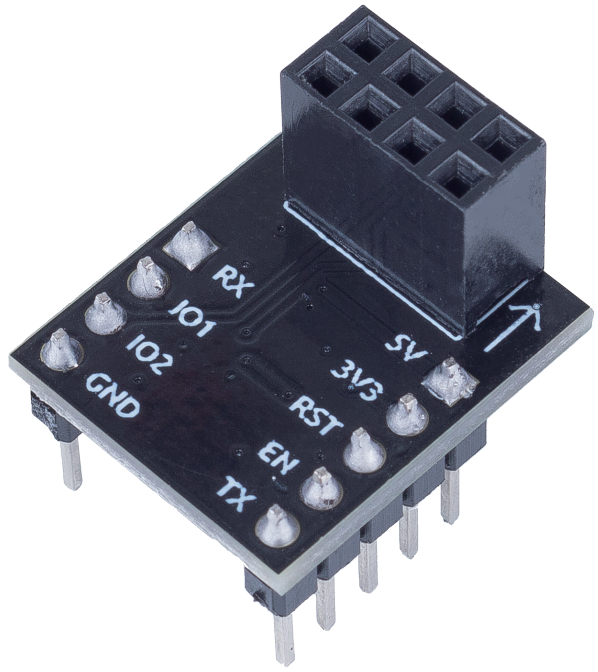
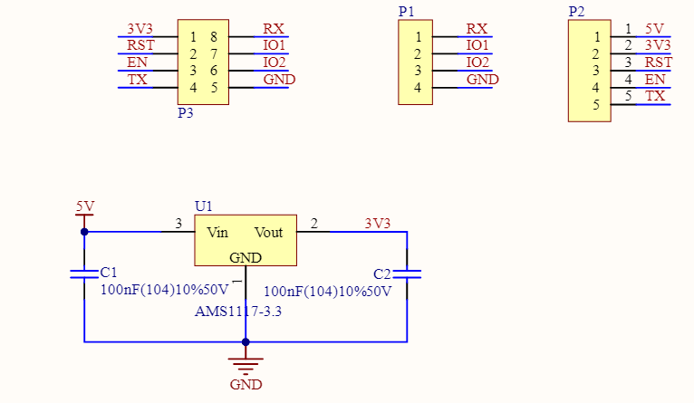

.. note::

   Hallo und willkommen in der SunFounder Raspberry Pi & Arduino & ESP32 Enthusiasten-Gemeinschaft auf Facebook! Tauchen Sie tiefer ein in die Welt von Raspberry Pi, Arduino und ESP32 mit anderen Enthusiasten.

   **Warum beitreten?**

   - **Expertenunterstützung**: Lösen Sie Nachverkaufsprobleme und technische Herausforderungen mit Hilfe unserer Gemeinschaft und unseres Teams.
   - **Lernen & Teilen**: Tauschen Sie Tipps und Anleitungen aus, um Ihre Fähigkeiten zu verbessern.
   - **Exklusive Vorschauen**: Erhalten Sie frühzeitigen Zugang zu neuen Produktankündigungen und exklusiven Einblicken.
   - **Spezialrabatte**: Genießen Sie exklusive Rabatte auf unsere neuesten Produkte.
   - **Festliche Aktionen und Gewinnspiele**: Nehmen Sie an Gewinnspielen und Feiertagsaktionen teil.

   👉 Sind Sie bereit, mit uns zu erkunden und zu erschaffen? Klicken Sie auf [|link_sf_facebook|] und treten Sie heute bei!

.. _cpn_esp8266:

ESP8266-Modul
=================

Das ESP8266 ist ein kostengünstiger Wi-Fi-Mikrochip mit integriertem TCP/IP-Netzwerksoftware und Mikrocontroller-Funktionalität, hergestellt von Espressif Systems in Shanghai, China.

Der Chip erregte erstmals im August 2014 die Aufmerksamkeit westlicher Maker mit dem ESP-01-Modul, das von einem Drittanbieter, Ai-Thinker, hergestellt wurde.
Dieses kleine Modul ermöglicht es Mikrocontrollern, eine Verbindung zu einem Wi-Fi-Netzwerk herzustellen und einfache TCP/IP-Verbindungen unter Verwendung von Hayes-ähnlichen Befehlen zu erstellen. 
Anfangs gab es jedoch fast keine englischsprachige Dokumentation zu dem Chip und den von ihm akzeptierten Befehlen. 
Der sehr niedrige Preis und die Tatsache, dass nur wenige externe Komponenten auf dem Modul vorhanden waren, 
was darauf hindeutete, dass es schließlich sehr kostengünstig in großen Stückzahlen sein könnte, zogen viele Hacker an, 
das Modul, den Chip und die darauf befindliche Software zu erkunden sowie die chinesische Dokumentation zu übersetzen.

Pins des ESP8266 und ihre Funktionen:

.. list-table:: ESP8266-01 Pins
   :widths: 25 25 100
   :header-rows: 1

   * - Pin
     - Name
     - Beschreibung
   * - 1
     - TXD
     - UART_TXD, Senden; General Purpose Input/Output: GPIO1; Pull-down ist beim Start nicht erlaubt.
   * - 2
     - GND
     - GND
   * - 3
     - CU_PD
     - Funktioniert bei hohem Pegel; Ausschalten bei niedrigem Pegel.
   * - 4
     - GPIO2
     - Sollte beim Einschalten auf hohem Pegel sein, Hardware-Pull-down ist nicht erlaubt; Standardmäßig Pull-up.
   * - 5
     - RST
     - Externes Reset-Signal, Reset bei niedrigem Pegel; Funktioniert bei hohem Pegel (standardmäßig hoch).
   * - 6
     - GPIO0
     - WiFi-Statusanzeige; Betriebsmodus-Auswahl: Pull-up: Flash Boot, Betriebsmodus; Pull-down: UART Download, Download-Modus.
   * - 7
     - VCC
     - Stromversorgung (3.3 V)
   * - 8
     - RXD
     - UART_RXD, Empfangen; General Purpose Input/Output: GPIO3.

* `ESP8266 - Espressif <https://www.espressif.com/en/products/socs/esp8266>`_
* |link_esp8266_at|

ESP8266-Adapter
---------------

Der ESP8266-Adapter ist eine Erweiterungsplatine, die es ermöglicht, das ESP8266-Modul auf einem Breadboard zu verwenden.

Er passt perfekt zu den Pins des ESP8266 und fügt auch einen 5V-Pin hinzu, um die Spannung vom Arduino-Board zu empfangen. Der integrierte AMS1117-Chip wird verwendet, um das ESP8266-Modul nach dem Absenken der Spannung auf 3.3 V zu betreiben.

Das Schaltbild ist wie folgt:

Beispiel
---------------------------
* :ref:`uno_lesson35_esp8266` (Arduino UNO)
* :ref:`uno_iot_weather_monito` (Arduino UNO)
* :ref:`uno_iot_vib_alert_system` (Arduino UNO)
* :ref:`uno_iot_flame` (Arduino UNO)
* :ref:`uno_iot_intrusion_alert_system` (Arduino UNO)
