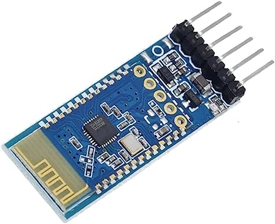
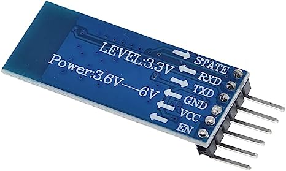

 .. _cpn_jdy31:.. note::

    こんにちは、SunFounder Raspberry Pi & Arduino & ESP32 Enthusiasts Communityへようこそ！Facebook上で、仲間と一緒にRaspberry Pi、Arduino、ESP32をさらに深く探求しましょう。

    **なぜ参加するのか？**

    - **専門的なサポート**：購入後の問題や技術的な課題をコミュニティやチームの助けを借りて解決。
    - **学びと共有**：スキルを向上させるためのヒントやチュートリアルを交換。
    - **限定プレビュー**：新製品発表や予告編に早期アクセス。
    - **特別割引**：最新製品の特別割引を楽しむ。
    - **フェスティブプロモーションとプレゼント**：プレゼントやホリデープロモーションに参加。

    👉 私たちと一緒に探索と創造を始める準備はできましたか？[|link_sf_facebook|]をクリックして、今すぐ参加しましょう！

JDY-31 Bluetoothモジュール
=====================================

.. warning::
  このモジュールは**Appleデバイスとの接続をサポートしていません**。このモジュールを使用するチュートリアルには、Android携帯またはタブレットが必要です。

JDY-31 Bluetoothモジュールは、HC-06 Bluetoothモジュールのピン互換の代替品です。HC-06よりも簡単で使いやすく、わずかに低価格で入手できることが多いです。

JDY-31 BluetoothモジュールはBluetooth 3.0 SPP設計に基づいており、Windows、Linux、およびAndroidのデータ送信をサポートできます。JDY-31 Bluetoothモジュールの動作周波数は2.4 GHzで、変調方式はGFSKです。最大送信出力は8 dBで、最大送信距離は30メートルです。ユーザーはATコマンドを使用して、デバイス名、ボーレートなどの設定を変更できます。

JDY-31のピンとその機能：

.. list-table:: JDY-31 Pins
   :widths: 25 25 100
   :header-rows: 1

   * - Pin	
     - Name	
     - Description
   * - 1
     - STATE
     - Connection status pin (not connected low level, output high level after connectio) 
   * - 2
     - RXD
     - Receiver pin, this pin must connect to TX pin of next device.
   * - 3
     - TXD
     - Transmitter pin, this pin must connect to RX pin of next device.
   * - 4
     - GND
     - GND
   * - 5
     - VCC
     - Power Supply(1.8-3.6V, 3.3v recommended)
   * - 6
     - EN
     - enable or disable the module. When this pin is held high, the module is enabled and begins transmitting and receiving data.

パッチ適用：一般的なアプリケーションではVCC、GND、RXD、TXDの4ピンを接続するだけでよく、接続状態で積極的に切断する必要がある場合は、接続状態でAT+DISCを送信します。

ATコマンドセット
---------------------------

+------------+-------------------------------------+-------------+
| コマンド   |               機能                 |   デフォルト  |
+============+=====================================+=============+
| AT+VERSION | バージョン番号                      | JDY-31-V1.2 |
+------------+-------------------------------------+------------+
| AT+RESET   | ソフトリセット                      |              |
+------------+-------------------------------------+-------------+
| AT+DISC    | 切断（接続時有効）                  |               |
+------------+-------------------------------------+-------------+
| AT+LADDR   | モジュールのMACアドレスをクエリ    |                 |
+------------+-------------------------------------+-------------+
| AT+PIN     | 接続パスワードの設定またはクエリ   | 1234            |
+------------+-------------------------------------+-------------+
| AT+BAUD    | ボーレートの設定またはクエリ       | 9600           |
+------------+-------------------------------------+-------------+
| AT+NAME    | ブロードキャスト名の設定またはクエリ | JDY-31-SPP    |
+------------+-------------------------------------+-------------+
| AT+DEFAULT | 工場出荷時設定                     |               |
+------------+-------------------------------------+-------------+
| AT+ENLOG   | シリアルポートステータス出力       | 1               |
+------------+-------------------------------------+-------------+

例
---------------------------
* :ref:`uno_lesson36_bluetooth` (Arduino UNO)
* :ref:`uno_bluetooth_lcd` (Arduino UNO)
* :ref:`uno_bluetooth_traffic_light` (Arduino UNO)