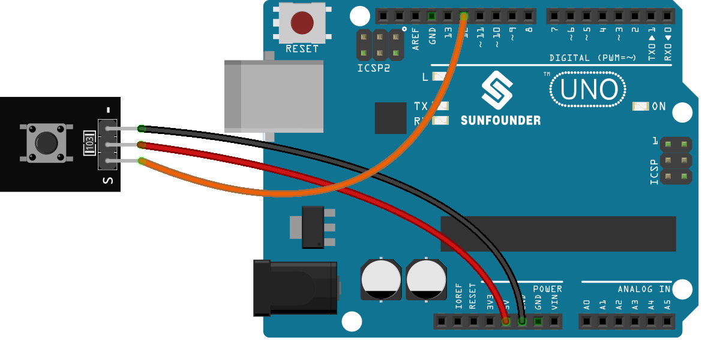

.. note::

    こんにちは、SunFounder Raspberry Pi & Arduino & ESP32 Enthusiasts Communityへようこそ！Facebook上で、仲間と一緒にRaspberry Pi、Arduino、ESP32をさらに深く探求しましょう。

    **なぜ参加するのか？**

    - **専門的なサポート**：購入後の問題や技術的な課題をコミュニティやチームの助けを借りて解決。
    - **学びと共有**：スキルを向上させるためのヒントやチュートリアルを交換。
    - **限定プレビュー**：新製品発表や予告編に早期アクセス。
    - **特別割引**：最新製品の特別割引を楽しむ。
    - **フェスティブプロモーションとプレゼント**：プレゼントやホリデープロモーションに参加。

    👉 私たちと一緒に探索と創造を始める準備はできましたか？[|link_sf_facebook|]をクリックして、今すぐ参加しましょう！
    
.. _uno_lesson01_button:

レッスン 01: ボタンモジュール
==================================

このレッスンでは、Arduinoを使用してボタンがLEDとどのように相互作用するかを学びます。ボタンを押すとLEDが点灯し、離すと消灯する仕組みを見ていきます。このプロジェクトは初心者に最適で、Arduinoプラットフォーム上での入力と出力の操作を実際に理解するのに役立ちます。

必要なコンポーネント
---------------------------

このプロジェクトでは、以下のコンポーネントが必要です。

全体のキットを購入するのが便利です。リンクはこちらです:

.. list-table::
    :widths: 20 20 20
    :header-rows: 1

    *   - Name	
        - ITEMS IN THIS KIT
        - LINK
    *   - Universal Maker Sensor Kit
        - 94
        - |link_umsk|

以下のリンクから個別に購入することもできます。

.. list-table::
    :widths: 30 20
    :header-rows: 1

    *   - Component Introduction
        - Purchase Link

    *   - Arduino UNO R3 or R4
        - |link_Uno_R3_buy|
    *   - :ref:`cpn_button`
        - \-
        

配線
---------------------------

コード
---------------------------

.. raw:: html

    <iframe src=https://create.arduino.cc/editor/sunfounder01/2249707e-73aa-400b-8141-15424c291f44/preview?embed style="height:510px;width:100%;margin:10px 0" frameborder=0></iframe>

コード解析
---------------------------

#. ピンの初期化

   ボタンとLEDのピンが定義され、初期化されます。 ``buttonPin`` はボタンの状態を読み取るために入力として設定され、 ``ledPin`` はLEDを制御するために出力として設定されます。

   .. note::
      ほとんどのArduinoボードには、抵抗と直列に接続されたオンボードLEDがあります。定数 ``LED_BUILTIN`` は、オンボードLEDが接続されているピンの番号です。ほとんどのボードでは、このLEDはデジタルピン13に接続されています。
   
   .. code-block:: arduino

      const int buttonPin = 12;        // Pin number for the button
      const int ledPin = LED_BUILTIN;  // Pin number for the LED
      int buttonState = 0;  // Variable to hold the current state of the button

#. セットアップ関数

   この関数は一度だけ実行され、ピンモードを設定します。 ``pinMode(buttonPin, INPUT)`` はボタンピンを入力として設定します。 ``pinMode(ledPin, OUTPUT)`` はLEDピンを出力として設定します。
   
   .. code-block:: arduino

      void setup() {
        pinMode(buttonPin, INPUT);  // Initialize buttonPin as an input pin
        pinMode(ledPin, OUTPUT);    // Initialize ledPin as an output pin
      }

#. メインループ関数

   これはプログラムの中核であり、ボタンの状態が連続して読み取られ、LEDの状態が制御されます。 ``digitalRead(buttonPin)`` はボタンの状態を読み取ります。ボタンが押されている場合（状態がLOW）、``digitalWrite(ledPin, HIGH)``でLEDが点灯します。押されていない場合、LEDは消灯します（ ``digitalWrite(ledPin, LOW)``）。

   このプロジェクトで使用されている :ref:`button module<cpn_button>` には内部プルアップ抵抗があります（その :ref:`schematic diagram<cpn_button_sch>`を参照）、ボタンが押されたときに低レベルになり、離されたときに高レベルのままになります。
   
   .. code-block:: arduino

      void loop() {
        // Read the current state of the button
        buttonState = digitalRead(buttonPin);

        // Check if the button is pressed (LOW)
        if (buttonState == LOW) {
          digitalWrite(ledPin, HIGH);  // Turn the LED on
        } else {
          digitalWrite(ledPin, LOW);  // Turn the LED off
        }
      }
