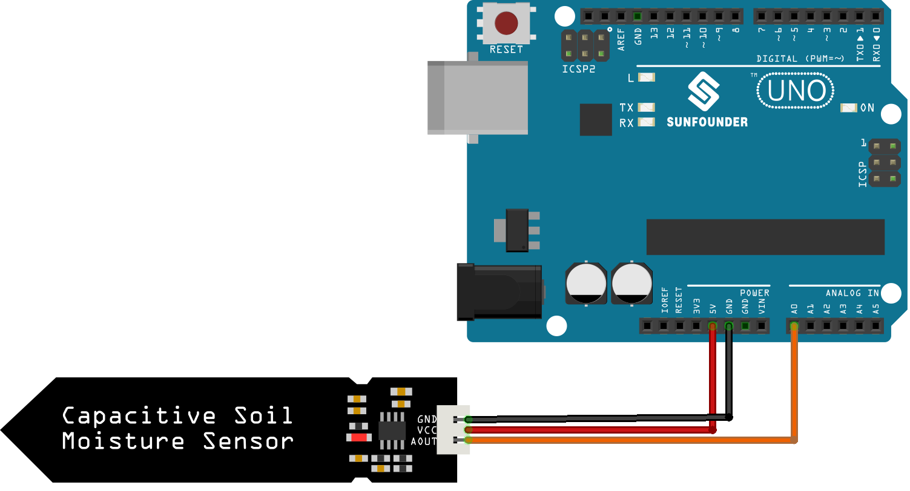

.. note::

    Hello, welcome to the SunFounder Raspberry Pi & Arduino & ESP32 Enthusiasts Community on Facebook! Dive deeper into Raspberry Pi, Arduino, and ESP32 with fellow enthusiasts.

    **Why Join?**

    - **Expert Support**: Solve post-sale issues and technical challenges with help from our community and team.
    - **Learn & Share**: Exchange tips and tutorials to enhance your skills.
    - **Exclusive Previews**: Get early access to new product announcements and sneak peeks.
    - **Special Discounts**: Enjoy exclusive discounts on our newest products.
    - **Festive Promotions and Giveaways**: Take part in giveaways and holiday promotions.

    👉 Ready to explore and create with us? Click [|link_sf_facebook|] and join today!

.. _uno_lesson02_soil_moisture:

Lesson 02: Capacitive Soil Moisture Module
============================================

In this lesson, you will learn how to connect a capacitive soil moisture sensor to an Arduino and interpret its readings. The project includes reading the sensor's analog output with the Arduino and understanding that lower readings indicate higher soil moisture levels. You'll gain practical experience in handling analog input and serial communication with the Arduino by using the provided code as a hands-on example.

Required Components
---------------------------

In this project, we need the following components. 

It's definitely convenient to buy a whole kit, here's the link: 

.. list-table::
    :widths: 20 20 20
    :header-rows: 1

    *   - Name	
        - ITEMS IN THIS KIT
        - LINK
    *   - Universal Maker Sensor Kit
        - 94
        - |link_umsk|

You can also buy them separately from the links below.

.. list-table::
    :widths: 30 20
    :header-rows: 1

    *   - Component Introduction
        - Purchase Link

    *   - Arduino UNO R3 or R4
        - |link_Uno_R3_buy|
    *   - :ref:`cpn_soil`
        - |link_soil_moisture_buy|

Wiring
---------------------------

Code
---------------------------

.. raw:: html

    <iframe src=https://create.arduino.cc/editor/sunfounder01/fa2c3492-576b-4039-bbfe-891ed87e72c9/preview?embed style="height:510px;width:100%;margin:10px 0" frameborder=0></iframe>

Code Analysis
---------------------------

#. Defining the sensor pin:

   This line of code declares a constant integer ``sensorPin`` and assigns it the value of ``A0``, which is the analog input pin the sensor is connected to.

   .. code-block:: arduino

      const int sensorPin = A0;

#. Setup function:

   The ``setup()`` function is executed once when the program starts. It initializes serial communication at 9600 baud rate. This setup is necessary for sending data to the serial monitor.

   .. code-block:: arduino

      void setup() {
        Serial.begin(9600);
      }

#. Loop function:

   The ``loop()`` function runs continuously after ``setup()``. It reads the sensor value from pin A0 using ``analogRead()`` and prints this value to the serial monitor. The ``delay(500)`` statement pauses the loop for 500 milliseconds before the next reading, thus controlling the rate of data acquisition.

   .. code-block:: arduino

      void loop() {
        Serial.println(analogRead(A0));
        delay(500);
      }

