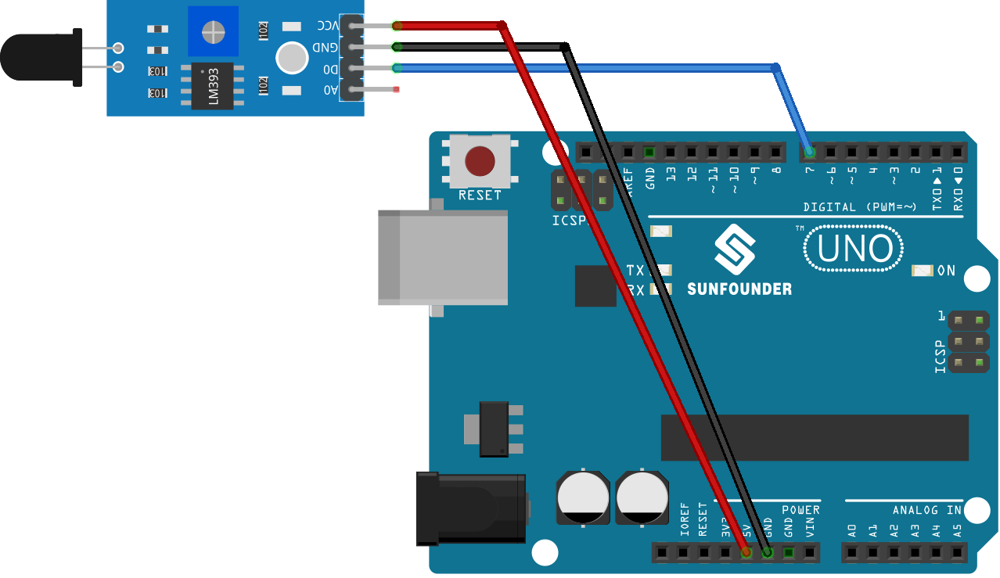

.. _uno_lesson03_flame:

Lesson 03: Flame Sensor Module
==================================

In this lesson, you will learn how to integrate a flame sensor with an Arduino board to detect the presence of fire. We will see how the flame sensor, when detecting a flame, triggers the Arduino's built-in LED to light up and sends a warning message to the serial monitor. Conversely, in the absence of a flame, the LED stays off, and a different message is relayed to the monitor. This project is an excellent starting point for beginners, offering a comprehensive understanding of how to manage digital inputs and outputs on the Arduino platform. It provides a hands-on approach to learning about sensor integration and real-time response mechanisms in an Arduino-based system.

Required Components
---------------------------

* Arduino UNO R3 or R4
* :ref:`cpn_flame`

Wiring
---------------------------

Code
---------------------------

.. raw:: html

    <iframe src=https://create.arduino.cc/editor/sunfounder01/244b68c4-0c4d-46fb-b220-985d42f4efdc/preview?embed style="height:510px;width:100%;margin:10px 0" frameborder=0></iframe>

Code Analysis
---------------------------

1. The first line of code is a constant integer declaration for the flame sensor pin. We use the digital pin 7 to read the output from the flame sensor.

   .. code-block:: arduino
   
      const int sensorPin = 7;

2. The ``setup()`` function initializes the flame sensor pin as an input and the built-in LED pin as an output. It also starts the serial communication at a baud rate of 9600 for printing messages to the serial monitor.

   .. code-block:: arduino
   
      void setup() {
        pinMode(sensorPin, INPUT);     // Set the flame sensor pin as input
        pinMode(LED_BUILTIN, OUTPUT);  // Set the built-in LED pin as output
        Serial.begin(9600);            // Initialize the serial monitor at a baud rate of 9600
      }

3. The ``loop()`` function is where we continuously check the status of the flame sensor. If the sensor detects a flame, the built-in LED is turned on and a message is printed to the serial monitor. If no flame is detected, the LED is turned off and a different message is printed. The process repeats every 100 milliseconds.

   .. note:: 
      You can change the threshold for detecting flames by adjusting the potentiometer on the flame sensor module.

   .. code-block:: arduino
   
      void loop() {
        // Check if the sensor is detecting a fire
        if (digitalRead(sensorPin) == 0) {
          digitalWrite(LED_BUILTIN, HIGH);  // Turn on the built-in LED
          Serial.println("** Fire detected!!! **");
        } else {
          digitalWrite(LED_BUILTIN, LOW);  // Turn off the built-in LED
          Serial.println("No Fire detected");
        }
        delay(100);
      }
