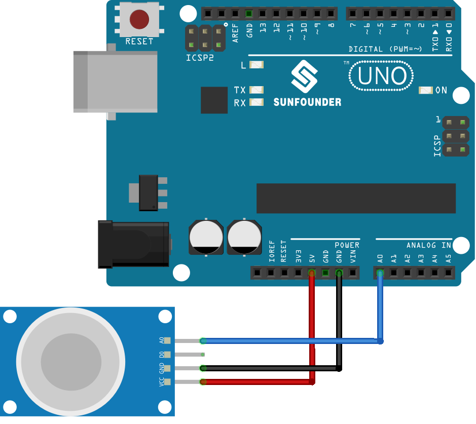

.. _uno_lesson04_mq2:

Lesson 04: Gas Sensor Module (MQ-2)
============================================

In this lesson, you will learn how to use the MQ-2 Gas Sensor with an Arduino Uno to measure gas concentrations. We'll explore how the sensor reads analog output values ranging from 0 to 1023, which represent the concentration of gases in the air. This project is essential for understanding environmental sensing and analog signal processing in Arduino, as well as a great introduction to working with sensors and interpreting their outputs. We'll discuss the importance of preheating the sensor for accurate readings and delve into the basics of serial communication for data visualization. This lesson is ideal for beginners interested in Arduino and environmental monitoring projects.

Required Components
--------------------------

In this project, we need the following components. 

It's definitely convenient to buy a whole kit, here's the link: 

.. list-table::
    :widths: 20 20 20
    :header-rows: 1

    *   - Name	
        - ITEMS IN THIS KIT
        - LINK
    *   - Universal Maker Sensor Kit
        - 94
        - |link_umsk|

You can also buy them separately from the links below.

.. list-table::
    :widths: 30 10
    :header-rows: 1

    *   - Component Introduction
        - Purchase Link

    *   - Arduino UNO R3 or R4
        - |link_Uno_R3_buy|
    *   - :ref:`cpn_gas`
        - |link_mq2_gas_sensor_module_buy|

Wiring
---------------------------

Code
---------------------------

.. raw:: html

    <iframe src=https://create.arduino.cc/editor/sunfounder01/6af3295c-28dd-4319-8f26-587930ffd2ef/preview?embed style="height:510px;width:100%;margin:10px 0" frameborder=0></iframe>

Code Analysis
---------------------------

1. The first line of code is a constant integer declaration for the gas sensor pin. We use the analog pin A0 to read the output from the gas sensor.

   .. code-block:: arduino
   
      const int sensorPin = A0;

2. The ``setup()`` function is where we initialize our serial communication at a baud rate of 9600. This is necessary to print the readings from the gas sensor to the serial monitor.

   .. code-block:: arduino
   
      void setup() {
        Serial.begin(9600);  // Start serial communication at 9600 baud rate
      }

3. The ``loop()`` function is where we continuously read the analog value from the gas sensor and print it to the serial monitor. We use the ``analogRead()`` function to read the analog value from the sensor. We then wait for 50 milliseconds before the next reading. This delay gives some breathing space for the serial monitor to process the data.

   .. note:: 
   
     MQ2 is a heating-driven sensor that usually requires preheating before use. During the preheating period, the sensor typically reads high and gradually decreases until it stabilizes.

   .. code-block:: arduino
   
      void loop() {
        Serial.print("Analog output: ");
        Serial.println(analogRead(sensorPin));  // Read the analog value of the gas sensor and print it to the serial monitor
        delay(50);                             // Wait for 50 milliseconds
      }

