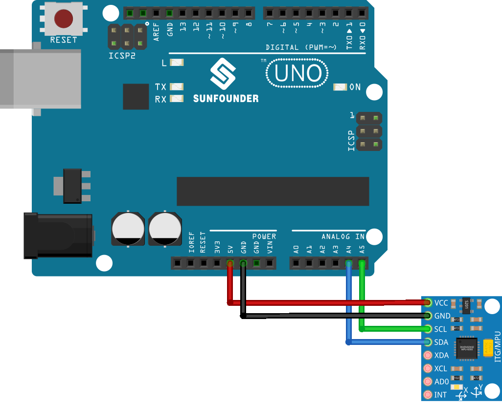

 .. note::

    Hallo und willkommen in der SunFounder Raspberry Pi & Arduino & ESP32 Enthusiasten-Gemeinschaft auf Facebook! Tauchen Sie tiefer ein in die Welt von Raspberry Pi, Arduino und ESP32 mit anderen Enthusiasten.

    **Warum beitreten?**

    - **Expertenunterstützung**: Lösen Sie Nachverkaufsprobleme und technische Herausforderungen mit Hilfe unserer Gemeinschaft und unseres Teams.
    - **Lernen & Teilen**: Tauschen Sie Tipps und Anleitungen aus, um Ihre Fähigkeiten zu verbessern.
    - **Exklusive Vorschauen**: Erhalten Sie frühzeitigen Zugang zu neuen Produktankündigungen und exklusiven Einblicken.
    - **Spezialrabatte**: Genießen Sie exklusive Rabatte auf unsere neuesten Produkte.
    - **Festliche Aktionen und Gewinnspiele**: Nehmen Sie an Gewinnspielen und Feiertagsaktionen teil.

    👉 Sind Sie bereit, mit uns zu erkunden und zu erschaffen? Klicken Sie auf [|link_sf_facebook|] und treten Sie heute bei!

.. _uno_lesson05_mpu6050:

Lektion 05: Gyroskop- & Beschleunigungssensormodul (MPU6050)
==============================================================

In dieser Lektion lernen Sie, wie Sie den MPU6050-Sensor mit einem Arduino verwenden, um Beschleunigung, Rotation und Temperatur zu messen. Wir werden die Initialisierung des Sensors, das Einstellen seiner Bereiche und das Auslesen der Daten zur Anzeige auf dem seriellen Monitor untersuchen. Dieses Projekt bietet einen praxisnahen Ansatz zur Arbeit mit Bewegungssensoren und deren Integration mit Arduino und ist perfekt für diejenigen, die in die Welt der Elektronik und der Sensor-Datenverarbeitung eintauchen möchten.

Benötigte Komponenten
--------------------------

Für dieses Projekt benötigen wir die folgenden Komponenten.

Es ist definitiv praktisch, ein komplettes Kit zu kaufen. Hier ist der Link:

.. list-table::
    :widths: 20 20 20
    :header-rows: 1

    *   - Name	
        - ITEMS IN THIS KIT
        - LINK
    *   - Universal Maker Sensor Kit
        - 94
        - |link_umsk|

Sie können die Komponenten auch separat über die folgenden Links kaufen.

.. list-table::
    :widths: 30 10
    :header-rows: 1

    *   - Component Introduction
        - Purchase Link

    *   - Arduino UNO R3 or R4
        - |link_Uno_R3_buy|
    *   - :ref:`cpn_mpu6050`
        - |link_mpu6050_buy|

Verkabelung
---------------------------

Code
---------------------------

.. raw:: html

    <iframe src=https://create.arduino.cc/editor/sunfounder01/b0efe80d-c89d-402e-a213-a778c404565b/preview?embed style="height:510px;width:100%;margin:10px 0" frameborder=0></iframe>

Codeanalyse
---------------------------

1. Der Code beginnt mit dem Einbinden der notwendigen Bibliotheken und dem Erstellen eines Objekts für den MPU6050-Sensor. Dieser Code verwendet die Adafruit_MPU6050-Bibliothek, die Adafruit_Sensor-Bibliothek und die Wire-Bibliothek. Die ``Adafruit_MPU6050``-Bibliothek wird verwendet, um mit dem MPU6050-Sensor zu interagieren und Daten zu Beschleunigung, Rotation und Temperatur abzurufen. Die ``Adafruit_Sensor``-Bibliothek bietet eine gemeinsame Schnittstelle für verschiedene Sensortypen. Die ``Wire``-Bibliothek wird für die I2C-Kommunikation verwendet, die notwendig ist, um mit dem MPU6050-Sensor zu kommunizieren.

   .. note:: 
       Um die Bibliothek zu installieren, verwenden Sie den Arduino Library Manager und suchen Sie nach **"Adafruit MPU6050"** und installieren Sie diese.
   
   .. code-block:: arduino
   
      #include <Adafruit_MPU6050.h>
      #include <Adafruit_Sensor.h>
      #include <Wire.h>
      Adafruit_MPU6050 mpu;
   
2. Die Funktion ``setup()`` initialisiert die serielle Kommunikation und überprüft, ob der Sensor erkannt wird. Wenn der Sensor nicht gefunden wird, geht der Arduino in eine Endlosschleife mit der Nachricht "Failed to find MPU6050 chip". Wenn der Sensor gefunden wird, werden der Beschleunigungsbereich, der Gyrobereich und die Filterbandbreite eingestellt, und eine Verzögerung wird für die Stabilität hinzugefügt.

   .. code-block:: arduino
   
      void setup(void) {
        // Initialize the serial communication
        Serial.begin(9600);
   
        // Check if the MPU6050 sensor is detected
        if (!mpu.begin()) {
          Serial.println("Failed to find MPU6050 chip");
          while (1) {
            delay(10);
          }
        }
        Serial.println("MPU6050 Found!");
   
        // set accelerometer range to +-8G
        mpu.setAccelerometerRange(MPU6050_RANGE_8_G);
   
        // set gyro range to +- 500 deg/s
        mpu.setGyroRange(MPU6050_RANGE_500_DEG);
   
        // set filter bandwidth to 21 Hz
        mpu.setFilterBandwidth(MPU6050_BAND_21_HZ);
   
        // Add a delay for stability
        delay(100);
      }

3. In der Funktion ``loop()`` erstellt das Programm Ereignisse, um die Sensorwerte zu speichern und diese dann abzurufen. Die Beschleunigungs-, Rotations- und Temperaturwerte werden dann auf dem seriellen Monitor ausgegeben.

   .. code-block:: arduino
   
      void loop() {
        // Get new sensor events with the readings
        sensors_event_t a, g, temp;
        mpu.getEvent(&a, &g, &temp);
   
        // Print out the acceleration, rotation, and temperature readings
        // ...
   
        // Add a delay to avoid flooding the serial monitor
        delay(1000);
      }
