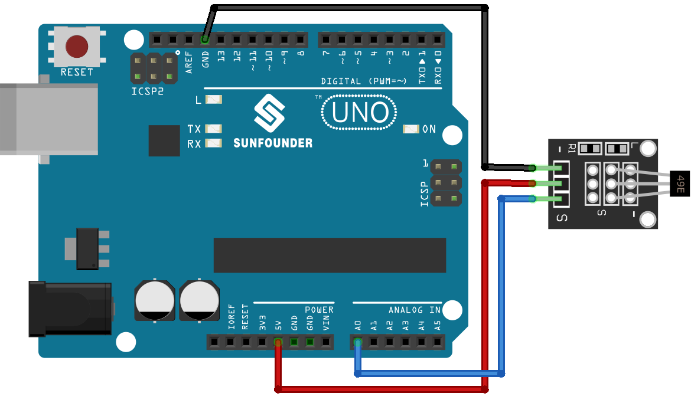

.. note::

    こんにちは、SunFounder Raspberry Pi & Arduino & ESP32 Enthusiasts Communityへようこそ！Facebook上で、仲間と一緒にRaspberry Pi、Arduino、ESP32をさらに深く探求しましょう。

    **なぜ参加するのか？**

    - **専門的なサポート**：購入後の問題や技術的な課題をコミュニティやチームの助けを借りて解決。
    - **学びと共有**：スキルを向上させるためのヒントやチュートリアルを交換。
    - **限定プレビュー**：新製品発表や予告編に早期アクセス。
    - **特別割引**：最新製品の特別割引を楽しむ。
    - **フェスティブプロモーションとプレゼント**：プレゼントやホリデープロモーションに参加。

    👉 私たちと一緒に探索と創造を始める準備はできましたか？[|link_sf_facebook|]をクリックして、今すぐ参加しましょう！

.. _uno_lesson06_hall_sensor:

レッスン 06: ホールセンサーモジュール
=======================================

このレッスンでは、Arduinoを使用してホールセンサーが磁場を検出する方法を学びます。Arduino Unoでセンサーのアナログ信号を読み取り、その値を解釈して磁場の極性を判断する方法について探求します。ホールセンサーの仕組みと、Arduinoボードがこれらの読み取り値をリアルタイムで処理・表示する方法を理解することができます。

必要なコンポーネント
---------------------------

このプロジェクトには以下のコンポーネントが必要です。

キット全体を購入するのが便利です。こちらのリンクからどうぞ:

.. list-table::
    :widths: 20 20 20
    :header-rows: 1

    *   - Name	
        - ITEMS IN THIS KIT
        - LINK
    *   - Universal Maker Sensor Kit
        - 94
        - |link_umsk|

以下のリンクから個別に購入することもできます。

.. list-table::
    :widths: 30 20
    :header-rows: 1

    *   - Component Introduction
        - Purchase Link

    *   - Arduino UNO R3 or R4
        - |link_Uno_R3_buy|
    *   - :ref:`cpn_hall`
        - \-
        

配線
---------------------------

コード
---------------------------

.. raw:: html

    <iframe src=https://create.arduino.cc/editor/sunfounder01/fc459930-a030-4a1d-b998-e57a6a4f2e78/preview?embed style="height:510px;width:100%;margin:10px 0" frameborder=0></iframe>

コード解析
---------------------------

1. ホールセンサーの設定

   .. code-block:: arduino

      const int hallSensorPin = A0;  // Pin A0 connected to the Hall sensor output
      void setup() {
        Serial.begin(9600);             // Initialize serial communication at 9600 bps
        pinMode(hallSensorPin, INPUT);  // Set hall sensor pin as input
      }

   ホールセンサーの出力はArduinoのピンA0に接続されています。 ``setup()`` 関数は、シリアルモニターでデータを表示するために9600ビット毎秒（bps）でシリアル通信を初期化します。 ``pinMode()`` 関数はA0を入力ピンとして設定します。

2. ホールセンサーからの読み取りと極性の判定

   ホールセンサーモジュールには49Eリニアホール効果センサーが搭載されており、磁場の北極および南極の極性と磁場の相対的な強さを測定できます。磁石の南極を49Eと記された側（テキストが刻まれた側）に近づけると、コードで読み取る値は適用される磁場強度に比例して線形に増加します。逆に、北極をこの側に近づけると、読み取る値は磁場強度に比例して線形に減少します。詳細については、:ref:`cpn_hall`を参照してください。

   .. code-block:: arduino

      void loop() {
        int sensorValue = analogRead(hallSensorPin);  // Read analog value from Hall sensor
        Serial.print(sensorValue);                    // Output raw sensor value to Serial Monitor
        delay(200);                                   // Delay for 200 milliseconds

        // Determine magnetic pole based on sensor value
        if (sensorValue >= 700) {
          Serial.print(" - South pole detected");  // South pole detected if value >= 700
        } else if (sensorValue <= 300) {
          Serial.print(" - North pole detected");  // North pole detected if value <= 300
        }

        Serial.println();  // New line for next output
      }

