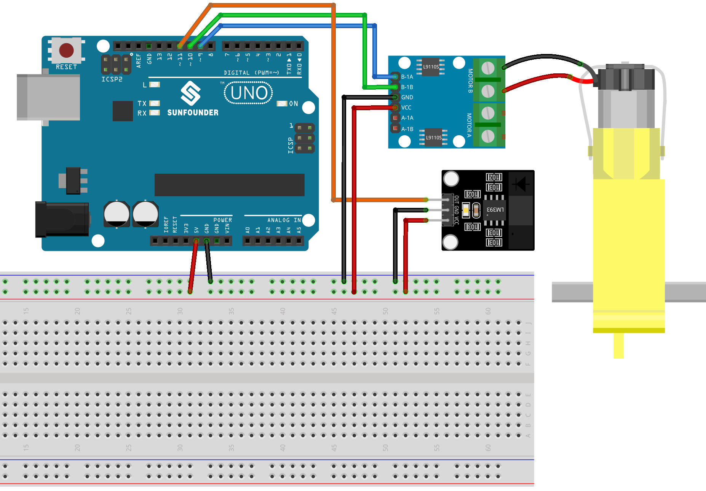

.. _uno_lesson07_speed:

Lesson 07: Infrared Speed Sensor Module
==========================================

In this lesson, you will learn how to measure motor speed using a speed sensor module with an Arduino Uno. We'll cover setting up the motor and sensor, programming the Arduino to calculate revolutions per second, and displaying the data. This project is great for intermediate learners as it provides hands-on experience with real-time data processing and motor control on the Arduino platform.

Required Components
---------------------------

.. list-table::
    :widths: 30 20
    :header-rows: 1

    *   - Component Introduction
        - Purchase Link

    *   - Arduino UNO R3 or R4
        - |link_Uno_R3_buy|
    *   - :ref:`cpn_breadboard`
        - |link_breadboard_buy|
    *   - :ref:`cpn_speed`
        - |link_speed_sensor_module_buy|
    *   - :ref:`cpn_ttmotor`
        - \-
    *   - :ref:`cpn_l9110`
        - \-

Wiring
---------------------------

Code
---------------------------

.. raw:: html

    <iframe src=https://create.arduino.cc/editor/sunfounder01/0d705c03-2813-4e71-8ec6-1208684358c9/preview?embed style="height:510px;width:100%;margin:10px 0" frameborder=0></iframe>

Code Analysis
---------------------------

#. Setting up the pins and initializing variables. Here, we define the pins for the motor and the speed sensor. We also initialize variables that will be used to measure and calculate the speed of the motor.

   .. code-block:: arduino

      // Define the sensor and motor pins
      const int sensorPin = 11;
      const int motorB_1A = 9;
      const int motorB_2A = 10;
      
      // Define variables for measuring speed
      unsigned long start_time = 0;
      unsigned long end_time = 0;
      int steps = 0;
      float steps_old = 0;
      float temp = 0;
      float rps = 0;

#. Initialization in the ``setup()`` function. This section sets up the serial communication, configures the pins' modes, and sets the initial motor speed.

   .. code-block:: arduino

      void setup() {
        Serial.begin(9600);
        pinMode(sensorPin, INPUT);
        pinMode(motorB_1A, OUTPUT);
        pinMode(motorB_2A, OUTPUT);
        analogWrite(motorB_1A, 160);
        analogWrite(motorB_2A, 0);
      }

#. Measuring the motor's speed in the ``loop()`` function. In this segment, the motor's steps are measured for a duration of 1 second. These steps are then used to calculate the revolutions per second (rps), which is then printed to the serial monitor.

   ``millis()`` returns the number of milliseconds passed since the Arduino board began running the current program. 

   .. code-block:: arduino

      void loop() {
        start_time = millis();
        end_time = start_time + 1000;
        while (millis() < end_time) {
          if (digitalRead(sensorPin)) {
            steps = steps + 1;
            while (digitalRead(sensorPin))
              ;
          }
        }
        temp = steps - steps_old;
        steps_old = steps;
        rps = (temp / 20);
        Serial.print("rps:");
        Serial.println(rps);
      }