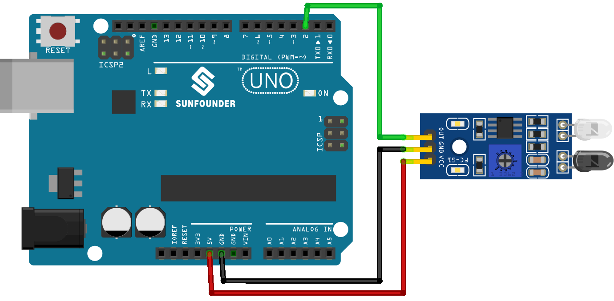

.. note::

   Hallo und willkommen in der SunFounder Raspberry Pi & Arduino & ESP32 Enthusiasten-Gemeinschaft auf Facebook! Tauchen Sie tiefer ein in die Welt von Raspberry Pi, Arduino und ESP32 mit anderen Enthusiasten.

   **Warum beitreten?**

   - **Expertenunterstützung**: Lösen Sie Nachverkaufsprobleme und technische Herausforderungen mit Hilfe unserer Gemeinschaft und unseres Teams.
   - **Lernen & Teilen**: Tauschen Sie Tipps und Anleitungen aus, um Ihre Fähigkeiten zu verbessern.
   - **Exklusive Vorschauen**: Erhalten Sie frühzeitigen Zugang zu neuen Produktankündigungen und exklusiven Einblicken.
   - **Spezialrabatte**: Genießen Sie exklusive Rabatte auf unsere neuesten Produkte.
   - **Festliche Aktionen und Gewinnspiele**: Nehmen Sie an Gewinnspielen und Feiertagsaktionen teil.

   👉 Sind Sie bereit, mit uns zu erkunden und zu erschaffen? Klicken Sie auf [|link_sf_facebook|] und treten Sie heute bei!

.. _uno_lesson08_ir_obstacle_avoidance:

Lektion 08: IR-Hindernisvermeidungssensormodul
====================================================

In dieser Lektion lernen Sie, wie Sie einen Infrarot-Hindernisvermeidungssensor mit einem Arduino Uno verwenden. Wir werden untersuchen, wie digitale Signale vom Sensor gelesen werden, um Hindernisse zu erkennen. Sie werden sehen, wie das rote Anzeigelicht des Sensors bei Hindernissen aufleuchtet und wie er ein Niedrigpegelsignal an den Arduino sendet. Diese Lektion ist perfekt für Anfänger und bietet praktische Erfahrungen im Lesen digitaler Eingaben und der seriellen Kommunikation auf der Arduino-Plattform.

Benötigte Komponenten
--------------------------

Für dieses Projekt benötigen wir die folgenden Komponenten.

Es ist definitiv praktisch, ein komplettes Kit zu kaufen. Hier ist der Link:

.. list-table::
    :widths: 20 20 20
    :header-rows: 1

    *   - Name	
        - ITEMS IN THIS KIT
        - LINK
    *   - Universal Maker Sensor Kit
        - 94
        - |link_umsk|

Sie können die Komponenten auch separat über die folgenden Links kaufen.

.. list-table::
    :widths: 30 20
    :header-rows: 1

    *   - Component Introduction
        - Purchase Link

    *   - Arduino UNO R3 or R4
        - |link_Uno_R3_buy|
    *   - :ref:`cpn_ir_obstacle`
        - |link_obstacle_avoidance_module_buy|

Verkabelung
---------------------------

Code
---------------------------

.. raw:: html

    <iframe src=https://create.arduino.cc/editor/sunfounder01/be83e63b-959c-4d9c-a27b-0be46291c1f8/preview?embed style="height:510px;width:100%;margin:10px 0" frameborder=0></iframe>

Codeanalyse
---------------------------

1. Definieren der Pinnummer für die Sensorverbindung:

   .. code-block:: arduino

     const int sensorPin = 2;

   Verbinden Sie den Ausgangspin des Sensors mit Pin 2 des Arduino.

2. Einrichtung der seriellen Kommunikation und Definition des Sensorpins als Eingang:

   .. code-block:: arduino

     void setup() {
       pinMode(sensorPin, INPUT);  
       Serial.begin(9600);
     }

   Initialisieren Sie die serielle Kommunikation mit einer Baudrate von 9600, um auf dem seriellen Monitor auszugeben.
   Setzen Sie den Sensorpin als Eingang, um das Eingangssignal zu lesen.

3. Lesen des Sensorwertes und Ausgabe auf dem seriellen Monitor:

   .. code-block:: arduino

     void loop() {
       Serial.println(digitalRead(sensorPin));
       delay(50); 
     }
   
   Lesen Sie kontinuierlich den digitalen Wert vom Sensorpin mit ``digitalRead()`` und geben Sie den Wert mit ``Serial.println()`` auf dem seriellen Monitor aus.
   Fügen Sie eine Verzögerung von 50 ms zwischen den Ausgaben hinzu, um die Ansicht zu verbessern.

   .. note:: 
   
      Wenn der Sensor nicht richtig funktioniert, richten Sie den IR-Sender und -Empfänger parallel aus. Zusätzlich können Sie die Erfassungsreichweite mit dem eingebauten Potentiometer einstellen.
