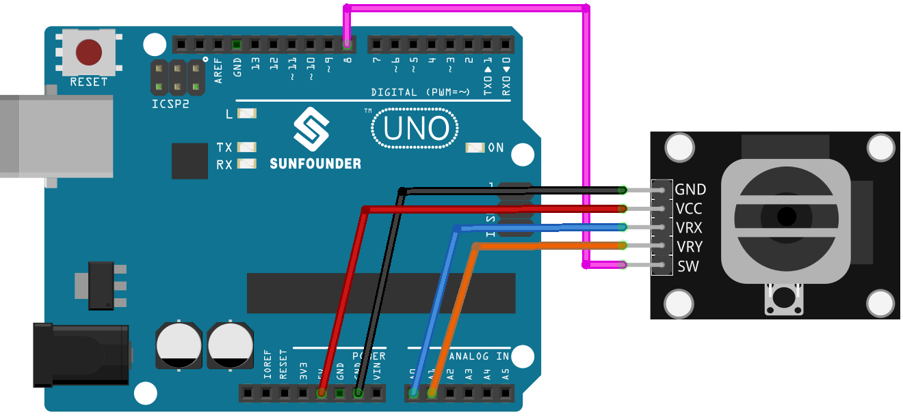

.. _uno_lesson09_joystick:

Lesson 09: Joystick Module
==================================

In this lesson, you will learn how to read values from a joystick module using an Arduino Uno. We will explore connecting the joystick's X and Y axes to the Arduino and how to display their values on the serial monitor. Additionally, we'll cover the usage of a switch button on the joystick. This project is perfect for beginners, offering hands-on experience with analog and digital inputs on the Arduino platform.

Required Components
---------------------------

* Arduino UNO R3 or R4
* :ref:`cpn_joystick`

Wiring
---------------------------

Code
---------------------------

.. raw:: html

    <iframe src=https://create.arduino.cc/editor/sunfounder01/82313b82-4ac8-407c-9b65-3e7d548e6520/preview?embed style="height:510px;width:100%;margin:10px 0" frameborder=0></iframe>

Code Analysis
---------------------------

#. Pin Definitions:
   
   .. code-block:: arduino
   
      const int xPin = A0;  //the VRX attach to
      const int yPin = A1;  //the VRY attach to
      const int swPin = 8;  //the SW attach to

   Constants for the joystick pins are defined. ``xPin`` and ``yPin`` are analog pins for the joystick's X and Y axes. ``swPin`` is a digital pin for the joystick's switch.

#. Setup Function:

   .. code-block:: arduino
   
      void setup() {
        pinMode(swPin, INPUT_PULLUP);
        Serial.begin(9600);
      }

   Initializes ``swPin`` as an input with a pull-up resistor, essential for the switch's functionality. Starts serial communication at 9600 baud.

#. Main Loop:

   .. code-block:: arduino
   
      void loop() {
        Serial.print("X: ");
        Serial.print(analogRead(xPin));  // print the value of VRX
        Serial.print("|Y: ");
        Serial.print(analogRead(yPin));  // print the value of VRY
        Serial.print("|Z: ");
        Serial.println(digitalRead(swPin));  // print the value of SW
        delay(50);
      }

   Continuously reads and prints the values from the joystick's axes and switch to the Serial Monitor, with a delay of 50 ms between readings.