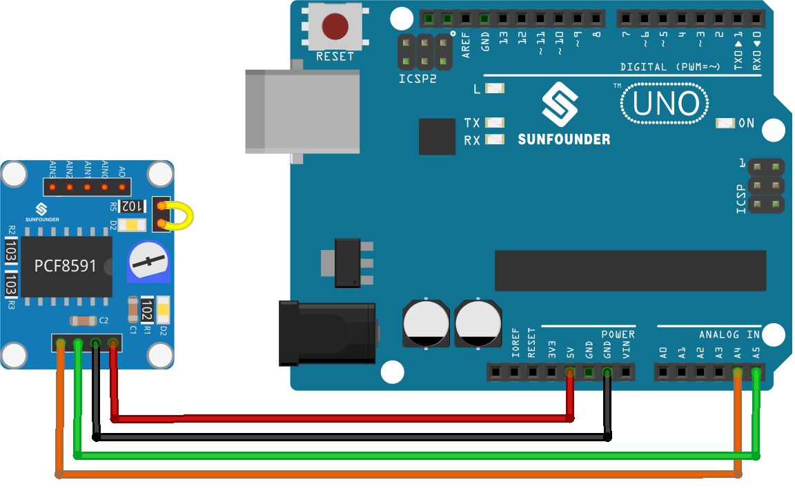

.. note::

   Hallo und willkommen in der SunFounder Raspberry Pi & Arduino & ESP32 Enthusiasten-Gemeinschaft auf Facebook! Tauchen Sie tiefer ein in die Welt von Raspberry Pi, Arduino und ESP32 mit anderen Enthusiasten.

   **Warum beitreten?**

   - **Expertenunterstützung**: Lösen Sie Nachverkaufsprobleme und technische Herausforderungen mit Hilfe unserer Gemeinschaft und unseres Teams.
   - **Lernen & Teilen**: Tauschen Sie Tipps und Anleitungen aus, um Ihre Fähigkeiten zu verbessern.
   - **Exklusive Vorschauen**: Erhalten Sie frühzeitigen Zugang zu neuen Produktankündigungen und exklusiven Einblicken.
   - **Spezialrabatte**: Genießen Sie exklusive Rabatte auf unsere neuesten Produkte.
   - **Festliche Aktionen und Gewinnspiele**: Nehmen Sie an Gewinnspielen und Feiertagsaktionen teil.

   👉 Sind Sie bereit, mit uns zu erkunden und zu erschaffen? Klicken Sie auf [|link_sf_facebook|] und treten Sie heute bei!

.. _uno_lesson10_pcf8591:

Lektion 10: PCF8591 ADC DAC Konverter-Modul
==============================================

In dieser Lektion lernen Sie, wie Sie den Arduino Uno R4 (oder R3) mit einem PCF8591 ADC DAC Konverter-Modul verbinden. Wir werden das Lesen analoger Werte vom Eingang AIN0, das Senden dieser Werte an den DAC (AOUT) und das Anzeigen der Roh- und Spannungswerte auf dem seriellen Monitor behandeln. Das Potentiometer des Moduls ist mit AIN0 verbunden, und die D2-LED auf dem Modul ist mit AOUT verbunden. So können Sie sehen, dass sich die Helligkeit der D2-LED ändert, wenn Sie das Potentiometer drehen.

Benötigte Komponenten
--------------------------

Für dieses Projekt benötigen wir die folgenden Komponenten.

Es ist definitiv praktisch, ein komplettes Kit zu kaufen. Hier ist der Link:

.. list-table::
    :widths: 20 20 20
    :header-rows: 1

    *   - Name	
        - ITEMS IN THIS KIT
        - LINK
    *   - Universal Maker Sensor Kit
        - 94
        - |link_umsk|

Sie können die Komponenten auch separat über die folgenden Links kaufen.

.. list-table::
    :widths: 30 20
    :header-rows: 1

    *   - Component Introduction
        - Purchase Link

    *   - Arduino UNO R3 or R4
        - |link_Uno_R3_buy|
    *   - :ref:`cpn_pcf8591`
        - |link_pcf8591_module_buy|

Verkabelung
---------------------------

Code
---------------------------

.. raw:: html

    <iframe src=https://create.arduino.cc/editor/sunfounder01/217d04d3-2c19-44df-b66b-5c1582955260/preview?embed style="height:510px;width:100%;margin:10px 0" frameborder=0></iframe>

Codeanalyse
---------------------------

#. **Bibliothek einbinden und Konstanten definieren**

   .. note:: 
      Um die Bibliothek zu installieren, verwenden Sie den Arduino Library Manager und suchen nach **"Adafruit PCF8591"** und installieren diese.

   .. code-block:: arduino

      // Include Adafruit PCF8591 library
      #include <Adafruit_PCF8591.h>
      // Define the reference voltage for ADC conversion
      #define ADC_REFERENCE_VOLTAGE 5.0

   In diesem Abschnitt wird die Adafruit PCF8591 Bibliothek eingebunden, die Funktionen zur Interaktion mit dem PCF8591 Modul bereitstellt. Die ADC-Referenzspannung wird auf 5,0 Volt gesetzt, was der maximalen Spannung entspricht, die der ADC messen kann.

#. **Einrichten des PCF8591 Moduls**

   .. code-block:: arduino

      // Create an instance of the PCF8591 module
      Adafruit_PCF8591 pcf = Adafruit_PCF8591();
      void setup() {
        Serial.begin(9600);
        Serial.println("# Adafruit PCF8591 demo");
        if (!pcf.begin()) {
          Serial.println("# PCF8591 not found!");
          while (1) delay(10);
        }
        Serial.println("# PCF8591 found");
        pcf.enableDAC(true);
      }

   In der Setup-Funktion wird die serielle Kommunikation gestartet und eine Instanz des PCF8591 Moduls erstellt. Die Funktion ``pcf.begin()`` überprüft, ob das Modul korrekt angeschlossen ist. Wenn nicht, wird eine Fehlermeldung ausgegeben und das Programm angehalten. Wenn das Modul gefunden wird, wird der DAC aktiviert.

#. **Lesen vom ADC und Schreiben zum DAC**

   .. code-block:: arduino

      void loop() {
        AIN0 = pcf.analogRead(0);
        pcf.analogWrite(AIN0);
        Serial.print("AIN0: ");
        Serial.print(AIN0);
        Serial.print(", ");
        Serial.print(int_to_volts(AIN0, 8, ADC_REFERENCE_VOLTAGE));
        Serial.println("V");
        delay(500);
      }

   Die Loop-Funktion liest kontinuierlich den Analogwert von AIN0 (analoger Eingang 0) des PCF8591 Moduls und schreibt diesen Wert dann zurück an den DAC. Außerdem wird der Rohwert und der in Spannung umgerechnete Wert von AIN0 auf dem seriellen Monitor ausgegeben.

   Jumperkappen verbinden das Potentiometer des Moduls mit AIN0, und die D2-LED ist mit AOUT verbunden; siehe das Schaltbild des PCF8591 Moduls :ref:`schematic <cpn_pcf8591_sch>` für Details. Die Helligkeit der LED ändert sich, wenn das Potentiometer gedreht wird.

#. **Funktion zur Umrechnung von digitalem Wert in Spannung**

   .. code-block:: arduino

      float int_to_volts(uint16_t dac_value, uint8_t bits, float logic_level) {
        return (((float)dac_value / ((1 << bits) - 1)) * logic_level);
      }

   Diese Funktion konvertiert den digitalen Wert zurück in die entsprechende Spannung. Sie nimmt den digitalen Wert (``dac_value``), die Anzahl der Auflösungsbits (``bits``) und die Logikpegelspannung (``logic_level``) als Argumente. Die verwendete Formel ist ein Standardansatz, um einen digitalen Wert in die äquivalente Spannung umzuwandeln.
