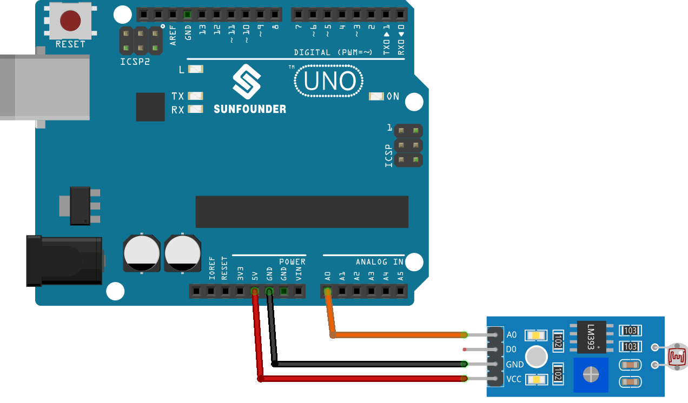

 
 .. note::

    Hallo und willkommen in der SunFounder Raspberry Pi & Arduino & ESP32 Enthusiasten-Gemeinschaft auf Facebook! Tauchen Sie tiefer ein in die Welt von Raspberry Pi, Arduino und ESP32 mit anderen Enthusiasten.

    **Warum beitreten?**

    - **Expertenunterstützung**: Lösen Sie Nachverkaufsprobleme und technische Herausforderungen mit Hilfe unserer Gemeinschaft und unseres Teams.
    - **Lernen & Teilen**: Tauschen Sie Tipps und Anleitungen aus, um Ihre Fähigkeiten zu verbessern.
    - **Exklusive Vorschauen**: Erhalten Sie frühzeitigen Zugang zu neuen Produktankündigungen und exklusiven Einblicken.
    - **Spezialrabatte**: Genießen Sie exklusive Rabatte auf unsere neuesten Produkte.
    - **Festliche Aktionen und Gewinnspiele**: Nehmen Sie an Gewinnspielen und Feiertagsaktionen teil.

    👉 Sind Sie bereit, mit uns zu erkunden und zu erschaffen? Klicken Sie auf [|link_sf_facebook|] und treten Sie heute bei!

.. _uno_lesson11_photoresistor:

Lektion 11: Fotowiderstandsmodul
==================================

In dieser Lektion lernen Sie, wie Sie die Lichtintensität mit einem Fotowiderstandssensor und einem Arduino Uno messen. Wir werden das Auslesen und Anzeigen der analogen Werte vom Sensor behandeln, die die Menge des erkannten Lichts widerspiegeln. Dieses Projekt ist ideal für Anfänger, da es praktische Erfahrungen im Umgang mit Sensoren und dem Verständnis von analogen Eingängen auf der Arduino-Plattform bietet. Sie verbessern auch Ihre Fähigkeiten in der seriellen Kommunikation, indem Sie die Sensormesswerte auf dem seriellen Monitor ausgeben.

Benötigte Komponenten
--------------------------

Für dieses Projekt benötigen wir die folgenden Komponenten.

Es ist definitiv praktisch, ein komplettes Kit zu kaufen. Hier ist der Link:

.. list-table::
    :widths: 20 20 20
    :header-rows: 1

    *   - Name	
        - ITEMS IN THIS KIT
        - LINK
    *   - Universal Maker Sensor Kit
        - 94
        - |link_umsk|

Sie können die Komponenten auch separat über die folgenden Links kaufen.

.. list-table::
    :widths: 30 20
    :header-rows: 1

    *   - Component Introduction
        - Purchase Link

    *   - Arduino UNO R3 or R4
        - |link_Uno_R3_buy|
    *   - :ref:`cpn_photoresistor`
        - |link_photoresistor_sensor_module_buy|

Verkabelung
---------------------------

Code
---------------------------

.. raw:: html

    <iframe src=https://create.arduino.cc/editor/sunfounder01/ac4664d2-2f44-4d5f-9cf4-a82eadc74d3e/preview?embed style="height:510px;width:100%;margin:10px 0" frameborder=0></iframe>

Codeanalyse
---------------------------

#. **Einrichten des Sensorpins und der seriellen Kommunikation**

   Wir beginnen damit, den Sensorpin zu definieren und die serielle Kommunikation in der Setup-Funktion zu initialisieren. Der Fotowiderstand ist mit dem analogen Pin A0 verbunden.

   .. code-block:: arduino

      const int sensorPin = A0;  // Pin connected to the photoresistor

      void setup() {
        Serial.begin(9600);  // Start serial communication at 9600 baud rate
      }

#. **Lesen und Anzeigen der Sensordaten**

   In der Loop-Funktion lesen wir kontinuierlich den Analogwert vom Sensor und geben ihn auf dem seriellen Monitor aus. Wir fügen auch eine kurze Verzögerung hinzu, um die Messwerte zu stabilisieren.

   .. code-block:: arduino

      void loop() {
        Serial.println(analogRead(sensorPin));  // Read and print the analog value
        delay(50);                              // Short delay to stabilize readings
      }

