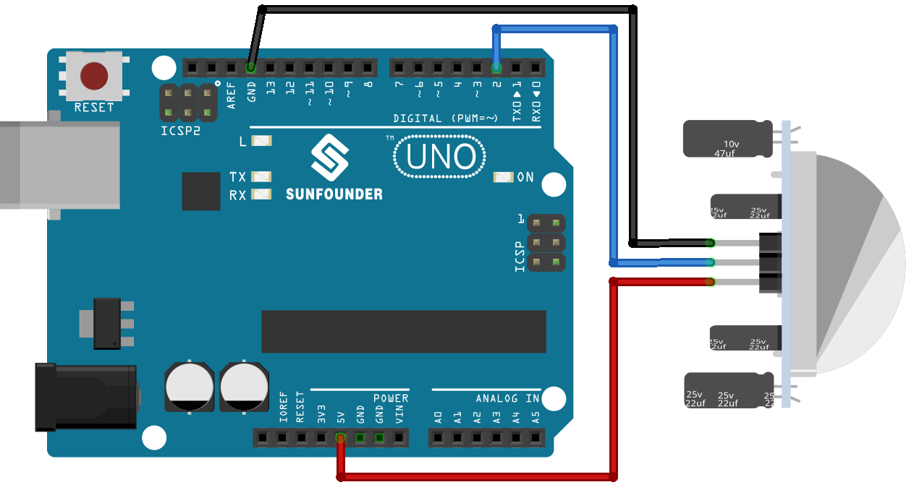

.. note::

    Hello, welcome to the SunFounder Raspberry Pi & Arduino & ESP32 Enthusiasts Community on Facebook! Dive deeper into Raspberry Pi, Arduino, and ESP32 with fellow enthusiasts.

    **Why Join?**

    - **Expert Support**: Solve post-sale issues and technical challenges with help from our community and team.
    - **Learn & Share**: Exchange tips and tutorials to enhance your skills.
    - **Exclusive Previews**: Get early access to new product announcements and sneak peeks.
    - **Special Discounts**: Enjoy exclusive discounts on our newest products.
    - **Festive Promotions and Giveaways**: Take part in giveaways and holiday promotions.

    👉 Ready to explore and create with us? Click [|link_sf_facebook|] and join today!

.. _uno_lesson12_pir_motion:

Lesson 12: PIR Motion Module (HC-SR501)
============================================

In this lesson, you will learn how to use a PIR (Passive Infrared) motion sensor with an Arduino Uno. We'll see how the sensor detects movement and sends a signal to the Arduino, which then triggers a response. This project is ideal for beginners as it provides hands-on experience with digital inputs, serial communication, and conditional programming on the Arduino platform.

Required Components
---------------------------

.. list-table::
    :widths: 30 20
    :header-rows: 1

    *   - Component Introduction
        - Purchase Link

    *   - Arduino UNO R3 or R4
        - |link_Uno_R3_buy|
    *   - :ref:`cpn_pir_motion`
        - \-

Wiring
---------------------------

Code
---------------------------

.. raw:: html

    <iframe src=https://create.arduino.cc/editor/sunfounder01/75947bcf-8e55-4737-b1b7-f17b4a28e775/preview?embed style="height:510px;width:100%;margin:10px 0" frameborder=0></iframe>

Code Analysis
---------------------------

1. Setting up the PIR Sensor Pin. The pin for the PIR sensor is defined as pin 2. 

   .. code-block:: arduino

      const int pirPin = 2;
      int state = 0;

2. Initializing the PIR Sensor. In the ``setup()`` function, the PIR sensor pin is set as an input. This allows the Arduino to read the state of the PIR sensor.

   .. code-block:: arduino

      void setup() {
        pinMode(pirPin, INPUT);
        Serial.begin(9600);
      }

3. Reading from the PIR Sensor and Displaying the Results. In the ``loop()`` function, the state of the PIR sensor is continuously read. 

   .. code-block:: arduino

      void loop() {
        state = digitalRead(pirPin);
        if (state == HIGH) {
          Serial.println("Somebody here!");
        } else {
          Serial.println("Monitoring...");
          delay(100);
        }
      }

   If the state is ``HIGH``, meaning motion is detected, a message "Somebody here!" is printed to the serial monitor. Otherwise, "Monitoring..." is printed.
