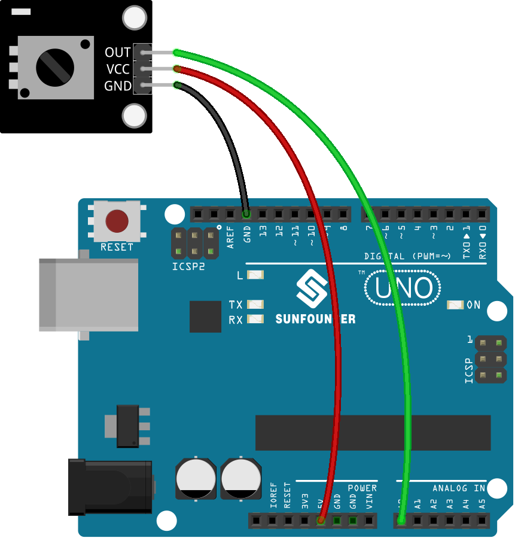

.. note::

    Hello, welcome to the SunFounder Raspberry Pi & Arduino & ESP32 Enthusiasts Community on Facebook! Dive deeper into Raspberry Pi, Arduino, and ESP32 with fellow enthusiasts.

    **Why Join?**

    - **Expert Support**: Solve post-sale issues and technical challenges with help from our community and team.
    - **Learn & Share**: Exchange tips and tutorials to enhance your skills.
    - **Exclusive Previews**: Get early access to new product announcements and sneak peeks.
    - **Special Discounts**: Enjoy exclusive discounts on our newest products.
    - **Festive Promotions and Giveaways**: Take part in giveaways and holiday promotions.

    👉 Ready to explore and create with us? Click [|link_sf_facebook|] and join today!

.. _uno_lesson13_potentiometer:

Lesson 13: Potentiometer Module
==================================

In this lesson, you'll learn how to read the analog value of a potentiometer with an Arduino Uno. We'll connect the potentiometer to pin A0 and use the Arduino to measure its value from 0 to 1023. This tutorial will walk you through setting up the circuit, writing code to read the sensor, and displaying the readings on the serial monitor. It's a great project for beginners, providing hands-on experience with analog input and serial communication on the Arduino platform.

Required Components
--------------------------

In this project, we need the following components. 

It's definitely convenient to buy a whole kit, here's the link: 

.. list-table::
    :widths: 20 20 20
    :header-rows: 1

    *   - Name	
        - ITEMS IN THIS KIT
        - LINK
    *   - Universal Maker Sensor Kit
        - 94
        - |link_umsk|

You can also buy them separately from the links below.

.. list-table::
    :widths: 30 20
    :header-rows: 1

    *   - Component Introduction
        - Purchase Link

    *   - Arduino UNO R3 or R4
        - |link_Uno_R3_buy|
    *   - :ref:`cpn_potentiometer`
        - |link_potentiometer_sensor_module_buy|

Wiring
---------------------------

Code
---------------------------

.. raw:: html

    <iframe src=https://create.arduino.cc/editor/sunfounder01/ce0f8eac-f28f-4168-be2c-bcaabb1b4c78/preview?embed style="height:510px;width:100%;margin:10px 0" frameborder=0></iframe>

Code Analysis
---------------------------

#. This line of code defines the pin number to which the potentiometer is connected on the Arduino board.

   .. code-block:: arduino

      const int sensorPin = A0;

#. The ``setup()`` function is a special function in Arduino that is executed only once when the Arduino is powered on or reset. In this project, the ``Serial.begin(9600)`` command initiates serial communication at a baud rate of 9600.

   .. code-block:: arduino

      void setup() {
        Serial.begin(9600);  
      }

#. The ``loop()`` function is the main function where the program runs repeatedly. In this function, the ``analogRead()`` function reads the analog value from the potentiometer and prints it to the serial monitor using ``Serial.println()``. The ``delay(50)`` command makes the program wait for 50 milliseconds before taking the next reading.

   .. code-block:: arduino

      void loop() {
        Serial.println(analogRead(sensorPin));  
        delay(50);
      }
