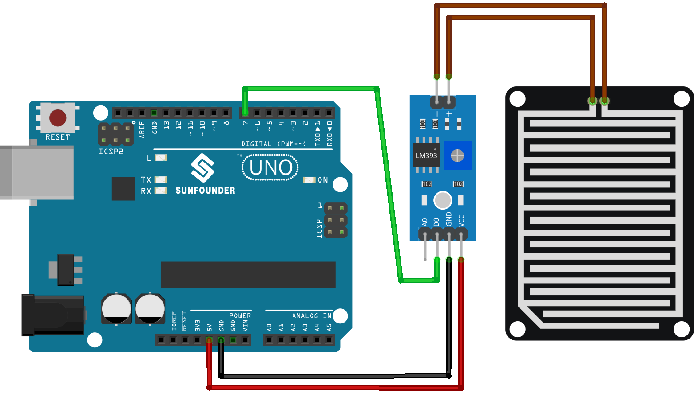

.. note::

    Hello, welcome to the SunFounder Raspberry Pi & Arduino & ESP32 Enthusiasts Community on Facebook! Dive deeper into Raspberry Pi, Arduino, and ESP32 with fellow enthusiasts.

    **Why Join?**

    - **Expert Support**: Solve post-sale issues and technical challenges with help from our community and team.
    - **Learn & Share**: Exchange tips and tutorials to enhance your skills.
    - **Exclusive Previews**: Get early access to new product announcements and sneak peeks.
    - **Special Discounts**: Enjoy exclusive discounts on our newest products.
    - **Festive Promotions and Giveaways**: Take part in giveaways and holiday promotions.

    👉 Ready to explore and create with us? Click [|link_sf_facebook|] and join today!

.. _uno_lesson15_raindrop:

Lesson 15: Raindrop Detection Module
=======================================

In this lesson, you will learn how to use a Raindrop Detection Sensor Module with an Arduino. We will see how the sensor detects rain by measuring changes in resistance caused by raindrops completing circuits on its nickel-coated surface.

Required Components
--------------------------

In this project, we need the following components. 

It's definitely convenient to buy a whole kit, here's the link: 

.. list-table::
    :widths: 20 20 20
    :header-rows: 1

    *   - Name	
        - ITEMS IN THIS KIT
        - LINK
    *   - Universal Maker Sensor Kit
        - 94
        - |link_umsk|

You can also buy them separately from the links below.

.. list-table::
    :widths: 30 20
    :header-rows: 1

    *   - Component Introduction
        - Purchase Link

    *   - Arduino UNO R3 or R4
        - |link_Uno_R3_buy|
    *   - :ref:`cpn_raindrop`
        - |link_raindrop_sensor_module_buy|

Wiring
---------------------------

Code
---------------------------

.. raw:: html

    <iframe src=https://create.arduino.cc/editor/sunfounder01/856a64c8-ecb6-455e-97e6-186cb8d159ea/preview?embed style="height:510px;width:100%;margin:10px 0" frameborder=0></iframe>

Code Analysis
---------------------------

1. Defining sensor pin

   Here, a constant integer named ``sensorPin`` is defined and assigned the value 7. This corresponds to the digital pin on the Arduino board where the raindrops detection sensor is connected.

   .. code-block:: arduino
   
       const int sensorPin = 7;

2. Setting up the pin mode and initiating serial communication.

   In the ``setup()`` function, two essential steps are performed. Firstly, ``pinMode()`` is used to set the ``sensorPin`` as an input, enabling us to read digital values from the raindrops sensor. Secondly, serial communication is initialized with a baud rate of 9600.

   .. code-block:: arduino
   
       void setup() {
         pinMode(sensorPin, INPUT);
         Serial.begin(9600);
       }

3. Reading the digital value and sending it to the serial monitor. 

   The ``loop()`` function reads the digital value from the raindrops sensor using ``digitalRead()``. This value (either HIGH or LOW) is printed to the Serial Monitor. When raindrops are detected, the serial monitor will display 0; when no raindrops are detected, it will display 1. The program then waits for 50 milliseconds before the next reading.

   .. code-block:: arduino
   
       void loop() {
         Serial.println(digitalRead(sensorPin));
         delay(50);
       }
