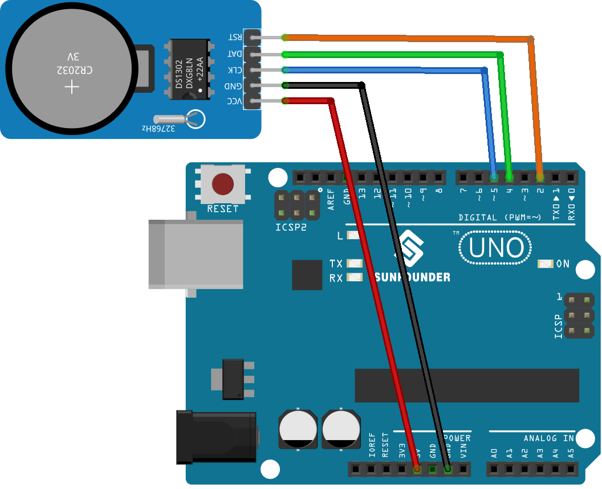

.. note::

   Hallo und willkommen in der SunFounder Raspberry Pi & Arduino & ESP32 Enthusiasten-Gemeinschaft auf Facebook! Tauchen Sie tiefer ein in die Welt von Raspberry Pi, Arduino und ESP32 mit anderen Enthusiasten.

   **Warum beitreten?**

   - **Expertenunterstützung**: Lösen Sie Nachverkaufsprobleme und technische Herausforderungen mit Hilfe unserer Gemeinschaft und unseres Teams.
   - **Lernen & Teilen**: Tauschen Sie Tipps und Anleitungen aus, um Ihre Fähigkeiten zu verbessern.
   - **Exklusive Vorschauen**: Erhalten Sie frühzeitigen Zugang zu neuen Produktankündigungen und exklusiven Einblicken.
   - **Spezialrabatte**: Genießen Sie exklusive Rabatte auf unsere neuesten Produkte.
   - **Festliche Aktionen und Gewinnspiele**: Nehmen Sie an Gewinnspielen und Feiertagsaktionen teil.

   👉 Sind Sie bereit, mit uns zu erkunden und zu erschaffen? Klicken Sie auf [|link_sf_facebook|] und treten Sie heute bei!

.. _uno_lesson16_ds1306:

Lektion 16: Echtzeituhr-Modul (DS1302)
==================================================

In dieser Lektion lernen Sie, wie Sie ein Echtzeituhr-Modul (RTC) mit einem Arduino einrichten und verwenden. Wir werden die Initialisierung des RTC DS1302-Moduls, die Anzeige des aktuellen Datums und der Uhrzeit auf dem seriellen Monitor und die Sicherstellung der genauen Zeitmessung behandeln. Diese Sitzung ist ideal für diejenigen, die sich für zeitbasierte Operationen in eingebetteten Systemen interessieren. Sie bietet praktische Erfahrungen im Umgang mit Datums- und Zeiteinstellungen, der Verwendung von RTC-Bibliotheken und der Fehlerbehebung bei gängigen Problemen. Dieses Projekt ist für fortgeschrittene Lernende geeignet, die mit den Grundlagen des Arduino vertraut sind.

Benötigte Komponenten
--------------------------

Für dieses Projekt benötigen wir die folgenden Komponenten.

Es ist definitiv praktisch, ein komplettes Kit zu kaufen. Hier ist der Link:

.. list-table::
    :widths: 20 20 20
    :header-rows: 1

    *   - Name	
        - ITEMS IN THIS KIT
        - LINK
    *   - Universal Maker Sensor Kit
        - 94
        - |link_umsk|

Sie können die Komponenten auch separat über die folgenden Links kaufen.

.. list-table::
    :widths: 30 20
    :header-rows: 1

    *   - Component Introduction
        - Purchase Link

    *   - Arduino UNO R3 or R4
        - |link_Uno_R3_buy|
    *   - :ref:`cpn_rtc_ds1302`
        - |link_ds1302_module_buy|

Verkabelung
---------------------------

Code
---------------------------

.. note:: 
   Um die Bibliothek zu installieren, verwenden Sie den Arduino Library Manager und suchen Sie nach **"Rtc by Makuna"** und installieren Sie diese. 

.. raw:: html

    <iframe src=https://create.arduino.cc/editor/sunfounder01/9b509afa-545f-4fb6-b8f0-0d87b7cf4992/preview?embed style="height:510px;width:100%;margin:10px 0" frameborder=0></iframe>

Codeanalyse
---------------------------

#. Initialisierung und Einbindung der Bibliotheken

   .. note:: 
      Um die Bibliothek zu installieren, verwenden Sie den Arduino Library Manager und suchen Sie nach **"Rtc by Makuna"** und installieren Sie diese. 

   Hier werden die notwendigen Bibliotheken für das DS1302 RTC-Modul eingebunden.

   .. code-block:: arduino

      #include <ThreeWire.h>
      #include <RtcDS1302.h>

#. Pins definieren und RTC-Instanz erstellen

   Kommunikationspins werden definiert und eine Instanz des RTC erstellt.

   .. code-block:: arduino

      const int IO = 4;    // DAT
      const int SCLK = 5;  // CLK
      const int CE = 2;    // RST

      ThreeWire myWire(4, 5, 2);  // IO, SCLK, CE
      RtcDS1302<ThreeWire> Rtc(myWire);

#. ``setup()`` function

   Diese Funktion initialisiert die serielle Kommunikation und richtet das RTC-Modul ein. Verschiedene Überprüfungen werden durchgeführt, um sicherzustellen, dass das RTC korrekt läuft.

   .. code-block:: arduino

      void setup() {
        Serial.begin(9600);
      
        Serial.print("compiled: ");
        Serial.print(__DATE__);
        Serial.println(__TIME__);
      
        Rtc.Begin();
      
        RtcDateTime compiled = RtcDateTime(__DATE__, __TIME__);
        printDateTime(compiled);
        Serial.println();
      
        if (!Rtc.IsDateTimeValid()) {
          // Common Causes:
          //    1) first time you ran and the device wasn't running yet
          //    2) the battery on the device is low or even missing
      
          Serial.println("RTC lost confidence in the DateTime!");
          Rtc.SetDateTime(compiled);
        }
      
        if (Rtc.GetIsWriteProtected()) {
          Serial.println("RTC was write protected, enabling writing now");
          Rtc.SetIsWriteProtected(false);
        }
      
        if (!Rtc.GetIsRunning()) {
          Serial.println("RTC was not actively running, starting now");
          Rtc.SetIsRunning(true);
        }
      
        RtcDateTime now = Rtc.GetDateTime();
        if (now < compiled) {
          Serial.println("RTC is older than compile time!  (Updating DateTime)");
          Rtc.SetDateTime(compiled);
        } else if (now > compiled) {
          Serial.println("RTC is newer than compile time. (this is expected)");
        } else if (now == compiled) {
          Serial.println("RTC is the same as compile time! (not expected but all is fine)");
        }
      }

#. ``loop()`` function

   Diese Funktion ruft periodisch das aktuelle Datum und die Uhrzeit vom RTC ab und gibt sie auf dem seriellen Monitor aus. Sie überprüft auch, ob das RTC weiterhin ein gültiges Datum und eine gültige Uhrzeit beibehält.

   .. code-block:: arduino

      void loop() {
        RtcDateTime now = Rtc.GetDateTime();
      
        printDateTime(now);
        Serial.println();
      
        if (!now.IsValid()) {
          // Common Causes:
          //    1) the battery on the device is low or even missing and the power line was disconnected
          Serial.println("RTC lost confidence in the DateTime!");
        }
      
        delay(5000);  // five seconds
      }

#. Funktion zum Drucken von Datum und Uhrzeit

   Eine Hilfsfunktion, die ein ``RtcDateTime``-Objekt nimmt und das formatierte Datum und die Uhrzeit auf dem seriellen Monitor ausgibt.

   .. code-block:: arduino

      void printDateTime(const RtcDateTime& dt) {
        char datestring[20];
      
        snprintf_P(datestring,
                   countof(datestring),
                   PSTR("%02u/%02u/%04u %02u:%02u:%02u"),
                   dt.Month(),
                   dt.Day(),
                   dt.Year(),
                   dt.Hour(),
                   dt.Minute(),
                   dt.Second());
        Serial.print(datestring);
      }
