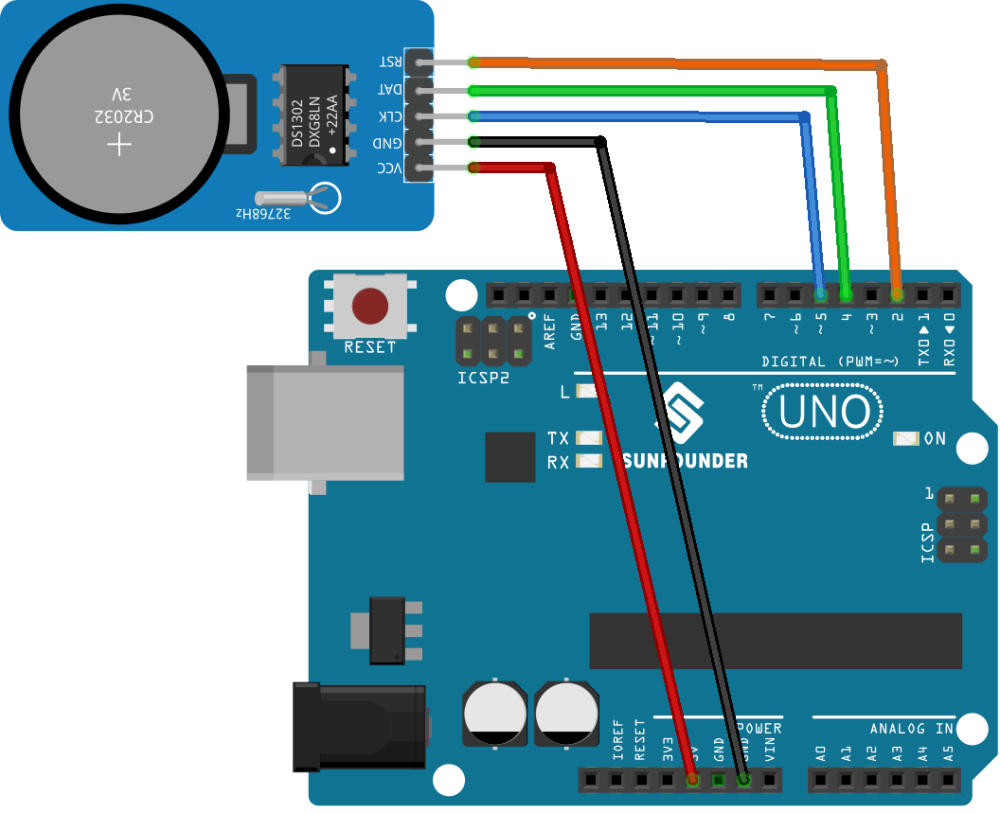

.. note::

    こんにちは、SunFounder Raspberry Pi & Arduino & ESP32 Enthusiasts Communityへようこそ！Facebook上で、仲間と一緒にRaspberry Pi、Arduino、ESP32をさらに深く探求しましょう。

    **なぜ参加するのか？**

    - **専門的なサポート**：購入後の問題や技術的な課題をコミュニティやチームの助けを借りて解決。
    - **学びと共有**：スキルを向上させるためのヒントやチュートリアルを交換。
    - **限定プレビュー**：新製品発表や予告編に早期アクセス。
    - **特別割引**：最新製品の特別割引を楽しむ。
    - **フェスティブプロモーションとプレゼント**：プレゼントやホリデープロモーションに参加。

    👉 私たちと一緒に探索と創造を始める準備はできましたか？[|link_sf_facebook|]をクリックして、今すぐ参加しましょう！

.. _uno_lesson16_ds1306:

レッスン16: リアルタイムクロックモジュール (DS1302)
==========================================================

このレッスンでは、Arduinoを使用してリアルタイムクロック（RTC）モジュールを設定し、使用する方法を学びます。RTC DS1302モジュールの初期化、現在の日付と時刻をシリアルモニターに表示する方法、および正確な時間管理を行う方法について説明します。このセッションは、組み込みシステムにおける時間ベースの操作に興味がある方に最適で、日付と時間の設定、RTCライブラリの使用、および一般的な問題のトラブルシューティングの実践経験を提供します。このプロジェクトは、Arduinoの基本を理解している中級学習者に適しています。

必要なコンポーネント
--------------------------

このプロジェクトでは、以下のコンポーネントが必要です。

一式をまとめて購入すると便利です。リンクはこちら：

.. list-table::
    :widths: 20 20 20
    :header-rows: 1

    *   - Name	
        - ITEMS IN THIS KIT
        - LINK
    *   - Universal Maker Sensor Kit
        - 94
        - |link_umsk|

以下のリンクから個別に購入することもできます。

.. list-table::
    :widths: 30 20
    :header-rows: 1

    *   - Component Introduction
        - Purchase Link

    *   - Arduino UNO R3 or R4
        - |link_Uno_R3_buy|
    *   - :ref:`cpn_rtc_ds1302`
        - |link_ds1302_module_buy|
        

配線
---------------------------

コード
---------------------------

.. note:: 
   ライブラリをインストールするには、Arduinoライブラリマネージャーを使用して **"Rtc by Makuna"** を検索し、インストールしてください。

.. raw:: html

    <iframe src=https://create.arduino.cc/editor/sunfounder01/9b509afa-545f-4fb6-b8f0-0d87b7cf4992/preview?embed style="height:510px;width:100%;margin:10px 0" frameborder=0></iframe>

コード解析
---------------------------

#. 初期化とライブラリのインクルード

   .. note:: 
      ライブラリをインストールするには、Arduinoライブラリマネージャーを使用して **"Rtc by Makuna"** を検索し、インストールしてください。

   ここでは、DS1302 RTCモジュール用の必要なライブラリをインクルードします。

   .. code-block:: arduino

      #include <ThreeWire.h>
      #include <RtcDS1302.h>

#. ピンの定義とRTCインスタンスの作成

   通信のためのピンが定義され、RTCのインスタンスが作成されます。

   .. code-block:: arduino

      const int IO = 4;    // DAT
      const int SCLK = 5;  // CLK
      const int CE = 2;    // RST

      ThreeWire myWire(4, 5, 2);  // IO, SCLK, CE
      RtcDS1302<ThreeWire> Rtc(myWire);

#. ``setup()`` 関数

   この関数はシリアル通信を初期化し、RTCモジュールをセットアップします。RTCが正常に動作していることを確認するためのさまざまなチェックが行われます。

   .. code-block:: arduino

      void setup() {
        Serial.begin(9600);
      
        Serial.print("compiled: ");
        Serial.print(__DATE__);
        Serial.println(__TIME__);
      
        Rtc.Begin();
      
        RtcDateTime compiled = RtcDateTime(__DATE__, __TIME__);
        printDateTime(compiled);
        Serial.println();
      
        if (!Rtc.IsDateTimeValid()) {
          // Common Causes:
          //    1) first time you ran and the device wasn't running yet
          //    2) the battery on the device is low or even missing
      
          Serial.println("RTC lost confidence in the DateTime!");
          Rtc.SetDateTime(compiled);
        }
      
        if (Rtc.GetIsWriteProtected()) {
          Serial.println("RTC was write protected, enabling writing now");
          Rtc.SetIsWriteProtected(false);
        }
      
        if (!Rtc.GetIsRunning()) {
          Serial.println("RTC was not actively running, starting now");
          Rtc.SetIsRunning(true);
        }
      
        RtcDateTime now = Rtc.GetDateTime();
        if (now < compiled) {
          Serial.println("RTC is older than compile time!  (Updating DateTime)");
          Rtc.SetDateTime(compiled);
        } else if (now > compiled) {
          Serial.println("RTC is newer than compile time. (this is expected)");
        } else if (now == compiled) {
          Serial.println("RTC is the same as compile time! (not expected but all is fine)");
        }
      }

#. ``loop()`` 関数

   この関数は、RTCから現在の日付と時刻を定期的に取得し、シリアルモニターに表示します。また、RTCが有効な日付と時刻を維持しているかどうかもチェックします。

   .. code-block:: arduino

      void loop() {
        RtcDateTime now = Rtc.GetDateTime();
      
        printDateTime(now);
        Serial.println();
      
        if (!now.IsValid()) {
          // Common Causes:
          //    1) the battery on the device is low or even missing and the power line was disconnected
          Serial.println("RTC lost confidence in the DateTime!");
        }
      
        delay(5000);  // five seconds
      }

#. 日付と時刻の表示関数

   ``RtcDateTime`` オブジェクトを受け取り、フォーマットされた日付と時刻をシリアルモニターに表示するヘルパー関数。

   .. code-block:: arduino

      void printDateTime(const RtcDateTime& dt) {
        char datestring[20];
      
        snprintf_P(datestring,
                   countof(datestring),
                   PSTR("%02u/%02u/%04u %02u:%02u:%02u"),
                   dt.Month(),
                   dt.Day(),
                   dt.Year(),
                   dt.Hour(),
                   dt.Minute(),
                   dt.Second());
        Serial.print(datestring);
      }