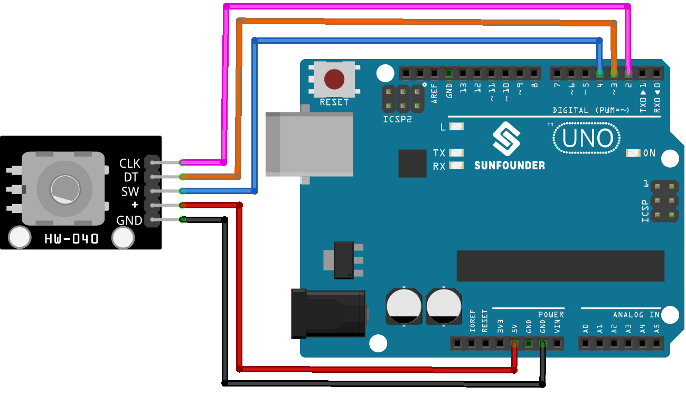

.. note::

    こんにちは、SunFounder Raspberry Pi & Arduino & ESP32 Enthusiasts Communityへようこそ！Facebook上で、仲間と一緒にRaspberry Pi、Arduino、ESP32をさらに深く探求しましょう。

    **なぜ参加するのか？**

    - **専門的なサポート**：購入後の問題や技術的な課題をコミュニティやチームの助けを借りて解決。
    - **学びと共有**：スキルを向上させるためのヒントやチュートリアルを交換。
    - **限定プレビュー**：新製品発表や予告編に早期アクセス。
    - **特別割引**：最新製品の特別割引を楽しむ。
    - **フェスティブプロモーションとプレゼント**：プレゼントやホリデープロモーションに参加。

    👉 私たちと一緒に探索と創造を始める準備はできましたか？[|link_sf_facebook|]をクリックして、今すぐ参加しましょう！

.. _uno_lesson17_rotary_encoder:

レッスン17: ロータリーエンコーダーモジュール
===========================================

このレッスンでは、Arduino Unoを使用してロータリーエンコーダーを監視および制御する方法を学びます。回転方向（時計回りまたは反時計回り）の追跡、回転数のカウント、エンコーダーモジュールのボタン押下の検出について説明します。このプロジェクトは、ロータリーエンコーダーとArduinoにおける入出力操作の理解を深めたい人に最適で、物理的な制御システムについての実践的な洞察を提供します。

必要なコンポーネント
--------------------------

このプロジェクトでは、以下のコンポーネントが必要です。

一式をまとめて購入すると便利です。リンクはこちら：

.. list-table::
    :widths: 20 20 20
    :header-rows: 1

    *   - Name	
        - ITEMS IN THIS KIT
        - LINK
    *   - Universal Maker Sensor Kit
        - 94
        - |link_umsk|

以下のリンクから個別に購入することもできます。

.. list-table::
    :widths: 30 20
    :header-rows: 1

    *   - Component Introduction
        - Purchase Link

    *   - Arduino UNO R3 or R4
        - |link_Uno_R3_buy|
    *   - :ref:`cpn_rotary_encoder`
        - \-
* Arduino UNO R3 or R4
* :ref:`cpn_rotary_encoder`

配線
---------------------------

コード
---------------------------

.. raw:: html

    <iframe src=https://create.arduino.cc/editor/sunfounder01/d72d6a5f-72c7-4f94-ad4e-f7dc83b127de/preview?embed style="height:510px;width:100%;margin:10px 0" frameborder=0></iframe>

コード解析
---------------------------

#. **セットアップと初期化**

   .. code-block:: arduino

      void setup() {
        pinMode(CLK, INPUT);
        pinMode(DT, INPUT);
        pinMode(SW, INPUT_PULLUP);
        Serial.begin(9600);
        lastStateCLK = digitalRead(CLK);
      }

   セットアップ関数では、エンコーダーのCLKおよびDTに接続されたデジタルピンを入力として設定します。ボタンに接続されたSWピンは内部プルアップ抵抗付きの入力として設定されます。これにより、外部プルアップ抵抗が不要になります。シリアル通信は9600ボーのレートで開始され、シリアルモニターでデータを視覚化できるようになります。CLKピンの初期状態が読み取られ、保存されます。

#. **メインループ: エンコーダーとボタンの状態を読み取る**

   .. code-block:: arduino

      void loop() {
        currentStateCLK = digitalRead(CLK);
        if (currentStateCLK != lastStateCLK && currentStateCLK == 1) {
          if (digitalRead(DT) != currentStateCLK) {
            counter--;
            currentDir = "CCW";
          } else {
            counter++;
            currentDir = "CW";
          }
          Serial.print("Direction: ");
          Serial.print(currentDir);
          Serial.print(" | Counter: ");
          Serial.println(counter);
        }
        lastStateCLK = currentStateCLK;
        int btnState = digitalRead(SW);
        if (btnState == LOW) {
          if (millis() - lastButtonPress > 50) {
            Serial.println("Button pressed!");
          }
          lastButtonPress = millis();
        }
        delay(1);
      }

   ループ関数では、プログラムはCLKピンの現在の状態を継続的に読み取ります。状態に変化がある場合、それは回転が発生したことを意味します。回転の方向は、CLKピンとDTピンの状態を比較することで決定されます。異なる場合は反時計回り（CCW）であり、同じ場合は時計回り（CW）です。エンコーダーのカウントはそれに応じて増減されます。この情報はシリアルモニターに送信されます。

   ボタンの状態はSWピンから読み取られます。LOW（押下）状態の場合、最後のボタン押下から経過した時間をチェックすることでデバウンス機構が実装されます。50ミリ秒以上経過している場合、有効な押下と見なされ、メッセージがシリアルモニターに送信されます。 `delay(1)` はデバウンスに役立ちます。
